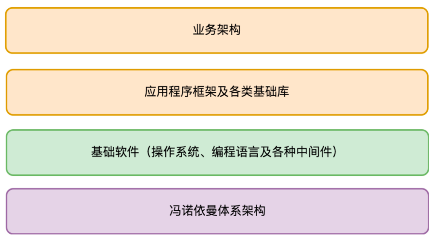

# fundamental architecture
- central process unit + storage + a series of INPUT/OUTPUT equipment
- CPU: execute command
- storage: store data

> Every time we power on the computer, the CPU loads data from a fixed location in storage and executes the commands one by one.

---
- the things we design should base on requirements, and focus on the specification。
- storage: CPU built-in supported storage, memory, mechanical hard drive, USB SSD, CD
  - Built-in supported storage(内置支持的存储):  register(寄存器), memory, ROM
  - external storage(外置存储): input/output device
- CPU
- Input / Output: like human facial features

> BIOS: A boot program on the computer motherboard ROM(计算机主板ROM上的一段启动程序)
> including: Storage device driver(存储设备的驱动程序)
> fundamental external device driver
> Basic management capabilities for devices and startup configurations(设备和启动配置的基础管理能力)
> Ability to execute programs on external storage(在外置存储上执行程序的能力)
---

---
BIOS -> boot area boot program -> OS boot program -> software

---
CPU real mode and protected mode(CPU的实模式和保护模式)
real mode: CPU directly accesses memory through physical address
protected mode: The CPU converts virtual memory addresses into physical memory addresses through an address mapping table.(CPU通过一个地址映射表把虚拟的内存地址转为物理的内存地址)

