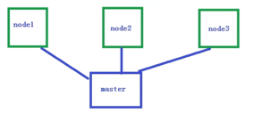
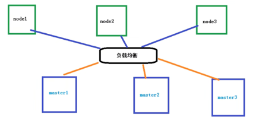

# 特性
## 自动装箱
基于容器对应用运行环境的资源配置要求自动部署应用容器

## 自我修复
容器健康检查，当容器异常时，会对容器进行重启

## 水平扩展
通过简单的命令或者用户UI界面，基于CPU等资源使用情况，对应用容器进行规模扩大或者规模裁剪

## 服务发现
用户不需要使用额外的服务发现机制，就能够基于Kubernetes自身能力实现服务发现和负责均衡

## 滚动更新
可以根据应用的变化，对应用容器运行的应用，进行一次性或批量式更新

## 版本回退
根据应用部署情况，对应用容器运行的应用，进行历史版本即时回退

## 密钥和配置管理
在不需要重新构建镜像的情况下，可以部署和更新密钥和应用配置

## 存储编排
自动实现存储系统挂载及应用，特别对有状态应用实现数据持久化非常重要。 存储系统可以可以来自本地目录，网络(NFS、Gluster、Ceph)等、公共云存储服务。

## 批处理
提供一次性任务，定时任务；满足批量数据处理和分析的场景

# k8s集群架构组件
## Master组件
API server: 集群统一入口，以restful方式，数据存储etcd
scheduler: 节点调度，选择node节点应用部署
controller-manager: 处理集群中常规后台任务，一个资源对应一个控制器
etcd: 存储系统，保存集群中的相关数据

## node组件
kubelet: 管理本机容器
kube-proxy： 提供网络代理，负载均衡等操作

# 核心概念
## Pod
最小部署单元
一组容器的集合
共享网络
生命周期是短暂的

## controller
确保预期Pod副本数量
无状态应用部署
有状态应用部署
确保所有node运行同一个pod
一次性任务和定时任务

## Service
定义一组pod的访问规则

# 搭建k8s环境平台规划
## 平台规划
1. 单master集群

2. 多master集群 

# 服务器硬件配置要求
## 硬件要求
基本（测试环境）
master 2C 4G 20G
node 4C 8G 40G
（生产环境）
master 8C 16G 100G
node 16C 64G 500G
# 搭建方式
## kubeadm
Kubeadm是k8s部署工具，提供kubeadm init和kubeadm join, 用于快速部署Kubernetes集群。
1. 创建一个Master节点kubeadm init
2. 将Node节点加入到当前集群中kubeadm join <Master节点的IP和端口>

---
前提
- 一台或多台机器，操作系统相同（CentOS/RedHat）
- 硬件配置：2GB或更多RAM，2CPU或更多，硬盘30GB或更多
- 集群中所有机器直接网络互通
- 可以访问外网，需要拉取镜像
- 禁止swap分区
---

## 二进制包
从github下载发行的二进制包，手动部署每个组件，组成kubernetes集群

