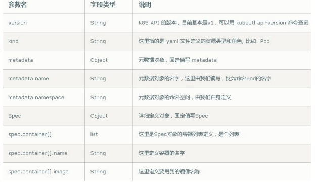
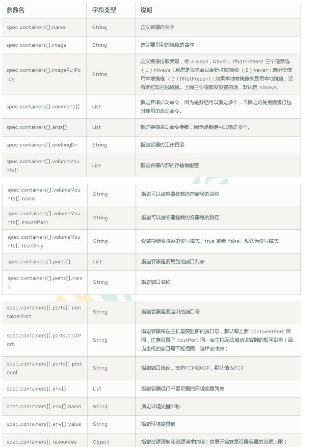
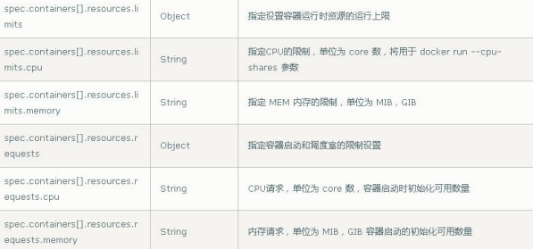

---
（1）一台或多台机器，操作系统 CentOS7.x-86_x64
（2）硬件配置：2GB 或更多 RAM，2 个 CPU 或更多 CPU，硬盘 30GB 或更多
（3）集群中所有机器之间网络互通
（4）可以访问外网，需要拉取镜像，如果服务器不能上网，需要提前下载镜像并导入节点
（5）禁止 swap 分区
---

---
软件 版本
操作系统 CentOS7.8_x64 （mini）
Docker 19-ce
Kubernetes 1.19
---

---
角色 IP 组件
k8s-master 192.168.31.71 kube-apiserver，kube-controller-manager，kube-scheduler，etcd
k8s-node1 192.168.31.72 kubelet，kube-proxy，docker etcd
k8s-node2 192.168.31.73 kubelet，kube-proxy，docker，etcd
---

---

# 关闭防火墙

systemctl stop firewalld
systemctl disable firewalld

# 关闭 selinux

sed -i 's/enforcing/disabled/' /etc/selinux/config # 永久
setenforce 0 # 临时

# 关闭 swap

swapoff -a # 临时
sed -ri 's/.*swap.*/#&/' /etc/fstab # 永久

# 根据规划设置主机名

hostnamectl set-hostname <hostname>

# 在 master 添加 hosts

cat >> /etc/hosts << EOF
192.168.44.147 m1
192.168.44.148 n1
EOF

# 将桥接的 IPv4 流量传递到 iptables 的链

cat > /etc/sysctl.d/k8s.conf << EOF
net.bridge.bridge-nf-call-ip6tables = 1
net.bridge.bridge-nf-call-iptables = 1
EOF
sysctl --system # 生效

# 时间同步

yum install ntpdate -y
ntpdate time.windows.com
---

---
部署Etcd集群
Etcd 是一个分布式键值存储系统，Kubernetes 使用 Etcd 进行数据存储，所以先准备一个 Etcd 数据库，为解决 Etcd
单点故障，应采用集群方式部署，这里使用3 台组建集群，可容忍 1 台机器故障（为了节省机器，这里与 K8s 节点机器复用。也可以独立于
k8s 集群之外部署，只要apiserver 能连接到就行。）
节点名称 IP
etcd-1 192.168.31.71
etcd-2 192.168.31.72
etcd-3 192.168.31.73
---

---
准备cfssl证书生成工具
cfssl是一个开源的证书管理工具，使用 json 文件生成证书，相比 openssl 更方便使用。找任意一台服务器操作，这里用 Master 节点。

```shell
wget https://pkg.cfssl.org/R1.2/cfssl_linux-amd64
wget https://pkg.cfssl.org/R1.2/cfssljson_linux-amd64
wget https://pkg.cfssl.org/R1.2/cfssl-certinfo_linux-amd64
chmod +x cfssl_linux-amd64 cfssljson_linux-amd64 cfssl-certinfo_linux-amd64
mv cfssl_linux-amd64 /usr/local/bin/cfssl
mv cfssljson_linux-amd64 /usr/local/bin/cfssljson
mv cfssl-certinfo_linux-amd64 /usr/bin/cfssl-certinfo
```

生成Etcd证书

自签证书颁发机构（CA）
   创建工作目录

~~~
mkdir -p ~/TLS/{etcd,k8s}
cd TLS/etcd
~~~

自签CA

~~~
cat > ca-config.json<< EOF
{
   "signing":{
      "default":{
         "expiry":"87600h"
      },
      "profiles":{
         "www":{
            "expiry":"87600h",
            "usages":[
               "signing",
               "key encipherment",
               "server auth",
               "client auth"
            ]
         }
      }
   }
}
EOF


cat > ca-csr.json<< EOF
{
   "CN":"etcd CA",
   "key":{
      "algo":"rsa",
      "size":2048
   },
   "names":[
      {
         "C":"CN",
         "L":"Beijing",
         "ST":"Beijing"
      }
   ]
}
EOF
~~~

生成证书

~~~
cfssl gencert -initca ca-csr.json | cfssljson -bare ca -
ls *pem
ca-key.pem ca.pem
~~~

使用自签CA签发Etcd HTTPS证书
创建证书申请文件

~~~
cat > server-csr.json<< EOF
{
   "CN":"etcd",
   "hosts":[
      "192.168.31.71",
      "192.168.31.72",
      "192.168.31.73"
   ],
   "key":{
      "algo":"rsa",
      "size":2048
   },
   "names":[
      {
         "C":"CN",
         "L":"BeiJing",
         "ST":"BeiJing"
      }
   ]
}
EOF

# 注：上述文件 hosts 字段中 IP 为所有 etcd 节点的集群内部通信 IP，一个都不能少！为了方便后期扩容可以多写几个预留的 IP。

~~~

生成证书
~~~
cfssl gencert -ca=ca.pem -ca-key=ca-key.pem -config=ca-config.json -
profile=www server-csr.json | cfssljson -bare server

ls server*pem
server-key.pem server.pem
~~~

---

从Github下载 Etcd 二进制文件
~~~
https://github.com/etcd-io/etcd/releases/download/v3.4.9/etcd-v3.4.9-linux-amd64.tar.gz
~~~

部署 Etcd 集群
创建工作目录并解压二进制包
~~~
mkdir /opt/etcd/{bin,cfg,ssl} –p
tar zxvf etcd-v3.4.9-linux-amd64.tar.gz
mv etcd-v3.4.9-linux-amd64/{etcd,etcdctl} /opt/etcd/bin/
~~~

创建 etcd 配置文件

~~~
cat > /opt/etcd/cfg/etcd.conf << EOF
#[Member]
ETCD_NAME="etcd-1"
ETCD_DATA_DIR="/var/lib/etcd/default.etcd"
ETCD_LISTEN_PEER_URLS="https://192.168.31.71:2380"
ETCD_LISTEN_CLIENT_URLS="https://192.168.31.71:2379"
#[Clustering]
ETCD_INITIAL_ADVERTISE_PEER_URLS="https://192.168.31.71:2380"
ETCD_ADVERTISE_CLIENT_URLS="https://192.168.31.71:2379"
ETCD_INITIAL_CLUSTER="etcd-1=https://192.168.31.71:2380,etcd2=https://192.168.31.72:2380,etcd-3=https://192.168.31.73:2380"
ETCD_INITIAL_CLUSTER_TOKEN="etcd-cluster"
ETCD_INITIAL_CLUSTER_STATE="new"
EOF

# ETCD_NAME：节点名称，集群中唯一
# ETCD_DATA_DIR：数据目录
# ETCD_LISTEN_PEER_URLS：集群通信监听地址
# ETCD_LISTEN_CLIENT_URLS：客户端访问监听地址
# ETCD_INITIAL_ADVERTISE_PEER_URLS：集群通告地址
# ETCD_ADVERTISE_CLIENT_URLS：客户端通告地址
# ETCD_INITIAL_CLUSTER：集群节点地址
# ETCD_INITIAL_CLUSTER_TOKEN：集群 Token
# ETCD_INITIAL_CLUSTER_STATE：加入集群的当前状态，new 是新集群，existing 表示加入已有集群
~~~

systemd 管理 etcd
~~~
cat > /usr/lib/systemd/system/etcd.service << EOF
[Unit]
Description=Etcd Server
After=network.target
After=network-online.target
Wants=network-online.target
[Service]
Type=notify
EnvironmentFile=/opt/etcd/cfg/etcd.conf
ExecStart=/opt/etcd/bin/etcd \
--cert-file=/opt/etcd/ssl/server.pem \
--key-file=/opt/etcd/ssl/server-key.pem \
--peer-cert-file=/opt/etcd/ssl/server.pem \
--peer-key-file=/opt/etcd/ssl/server-key.pem \
--trusted-ca-file=/opt/etcd/ssl/ca.pem \
--peer-trusted-ca-file=/opt/etcd/ssl/ca.pem \
--logger=zap
Restart=on-failure
LimitNOFILE=65536
[Install]
WantedBy=multi-user.target
EOF
~~~

拷贝刚刚生成的证书到配置文件中的路径
~~~
cp ~/TLS/etcd/ca*pem ~/TLS/etcd/server*pem /opt/etcd/ssl/
~~~

启动并设置开机启动
~~~
systemctl daemon-reload
systemctl start etcd
systemctl enable etcd
~~~

拷贝文件到其他机器
~~~
scp -r /opt/etcd/ root@192.168.31.72:/opt/
scp /usr/lib/systemd/system/etcd.service
root@192.168.31.72:/usr/lib/systemd/system/
scp -r /opt/etcd/ root@192.168.31.73:/opt/
scp /usr/lib/systemd/system/etcd.service
root@192.168.31.73:/usr/lib/systemd/system/
~~~

修改其他机器上的etcd.conf文件，配置节点名称和当前服务器IP
~~~
vi /opt/etcd/cfg/etcd.conf
#[Member]
ETCD_NAME="etcd-1" # 修改此处，节点 2 改为 etcd-2，节点 3 改为etcd-3
ETCD_DATA_DIR="/var/lib/etcd/default.etcd"
ETCD_LISTEN_PEER_URLS="https://192.168.31.71:2380" # 修改此处为当前服务器IPETCD_LISTEN_CLIENT_URLS="https://192.168.31.71:2379" # 修改此处为当前服务器IP#[Clustering]
ETCD_INITIAL_ADVERTISE_PEER_URLS="https://192.168.31.71:2380" # 修改此处为当前服务器 IP
ETCD_ADVERTISE_CLIENT_URLS="https://192.168.31.71:2379" # 修改此处为当前服务器IP
ETCD_INITIAL_CLUSTER="etcd-1=https://192.168.31.71:2380,etcd2=https://192.168.31.72:2380,etcd-3=https://192.168.31.73:2380"
ETCD_INITIAL_CLUSTER_TOKEN="etcd-cluster"
ETCD_INITIAL_CLUSTER_STATE="new
~~~

查看集群状态
~~~
ETCDCTL_API=3 /opt/etcd/bin/etcdctl --cacert=/opt/etcd/ssl/ca.pem --
cert=/opt/etcd/ssl/server.pem --key=/opt/etcd/ssl/server-key.pem --
endpoints="https://192.168.31.71:2379,https://192.168.31.72:2379,https://192.168.31.73:2379" endpoint health
https://192.168.31.71:2379 is healthy: successfully committed proposal: took =8.154404ms
https://192.168.31.73:2379 is healthy: successfully committed proposal: took =9.044117ms
https://192.168.31.72:2379 is healthy: successfully committed proposal: took =10.000825ms

# 如果输出上面信息，就说明集群部署成功。如果有问题第一步先看日志：/var/log/message 或 journalctl -u etcd
~~~

---

安装Docker
~~~
下载地址：https://download.docker.com/linux/static/stable/x86_64/docker19.03.9.tgz
~~~

```shell
tar zxvf docker-19.03.9.tgz
mv docker/* /usr/bin
```

systemd管理docker
```shell
cat > /usr/lib/systemd/system/docker.service << EOF
[Unit]
Description=Docker Application Container Engine
Documentation=https://docs.docker.com
After=network-online.target firewalld.service
Wants=network-online.target
[Service]
Type=notify
ExecStart=/usr/bin/dockerd
ExecReload=/bin/kill -s HUP $MAINPID
LimitNOFILE=infinity
LimitNPROC=infinity
LimitCORE=infinity
TimeoutStartSec=0
Delegate=yes
KillMode=process
Restart=on-failure
StartLimitBurst=3
StartLimitInterval=60s
[Install]
WantedBy=multi-user.target
EOF
```
创建配置文件
```shell
mkdir /etc/docker
cat > /etc/docker/daemon.json << EOF
{
"registry-mirrors": ["https://b9pmyelo.mirror.aliyuncs.com"] //registry-mirrors 阿里云镜像加速器
}
EOF
```

启动并设置开机启动
```shell
systemctl daemon-reload
systemctl start docker
systemctl enable docker
```

部署master node
自签证书颁发机构（CA）
```shell
cat > ca-config.json<< EOF
{
"signing": {
"default": {
"expiry": "87600h"
},
"profiles": {
"kubernetes": {
"expiry": "87600h",
"usages": [
"signing",
"key encipherment",
"server auth",
"client auth"
]
}
} 
}
}
EOF
cat > ca-csr.json<< EOF
{
"CN": "kubernetes",
"key": {
"algo": "rsa",
"size": 2048
},
"names": [
{
"C": "CN",
"L": "Beijing",
"ST": "Beijing",
"O": "k8s",
"OU": "System"
}
]
}
EOF
```

生成证书
```shell
cfssl gencert -initca ca-csr.json | cfssljson -bare ca -
ls *pem
ca-key.pem ca.pem
```

使用自签 CA 签发 kube-apiserver HTTPS 证书
创建证书申请文件
```shell
cat > server-csr.json<< EOF
{
"CN": "kubernetes",
"hosts": [
"10.0.0.1",
"127.0.0.1",
"192.168.31.71",
"192.168.31.72",
"192.168.31.73",
"192.168.31.74",
"192.168.31.81",
"192.168.31.82",
"192.168.31.88",
"kubernetes",
"kubernetes.default",
"kubernetes.default.svc",
"kubernetes.default.svc.cluster",
"kubernetes.default.svc.cluster.local"
],
"key": {
"algo": "rsa",
"size": 2048
},
"names": [
{
"C": "CN",
"L": "BeiJing",
"ST": "BeiJing",
"O": "k8s",
"OU": "System"
}
]
}
EOF
```

生成证书
```shell
cfssl gencert -ca=ca.pem -ca-key=ca-key.pem -config=ca-config.json -
profile=kubernetes server-csr.json | cfssljson -bare server
ls server*pem
server-key.pem server.pem
```

从 Github 下载二进制文件
下载一个 server 包, 包含了Master 和Worker Node 二进制文件
https://github.com/kubernetes/kubernetes/blob/master/CHANGELOG/CHANGELOG-1.18.md#v1183

解压二进制包
mkdir -p /opt/kubernetes/{bin,cfg,ssl,logs}
tar zxvf kubernetes-server-linux-amd64.tar.gz
cd kubernetes/server/bin
cp kube-apiserver kube-scheduler kube-controller-manager /opt/kubernetes/bin
cp kubectl /usr/bin/

部署 kube-apiserver
创建配置文件
```shell
cat > /opt/kubernetes/cfg/kube-apiserver.conf << EOF
KUBE_APISERVER_OPTS="--logtostderr=false \\
--v=2 \\
--log-dir=/opt/kubernetes/logs \\
--etcdservers=https://192.168.31.71:2379,https://192.168.31.72:2379,https://192.168.31.73:2379 \\
--bind-address=192.168.31.71 \\
--secure-port=6443 \\
--advertise-address=192.168.31.71 \\
--allow-privileged=true \\
--service-cluster-ip-range=10.0.0.0/24 \\
--enable-admissionplugins=NamespaceLifecycle,LimitRanger,ServiceAccount,ResourceQuota,NodeRestriction \\
--authorization-mode=RBAC,Node \\
--enable-bootstrap-token-auth=true \\
--token-auth-file=/opt/kubernetes/cfg/token.csv \\
--service-node-port-range=30000-32767 \\
--kubelet-client-certificate=/opt/kubernetes/ssl/server.pem \\
--kubelet-client-key=/opt/kubernetes/ssl/server-key.pem \\
--tls-cert-file=/opt/kubernetes/ssl/server.pem \\
--tls-private-key-file=/opt/kubernetes/ssl/server-key.pem \\
--client-ca-file=/opt/kubernetes/ssl/ca.pem \\
--service-account-key-file=/opt/kubernetes/ssl/ca-key.pem \\
--etcd-cafile=/opt/etcd/ssl/ca.pem \\
--etcd-certfile=/opt/etcd/ssl/server.pem \\
--etcd-keyfile=/opt/etcd/ssl/server-key.pem \\
--audit-log-maxage=30 \\
--audit-log-maxbackup=3 \\
--audit-log-maxsize=100 \\
--audit-log-path=/opt/kubernetes/logs/k8s-audit.log"
EOF
```
```
注：上面两个\ \ 第一个是转义符，第二个是换行符，使用转义符是为了使用EOF 保留换行符。
–logtostderr：启用日志
—v：日志等级
–log-dir：日志目录
–etcd-servers：etcd 集群地址
–bind-address：监听地址
–secure-port：https 安全端口
–advertise-address：集群通告地址
–allow-privileged：启用授权
–service-cluster-ip-range：Service 虚拟 IP 地址段
–enable-admission-plugins：准入控制模块
–authorization-mode：认证授权，启用 RBAC 授权和节点自管理
–enable-bootstrap-token-auth：启用 TLS bootstrap 机制
–token-auth-file：bootstrap token 文件
–service-node-port-range：Service nodeport 类型默认分配端口范围–kubelet-client-xxx：apiserver 访问 kubelet 客户端证书
–tls-xxx-file：apiserver https 证书
–etcd-xxxfile：连接 Etcd 集群证书
–audit-log-xxx：审计日志
```

拷贝刚才生成的证书
把刚才生成的证书拷贝到配置文件中的路径：
cp ~/TLS/k8s/ca*pem ~/TLS/k8s/server*pem /opt/kubernetes/ssl/

启用 TLS Bootstrapping 机制
TLS Bootstraping：Master apiserver 启用 TLS 认证后，Node 节点kubelet 和kube- proxy 要与 kube-apiserver 进行通信，必须使用 CA 签发的有效证书才可以，当Node节点很多时，这种客户端证书颁发需要大量工作，同样也会增加集群扩展复杂度。为了简化流程，Kubernetes 引入了 TLS bootstraping 机制来自动颁发客户端证书，kubelet
会以一个低权限用户自动向 apiserver 申请证书，kubelet 的证书由apiserver 动态签署。
所以强烈建议在 Node 上使用这种方式，目前主要用于 kubelet，kube-proxy 还是由我们统一颁发一个证书。


创建上述配置文件中 token 文件
```shell
cat > /opt/kubernetes/cfg/token.csv << EOF
c47ffb939f5ca36231d9e3121a252940,kubelet-bootstrap,10001,"system:nodebootstrapper"
EOF
```
格式：token，用户名，UID，用户组
token 也可自行生成替换
```shell
head -c 16 /dev/urandom | od -An 
```

systemd 管理 apiserver
```shell
cat > /usr/lib/systemd/system/kube-apiserver.service << EOF
[Unit]
Description=Kubernetes API Server
Documentation=https://github.com/kubernetes/kubernetes
[Service]
EnvironmentFile=/opt/kubernetes/cfg/kube-apiserver.conf
ExecStart=/opt/kubernetes/bin/kube-apiserver \$KUBE_APISERVER_OPTS
Restart=on-failure
[Install]
WantedBy=multi-user.target
EOF
```

启动并设置开机启动
```shell
systemctl daemon-reload
systemctl start kube-apiserver
systemctl enable kube-apiserver
```

授权 kubelet-bootstrap 用户允许请求证书
```shell
kubectl create clusterrolebinding kubelet-bootstrap \
--clusterrole=system:node-bootstrapper \
--user=kubelet-bootstrap
```

部署 kube-controller-manager
创建配置文件
```shell
cat > /opt/kubernetes/cfg/kube-controller-manager.conf << EOF
KUBE_CONTROLLER_MANAGER_OPTS="--logtostderr=false \\
--v=2 \\
--log-dir=/opt/kubernetes/logs \\
--leader-elect=true \\
--master=127.0.0.1:8080 \\
--bind-address=127.0.0.1 \\
--allocate-node-cidrs=true \\
--cluster-cidr=10.244.0.0/16 \\
--service-cluster-ip-range=10.0.0.0/24 \\
--cluster-signing-cert-file=/opt/kubernetes/ssl/ca.pem \\
--cluster-signing-key-file=/opt/kubernetes/ssl/ca-key.pem \\
--root-ca-file=/opt/kubernetes/ssl/ca.pem \\
--service-account-private-key-file=/opt/kubernetes/ssl/ca-key.pem \\
--experimental-cluster-signing-duration=87600h0m0s"
EOF
```
–master：通过本地非安全本地端口 8080 连接 apiserver。
–leader-elect：当该组件启动多个时，自动选举（HA）
–cluster-signing-cert-file/–cluster-signing-key-file：自动为kubelet 颁发证书的 CA，与 apiserver 保持一致

systemd 管理 controller-manager
```shell
cat > /usr/lib/systemd/system/kube-controller-manager.service << EOF
[Unit]
Description=Kubernetes Controller Manager
Documentation=https://github.com/kubernetes/kubernetes
[Service]
EnvironmentFile=/opt/kubernetes/cfg/kube-controller-manager.conf
ExecStart=/opt/kubernetes/bin/kube-controller-manager
\$KUBE_CONTROLLER_MANAGER_OPTS
Restart=on-failure
[Install]
WantedBy=multi-user.target
EOF
```

启动并设置开机启动
```shell
systemctl daemon-reload
systemctl start kube-controller-manager
systemctl enable kube-controller-manager
```

部署 kube-scheduler
创建配置文件
```shell
cat > /opt/kubernetes/cfg/kube-scheduler.conf << EOF
KUBE_SCHEDULER_OPTS="--logtostderr=false \
--v=2 \
--log-dir=/opt/kubernetes/logs \
--leader-elect \
--master=127.0.0.1:8080 \
--bind-address=127.0.0.1"
EOF
```
–master：通过本地非安全本地端口 8080 连接 apiserver。
–leader-elect：当该组件启动多个时，自动选举（HA）

systemd 管理 scheduler
```shell
cat > /usr/lib/systemd/system/kube-scheduler.service << EOF
[Unit]
Description=Kubernetes Scheduler
Documentation=https://github.com/kubernetes/kubernetes
[Service]
EnvironmentFile=/opt/kubernetes/cfg/kube-scheduler.conf
ExecStart=/opt/kubernetes/bin/kube-scheduler \$KUBE_SCHEDULER_OPTS
Restart=on-failure
[Install]
WantedBy=multi-user.target
EOF
```

启动并设置开机启动
```shell
systemctl daemon-reload
systemctl start kube-scheduler
systemctl enable kube-scheduler
```

查看集群状态
所有组件都已经启动成功，通过 kubectl 工具查看当前集群组件状态
```
kubectl get cs
NAME STATUS MESSAGE ERROR
scheduler Healthy ok
controller-manager Healthy ok
etcd-2 Healthy {"health":"true"}
etcd-1 Healthy {"health":"true"}
etcd-0 Healthy {"health":"true"}
```

部署 Worker Node
创建工作目录并拷贝二进制文件
在所有 worker node 创建工作目录
```shell
mkdir -p /opt/kubernetes/{bin,cfg,ssl,logs}
cd kubernetes/server/bin
cp kubelet kube-proxy /opt/kubernetes/bin # 本地拷贝
```
部署 kubelet
```shell
cat > /opt/kubernetes/cfg/kubelet.conf << EOF
KUBELET_OPTS="--logtostderr=false \\
--v=2 \\
--log-dir=/opt/kubernetes/logs \\
--hostname-override=k8s-master \\
--network-plugin=cni \\
--kubeconfig=/opt/kubernetes/cfg/kubelet.kubeconfig \\
--bootstrap-kubeconfig=/opt/kubernetes/cfg/bootstrap.kubeconfig \\
--config=/opt/kubernetes/cfg/kubelet-config.yml \\
--cert-dir=/opt/kubernetes/ssl \\
--pod-infra-container-image=lizhenliang/pause-amd64:3.0"
EOF
```
–hostname-override：显示名称，集群中唯一
–network-plugin：启用 CNI 
–kubeconfig：空路径，会自动生成，后面用于连接 apiserver
–bootstrap-kubeconfig：首次启动向 apiserver 申请证书
–config：配置参数文件
–cert-dir：kubelet 证书生成目录
–pod-infra-container-image：管理 Pod 网络容器的镜像

配置参数文件
```shell
cat > /opt/kubernetes/cfg/kubelet-config.yml << EOF
kind: KubeletConfiguration
apiVersion: kubelet.config.k8s.io/v1beta1
address: 0.0.0.0
port: 10250
readOnlyPort: 10255
cgroupDriver: cgroupfs
clusterDNS:
- 10.0.0.2
clusterDomain: cluster.local
failSwapOn: false
authentication:
anonymous:
enabled: false
webhook:
cacheTTL: 2m0s
enabled: true
x509:
clientCAFile: /opt/kubernetes/ssl/ca.pem
authorization:
mode: Webhook
webhook:
cacheAuthorizedTTL: 5m0s
cacheUnauthorizedTTL: 30s
evictionHard:
imagefs.available: 15%
memory.available: 100Mi
nodefs.available: 10%
nodefs.inodesFree: 5%
maxOpenFiles: 1000000
maxPods: 110
EOF
```
生成 bootstrap.kubeconfig 文件
```shell
KUBE_APISERVER="https://192.168.31.71:6443" # apiserver IP:PORT
TOKEN="c47ffb939f5ca36231d9e3121a252940" # 与 token.csv 里保持一致# 生成 kubelet bootstrap kubeconfig 配置文件
kubectl config set-cluster kubernetes \
--certificate-authority=/opt/kubernetes/ssl/ca.pem \
--embed-certs=true \
--server=${KUBE_APISERVER} \
--kubeconfig=bootstrap.kubeconfig
kubectl config set-credentials "kubelet-bootstrap" \
--token=${TOKEN} \
--kubeconfig=bootstrap.kubeconfig
kubectl config set-context default \
--cluster=kubernetes \
--user="kubelet-bootstrap" \
--kubeconfig=bootstrap.kubeconfig
kubectl config use-context default --kubeconfig=bootstrap.kubeconfig
```

拷贝到配置文件路径
```shell
cp bootstrap.kubeconfig /opt/kubernetes/cfg
```

systemd 管理 kubelet
```shell
cat > /usr/lib/systemd/system/kubelet.service << EOF
[Unit]
Description=Kubernetes Kubelet
After=docker.service
[Service]
EnvironmentFile=/opt/kubernetes/cfg/kubelet.conf
ExecStart=/opt/kubernetes/bin/kubelet \$KUBELET_OPTS
Restart=on-failure
LimitNOFILE=65536
[Install]
WantedBy=multi-user.target
EOF
```

启动并设置开机启动
```shell
systemctl daemon-reload
systemctl start kubelet
systemctl enable kubelet
```

批准 kubelet 证书申请并加入集群
```shell
# 查看 kubelet 证书请求
kubectl get csr
NAME AGE SIGNERNAME
REQUESTOR CONDITION
node-csr-uCEGPOIiDdlLODKts8J658HrFq9CZ--K6M4G7bjhk8A 6m3s
kubernetes.io/kube-apiserver-client-kubelet kubelet-bootstrap Pending
# 批准申请
kubectl certificate approve node-csr-uCEGPOIiDdlLODKts8J658HrFq9CZ--
K6M4G7bjhk8A
# 查看节点
kubectl get node
```

部署 kube-proxy
创建配置文件
```shell
cat > /opt/kubernetes/cfg/kube-proxy.conf << EOF
KUBE_PROXY_OPTS="--logtostderr=false \\
--v=2 \\
--log-dir=/opt/kubernetes/logs \\
--config=/opt/kubernetes/cfg/kube-proxy-config.yml"
EOF
```
配置参数文件
```shell
cat > /opt/kubernetes/cfg/kube-proxy-config.yml << EOF
kind: KubeProxyConfiguration
apiVersion: kubeproxy.config.k8s.io/v1alpha1
bindAddress: 0.0.0.0
metricsBindAddress: 0.0.0.0:10249
clientConnection:
kubeconfig: /opt/kubernetes/cfg/kube-proxy.kubeconfig
hostnameOverride: k8s-master
clusterCIDR: 10.0.0.0/24
EOF
```

生成 kube-proxy.kubeconfig 文件
生成 kube-proxy 证书
```shell
# 切换工作目录
cd TLS/k8s
# 创建证书请求文件
cat > kube-proxy-csr.json<< EOF
{
"CN": "system:kube-proxy",
"hosts": [],
"key": {
"algo": "rsa",
"size": 2048
},
"names": [
{
"C": "CN",
"L": "BeiJing",
"ST": "BeiJing",
"O": "k8s",
"OU": "System"
}
]
}
EOF
# 生成证书
cfssl gencert -ca=ca.pem -ca-key=ca-key.pem -config=ca-config.json -
profile=kubernetes kube-proxy-csr.json | cfssljson -bare kube-proxy
ls kube-proxy*pem
kube-proxy-key.pem kube-proxy.pem
```

生成 kubeconfig 文件
```shell
KUBE_APISERVER="https://192.168.31.71:6443"
kubectl config set-cluster kubernetes \
--certificate-authority=/opt/kubernetes/ssl/ca.pem \
--embed-certs=true \
--server=${KUBE_APISERVER} \
--kubeconfig=kube-proxy.kubeconfig
kubectl config set-credentials kube-proxy \
--client-certificate=./kube-proxy.pem \
--client-key=./kube-proxy-key.pem \
--embed-certs=true \
--kubeconfig=kube-proxy.kubeconfig
kubectl config set-context default \
--cluster=kubernetes \
--user=kube-proxy \
--kubeconfig=kube-proxy.kubeconfig
kubectl config use-context default --kubeconfig=kube-proxy.kubeconfig
```

拷贝到配置文件指定路径
```shell
cp kube-proxy.kubeconfig /opt/kubernetes/cfg/
```

systemd 管理 kube-proxy
```shell
cat > /usr/lib/systemd/system/kube-proxy.service << EOF
[Unit]
Description=Kubernetes Proxy
After=network.target
[Service]
EnvironmentFile=/opt/kubernetes/cfg/kube-proxy.conf
ExecStart=/opt/kubernetes/bin/kube-proxy \$KUBE_PROXY_OPTS
Restart=on-failure
LimitNOFILE=65536
[Install]
WantedBy=multi-user.target
EOF
```

启动并设置开机启动
```shell
systemctl daemon-reload
systemctl start kube-proxy
systemctl enable kube-proxy
```

部署 CNI 网络
先准备好 CNI 二进制文件
https://github.com/containernetworking/plugins/releases/download/v0.8.6/cni-plugins-linux-amd64-v0.8.6.tgz

解压二进制包并移动到默认工作目
```shell
mkdir /opt/cni/bin
tar zxvf cni-plugins-linux-amd64-v0.8.6.tgz -C /opt/cni/bin
```

部署 CNI 网络
```shell
wget
https://raw.githubusercontent.com/coreos/flannel/master/Documentation/kubeflannel.yml
sed -i -r "s#quay.io/coreos/flannel:.*-amd64#lizhenliang/flannel:v0.12.0-
amd64#g" kube-flannel.yml
```

默认镜像地址无法访问，修改为 docker hub 镜像仓库
```shell
kubectl apply -f kube-flannel.yml
kubectl get pods -n kube-system
kubectl get node
```

授权 apiserver 访问 kubelet
````shell
cat > apiserver-to-kubelet-rbac.yaml<< EOF
apiVersion: rbac.authorization.k8s.io/v1
kind: ClusterRole
metadata:
annotations:
rbac.authorization.kubernetes.io/autoupdate: "true"
labels:
kubernetes.io/bootstrapping: rbac-defaults
name: system:kube-apiserver-to-kubelet
rules:
- apiGroups:
- ""
resources:
- nodes/proxy
- nodes/stats
- nodes/log
- nodes/spec
- nodes/metrics
- pods/log
verbs:
- "*"
---
apiVersion: rbac.authorization.k8s.io/v1
kind: ClusterRoleBinding
metadata:
name: system:kube-apiserver
namespace: ""
roleRef:
apiGroup: rbac.authorization.k8s.io
kind: ClusterRole
name: system:kube-apiserver-to-kubelet
subjects:
- apiGroup: rbac.authorization.k8s.io
kind: User
name: kubernetes
EOF
kubectl apply -f apiserver-to-kubelet-rbac.yaml
````

新增加 Worker Node
拷贝已部署好的 Node 相关文件到新节点
在 master 节点将 Worker Node 涉及文件拷贝到新节点 192.168.31.72/73
```shell
scp -r /opt/kubernetes root@192.168.31.72:/opt/
scp -r /usr/lib/systemd/system/{kubelet,kube-proxy}.service
root@192.168.31.72:/usr/lib/systemd/system
scp -r /opt/cni/ root@192.168.31.72:/opt/
scp /opt/kubernetes/ssl/ca.pem root@192.168.31.72:/opt/kubernetes/ssl
```

删除 kubelet 证书和 kubeconfig 文件
```shell
rm /opt/kubernetes/cfg/kubelet.kubeconfig
rm -f /opt/kubernetes/ssl/kubelet*
```
修改主机名
```shell
vi /opt/kubernetes/cfg/kubelet.conf
--hostname-override=k8s-node1
vi /opt/kubernetes/cfg/kube-proxy-config.yml
hostnameOverride: k8s-node1
```

启动并设置开机启动
```shell
systemctl daemon-reload
systemctl start kubelet
systemctl enable kubelet
systemctl start kube-proxy
systemctl enable kube-proxy
```

在 Master 上批准新 Node kubelet 证书申请
```shell
kubectl get csr
Kubectl get node
```

# kubernetes 集群 YAML 文件详解
YAML 文件概述
k8s 集群中对资源管理和资源对象编排部署都可以通过声明样式（YAML）文件来解决，也就是可以把需要对资源对象操作编辑到 YAML 格式文件中，我们把这种文件叫做资源清单文件，通过 kubectl 命令直接使用资源清单文件就可以实现对大量的资源对象进行编排部署.

YAML 文件书写格式
YAML ：仍是一种标记语言。为了强调这种语言以数据做为中心，而不是以标记语言为重点。YAML 是一个可读性高，用来表达数据序列的格式.

YAML 基本语法
* 使用空格做为缩进
* 缩进的空格数目不重要，只要相同层级的元素左侧对齐即可
* 低版本缩进时不允许使用 Tab 键，只允许使用空格
* 使用#标识注释，从这个字符一直到行尾，都会被解释器忽略

YAML 支持的数据结
对象
键值对的集合，又称为映射(mapping) / 哈希（hashes） / 字典（dictionary）

数组
一组按次序排列的值，又称为序列（sequence） / 列表 （list）

纯量（scalars）
单个的、不可再分的值

资源清单描述方法
在 k8s 中，一般使用 YAML 格式的文件来创建符合我们预期期望的pod,这样的YAML
文件称为资源清单



spec 主要对象



# kubernetes 集群命令行工具 kubectl
```shell
kuberctl [command] [TYPE] [NAME] [flags]
```
command：指定要对资源执行的操作，例如 create、get、describe 和delete
TYPE：指定资源类型，资源类型是大小写敏感的，开发者能够以单数、复数和缩略的形式
NAME：指定资源的名称，名称也大小写敏感的。如果省略名称，则会显示所有的资源

kubectl get pods
flags 指定可选的参数。例如，可用-s 或者–server 参数指定Kubernetes API
server 的地址和端口

# kubernetes 核心技术-Pod
Pod 是 k8s 系统中可以创建和管理的最小单元，是资源对象模型中由用户创建或部署的最小资源对象模型，也是在 k8s 上运行容器化应用的资源对象，其他的资源对象都是用来支撑或者扩展 Pod 对象功能的，比如控制器对象是用来管控 Pod 对象的，Service 或者Ingress 资源对象是用来暴露 Pod 引用对象的，PersistentVolume 资源对象是用来为Pod提供存储等等，k8s 不会直接处理容器，而是 Pod，Pod 是由一个或多个container 组成Pod 是 Kubernetes 的最重要概念，每一个 Pod 都有一个特殊的被称为”根容器“的Pause容器。Pause 容器对应的镜 像属于 Kubernetes 平台的一部分，除了Pause 容器，每个Pod还包含一个或多个紧密相关的用户业务容器


一个 Pod 可以有多个容器，彼此间共享网络和存储资源，每个 Pod 中有一个Pause 容器保存所有的容器状态， 通过管理 pause 容器，达到管理 pod 中所有容器的效果

同一个 Pod 中的容器总会被调度到相同 Node 节点，不同节点间 Pod 的通信基于虚拟二层网络技术实现   


## Pod 特性
资源共享
一个 Pod 里的多个容器可以共享存储和网络，可以看作一个逻辑的主机。共享的如namespace,cgroups 或者其他的隔离资源

多个容器共享同一 network namespace，由此在一个 Pod 里的多个容器共享Pod 的IP 和端口 namespace，所以一个 Pod 内的多个容器之间可以通过 localhost 来进行通信,所需要注意的是不同容器要注意不要有端口冲突即可。不同的 Pod 有不同的IP,不同Pod 内的多个容器之前通信，不可以使用 IPC（如果没有特殊指定的话）通信，通常情况下使用Pod的 IP 进行通信。
一个 Pod 里的多个容器可以共享存储卷，这个存储卷会被定义为 Pod 的一部分，并且可以挂载到该 Pod 里的所有容器的文件系统上

生命周期短暂
Pod 属于生命周期比较短暂的组件，比如，当 Pod 所在节点发生故障，那么该节点上的Pod会被调度到其他节点，但需要注意的是，被重新调度的 Pod 是一个全新的Pod,跟之前的Pod 没有半毛钱关系。

平坦的网络
K8s 集群中的所有 Pod 都在同一个共享网络地址空间中，也就是说每个Pod 都可以通过其他 Pod 的 IP 地址来实现访问。

Pod 定义
```
apiVersion: v1
kind: Pod
metadata: //元数据
name: string
namespace: string
labels:
  -name: string
annotations:
  -name: string
spec:
containers: //pod 中的容器列表，可以有多个容器
   - name: string //容器的名称
   image: string //容器中的镜像
   imagesPullPolicy: [Always|Never|IfNotPresent]//获取镜像的策略，默认值为Always，每次都尝试重新下载镜像
   command: [string] //容器的启动命令列表（不配置的话使用镜像内部的命令）args:[string] //启动参数列表
   workingDir: string //容器的工作目录 volumeMounts: //挂载到到容器内部的存储卷设置
      -name: string
   mountPath: string //存储卷在容器内部 Mount 的绝对路径 readOnly: boolean //默认值为读写
   ports: //容器需要暴露的端口号列表
      -name: string
   containerPort: int //容器要暴露的端口
   hostPort: int //容器所在主机监听的端口（容器暴露端口映射到宿主机的端口，设置hostPort 时同一 台宿主机将不能再启动该容器的第 2 份副本）
   protocol: string //TCP 和 UDP，默认值为 TCP env: //容器运行前要设置的环境列表
      -name: string value: string
   resources:
   limits: //资源限制，容器的最大可用资源数量 cpu: Srting
   memory: string
   requeste: //资源限制，容器启动的初始可用资源数量 cpu: string
   memory: string
   livenessProbe: //pod 内容器健康检查的设置 exec:
   command: [string] //exec 方式需要指定的命令或脚本 httpGet: //通过httpget 检查健康
   path: string port: number host: string scheme: Srtring httpHeaders:
      - name: Stirng value: string
   tcpSocket: //通过 tcpSocket 检查健康
   port: number initialDelaySeconds: 0//首次检查时间 timeoutSeconds: 0 //检查超时时间
   periodSeconds: 0 //检查间隔时间
   successThreshold: 0
   failureThreshold: 0 securityContext: //安全配置
   privileged: falae
   restartPolicy: [Always|Never|OnFailure]//重启策略，默认值为Always
   nodeSelector: object //节点选择，表示将该 Pod 调度到包含这些label 的Node 上，以key:value 格式指定
   imagePullSecrets:
      -name: string
   hostNetwork: false //是否使用主机网络模式，弃用 Docker 网桥，默认否volumes: //在该 pod 上定义共享存储卷列表
      -name: string emptyDir: {} hostPath:
   path: string secret:
   secretName: string item:
      -key: string path: string
   configMap: name: string items:
   -key: string
   path: string
```

Pod 的基本使用方法
在 kubernetes 中对运行容器的要求为：容器的主程序需要一直在前台运行，而不是后台运行。应用需要改造成前台运行的方式.

一个容器组成的 Pod 的 yaml 示例
```
# 一个容器组成的 Pod
apiVersion: v1 kind: Pod metadata:
name: mytomcat labels:
name: mytomcat spec:
containers:
- name: mytomcat image: tomcat ports:
- containerPort: 8000
```
多个容器组成的 Pod 的 yaml 示例
```
#两个紧密耦合的容器
apiVersion: v1 kind: Pod metadata:
name: myweb labels:
name: tomcat-redis
spec:
containers:
-name: tomcat image: tomcat ports:
-containerPort: 8080
-name: redis image: redis ports:
-containerPort: 6379
```
（3）创建
kubectl create -f xxx.yaml
（4）查看
kubectl get pod/po <Pod_name>
kubectl get pod/po <Pod_name> -o wide
kubectl describe pod/po <Pod_name>
（5）删除
kubectl delete -f pod pod_name.yaml
kubectl delete pod --all/[pod_name]


Pod 有两种类型
（1）普通 Pod
普通 Pod 一旦被创建，就会被放入到 etcd 中存储，随后会被 Kubernetes Master 调度到某个具体的 Node 上并进行绑定，随后该 Pod 对应的 Node 上的 kubelet 进程实例化成一组相关的 Docker 容器并启动起来。在默认情 况下，当 Pod 里某个容器停止时，Kubernetes 会自动检测到这个问题并且重新启动这个 Pod 里某所有容器， 如果 Pod 所在的Node 宕机，则会将这个 Node 上的所有 Pod 重新调度到其它节点上。
（2）静态 Pod
静态 Pod 是由 kubelet 进行管理的仅存在于特定 Node 上的 Pod,它们不能通过API Server进行管理，无法与 ReplicationController、Deployment 或 DaemonSet 进行关联，并且kubelet 也无法对它们进行健康检查。

Pod 生命周期和重启策略
Pod 的状态


Pod 重启策略
Pod 的重启策略包括 Always、OnFailure 和 Never，默认值是 Always
Always 当容器失效时，由kubelet自动重启该容器
OnFailure 当容器终止运行且退出码不为0时，由kubelet自动重启该容器
Never 不论容器运行状态如何，kubelet都不会重启该容器


常见状态转换

| Pod包含的容器数 | Pod当前的状态 | 发生事件     | Pod的结果状态             |                         |                     |
|-----------|----------|----------|----------------------|-------------------------|---------------------|
|           |          |          | RestartPolicy=Always | RestartPolicy=OnFailure | RestartPolicy=Never |
| 包含一个容器    | Running  | 容器成功退出   | Running              | Succeeded               | Succeeded           |
| 包含一个容器    | Running  | 容器失败退出   | Running              | Running                 | Failure             |
| 包含两个容器    | Running  | 1个容器失败退出 | Running              | Running                 | Running             |
| 包含两个容器    | Running  | 容器被OOM杀掉 | Running              | Running                 | Failure             |


Pod 资源配置
每个 Pod 都可以对其能使用的服务器上的计算资源设置限额，Kubernetes 中可以设置限额的计算资源有 CPU 与 Memory 两种，其中 CPU 的资源单位为 CPU 数量,是一个绝对值而非相对值。Memory 配额也是一个绝对值，它的单 位是内存字节数

Kubernetes 里，一个计算资源进行配额限定需要设定以下两个参数：Requests 该资源最小申请数量，系统必须满足要求 Limits 该资源最大允许使用的量，不能突破，当容器试图使用超过这个量的资源时，可能会被 Kubernetes Kill 并重启
```
sepc
containers:
- name: db
image: mysql
resources:
requests:
memory: "64Mi"
cpu: "250m"
limits:
memory: "128Mi"
cpu: "500m"
```
上述代码表明 MySQL 容器申请最少 0.25 个 CPU 以及 64MiB 内存，在运行过程中容器所能使用的资源配额为 0.5 个 CPU 以及 128MiB 内存。

# kubernetes 核心技术-Label
Label 是 Kubernetes 系统中另一个核心概念。一个 Label 是一个 key=value 的键值对，其中 key 与 value 由用户自己指 定。Label 可以附加到各种资源对象上，如Node、Pod、Service、RC，一个资源对象可以定义任意数量的 Label， 同一个 Label 也可以被添加到任意数量的资源对象上，Label 通常在资源对象定义时确定，也可以在对象创建后动态添加或删除。
Label 的最常见的用法是使用 metadata.labels 字段，来为对象添加Label，通过spec.selector 来引用对象
```
apiVersion: v1
kind: ReplicationController metadata:
name: nginx spec:
replicas: 3 selector:
app: nginx template:
metadata:
labels:
app: nginx spec:
containers:
- name: nginx image: nginx ports:
- containerPort: 80
-------------------------------------
apiVersion: v1 kind: Service metadata: name: nginx
spec:
type: NodePort ports:
- port: 80
nodePort: 3333 selector:
app: nginx
```
Label 附加到 Kubernetes 集群中各种资源对象上，目的就是对这些资源对象进行分组管理，而分组管理的核心就 是 Label Selector。Label 与 Label Selector 都是不能单独定义，必须附加在一些资源对象的定义文件上，一般附加 在 RC 和 Service 的资源定义文件中


# kubernetes 核心技术-Controller 控制器
Replication Controller(RC)是 Kubernetes 系统中核心概念之一，当我们定义了一个RC并提交到 Kubernetes 集群中以后，Master 节点上的 Controller Manager 组件就得到通知，定期检查系统中存活的 Pod,并确保目标 Pod 实例的数量刚好等于 RC 的预期值，如果有过多或过少的 Pod 运行，系统就会停掉或创建一些 Pod.此外我们也可以通过修改RC 的副本数量，来实现 Pod 的动态缩放功能。
kubectl scale rc nginx --replicas=5

由于 Replication Controller 与 Kubernetes 代码中的模块 Replication Controller 同名，所以在 Kubernetes v1.2 时， 它就升级成了另外一个新的概念 Replica Sets,官方解释为下一代的 RC，它与 RC 区别是:Replica Sets 支援基于集合的 Label selector,而RC 只支持基于等式的 Label Selector。我们很少单独使用 Replica Set,它主要被Deployment 这个更高层面的资源对象所使用，从而形成一整套 Pod 创建、删除、更新的编排机制。最好不要越过 RC 直接创建 Pod， 因为 Replication Controller 会通过RC 管理Pod 副本，实现自动创建、补足、替换、删除 Pod 副本，这样就能提高应用的容灾能力，减少由于节点崩溃等意外状况造成的损失。即使应用程序只有一个 Pod 副本，也强烈建议使用RC 来定义 Pod

Replica Set
ReplicaSet 跟 ReplicationController 没有本质的不同，只是名字不一样，并且ReplicaSet 支持集合式的 selector（ReplicationController 仅支持等式）。Kubernetes 官方强烈建议避免直接使用 ReplicaSet，而应该通过 Deployment 来创建RS 和Pod。由于 ReplicaSet 是 ReplicationController 的代替物，因此用法基本相同，唯一的区别在于 ReplicaSet 支持集合式的 selector。

Deployment
Deployment 是 Kubenetes v1.2 引入的新概念，引入的目的是为了更好的解决Pod 的编排问题，Deployment 内部使用了 Replica Set 来实现。Deployment 的定义与Replica Set 的定义很类似，除了 API 声明与 Kind 类型有所区别

```
apiVersion: extensions/v1beta1 kind: Deployment
metadata:
name: frontend spec:
replicas: 1 selector:
matchLabels:
tier: frontend matchExpressions:
- {key: tier, operator: In, values: [frontend]} template:
metadata:
labels:
app: app-demo tier: frontend
spec:
containers:
- name: tomcat-demo image: tomcat ports:
- containerPort: 8080
```

Horizontal Pod Autoscaler
Horizontal Pod Autoscal(Pod 横向扩容 简称 HPA)与 RC、Deployment 一样，也属于一种Kubernetes 资源对象。通过追踪分析 RC 控制的所有目标 Pod 的负载变化情况，来确定是否需要针对性地调整目标 Pod 的副本数，这是 HPA 的 实现原理

Kubernetes 对 Pod 扩容与缩容提供了手动和自动两种模式，手动模式通过kubectl scale命令对一个 Deployment/RC 进行 Pod 副本数量的设置。自动模式则需要用户根据某个性能指标或者自定义业务指标，并指定 Pod 副本数量的范围，系统将自动在这个范围内根据性能指标的变化进行调整
kubectl scale deployment frontend --replicas 1

自动扩容和缩容
HPA 控制器基本 Master 的 kube-controller-manager 服务启动参数--horizontal-podautoscaler-sync-period 定义的时长(默认值为 30s),周期性地监测Pod 的CPU 使用率，并在满足条件时对 RC 或 Deployment 中的 Pod 副 本数量进行调整，以符合用户定义的平均Pod CPU 使用率。
```
apiVersion: extensions/v1beta1 kind: Deployment
metadata:
name: nginx-deployment spec:
replicas: 1 template:
metadata: name: nginx labels:
app: nginx spec:
containers:
- name: nginx image: nginx
resources:
requests:
cpu: 50m ports:
- containerPort: 80
apiVersion: v1 kind: Service metadata:
name: nginx-svc spec:
ports:
- port: 80 selector:
app: nginx
-----------------------------------
apiVersion: autoscaling/v1 kind: HorizontalPodAutoscaler metadata:
name: nginx-hpa spec:
scaleTargetRef:
apiVersion: app/v1beta1 kind: Deployment
name: nginx-deployment minReplicas: 1
maxReplicas: 10
targetCPUUtilizationPercentage: 50
```

kubernetes 核心技术-Volume
Volume 是 Pod 中能够被多个容器访问的共享目录。Kubernetes 的 Volume 定义在Pod 上，它被一个 Pod 中的多个容 器挂载到具体的文件目录下。Volume 与 Pod 的生命周期相同，但与容器的生命周期不相关，当容器终止或重启时，Volume 中的数据也不会丢失。要使用volume，pod 需要指定 volume 的类型和内容（ 字段），和映射到容器的位置（字段）。Kubernetes 支持多种类型的 Volume,包括：emptyDir、hostPath、gcePersistentDisk、awsElasticBlockStore、nfs、iscsi、flocker、glusterfs、rbd、cephfs、gitRepo、secret、persistentVolumeClaim、downwardAPI、azureFileVolume、azureDisk、vsphereVolume、Quobyte、PortworxVolume、ScaleIO。emptyDirEmptyDir 类型的volume创建于 pod 被调度到某个宿主机上的时候，而同一个 pod 内的容器都能读写EmptyDir 中的同一个文件。一旦这个 pod 离开了这个宿主机，EmptyDir 中的数据就会被永久删除。所以目前 EmptyDir 类型的 volume 主要用作临时空间，比如 Web 服务器写日志或者tmp 文件需要的临时目录。

```
apiVersion: v1 kind: Pod metadata:
name: test-pd spec:
containers:
- image: docker.io/nazarpc/webserver
name: 
olumeMounts:
- mountPath: /cache name: cache-volume
volumes:
- name: cache-volume emptyDir: {}
```

hostPath
HostPath 属性的 volume 使得对应的容器能够访问当前宿主机上的指定目录。例如，需要运行一个访问 Docker 系统目录的容器，那么就使用/var/lib/docker 目录作为一个HostDir 类型的 volume；或者要在一个容器内部运行 CAdvisor，那么就使用/dev/cgroups目录作为一个 HostDir 类型的 volume。一旦这个 pod 离开了这个宿主机，HostDir 中的数据虽然不会被永久删除，但数据也不会随 pod 迁移到其他宿主机上。因此，需要注意的是，由于各个宿主机上的文件系统结构和内容并不一定完全相同，所以相同pod 的HostDir 可能会在不 同的宿主机上表现出不同的行为。
```
apiVersion: v1 kind: Pod metadata:
name: test-pd spec:
containers:
-image: docker.io/nazarpc/webserver name: test-container
# 指定在容器中挂接路径
volumeMounts:
- mountPath: /test-pd name: test-volume
# 指定所提供的存储卷
volumes:
-name: test-volume # 宿主机上的目录 hostPath:
# directory location on host path: /data
```

nfs
NFS 类型 volume。允许一块现有的网络硬盘在同一个 pod 内的容器间共享。
```
apiVersion: apps/v1 # for versions before 1.9.0 use apps/v1beta2 kind:
Deployment
metadata:
name: redis spec:
selector: matchLabels:
app: redis revisionHistoryLimit: 2 template:
metadata:
labels:
app: redis spec:
containers:
app: redis revisionHistoryLimit: 2 template:
metadata:
labels:
app: redis spec:
containers:
# 应用的镜像
-image: redis name: redis
imagePullPolicy: IfNotPresent # 应用的内部端口
ports:
-containerPort: 6379 name: redis6379
env:
-name: ALLOW_EMPTY_PASSWORD
value: "yes"
-name: REDIS_PASSWORD
value: "redis"
# 持久化挂接位置，在 docker 中
volumeMounts:
-name: redis-persistent-storage mountPath: /data
volumes:
# 宿主机上的目录
-name: redis-persistent-storage nfs:
path: /k8s-nfs/redis/data server: 
```

kubernetes 核心技术-PVC 和 PV
管理存储是管理计算的一个明显问题。该 PersistentVolume 子系统为用户和管理员提供了一个 API，用于抽象如何根据消费方式提供存储的详细信息。为此，我们引入了两个新的API 资源：PersistentVolume 和 PersistentVolumeClaim
PersistentVolume（PV）是集群中由管理员配置的一段网络存储。 它是集群中的资源，就像节点是集群资源一样。 PV 是容量插件，如 Volumes，但其生命周期独立于使用PV 的任何单个 pod。 此 API 对象捕获存储实现的详细信息，包括 NFS，iSCSI 或特定于云提供程序的存储系统。

PersistentVolume（PV）是集群中由管理员配置的一段网络存储。 它是集群中的资源，就像节点是集群资源一样。 PV 是容量插件，如 Volumes，但其生命周期独立于使用PV 的任何单个 pod。 此 API 对象捕获存储实现的详细信息，包括 NFS，iSCSI 或特定于云提供程序的存储系统。

PersistentVolumeClaim（PVC）是由用户进行存储的请求。 它类似于pod。Pod 消耗节点资源，PVC 消耗 PV 资源。Pod 可以请求特定级别的资源（CPU 和内存）。声明可以请求特定的大小和访问模式（例如，可以一次读/写或多次只读）。
虽然 PersistentVolumeClaims 允许用户使用抽象存储资源，但是 PersistentVolumes 对于不同的问题，用户通常需要具有不同属性（例如性能）。群集管理员需要能够提供各种PersistentVolumes 不同的方式，而不仅仅是大小和访问模式，而不会让用户了解这些卷的实现方式。对于这些需求，有 StorageClass 资源。
StorageClass 为管理员提供了一种描述他们提供的存储的“类”的方法。不同的类可能映射到服务质量级别，或备份策略，或者由群集管理员确定的任意策略。Kubernetes 本身对于什么类别代表是不言而喻的。 这个概念有时在其他存储系统中称为“配置文件”。PVC 和 PV 是一一对应的。

生命周期
PV 是群集中的资源。PVC 是对这些资源的请求，并且还充当对资源的检查。PV 和PVC 之间的相互作用遵循以下生命周期：
Provisioning ——-> Binding ——–>Using——>Releasing——>Recycling
供应准备 Provisioning---通过集群外的存储系统或者云平台来提供存储持久化支持。- 静态提供 Static：集群管理员创建多个 PV。 它们携带可供集群用户使用的真实存储的详细信息。 它们存在于 Kubernetes API 中，可用于消费
- 动态提供 Dynamic：当管理员创建的静态 PV 都不匹配用户的 PersistentVolumeClaim
  时，集群可能会尝试为 PVC 动态配置卷。 此配置基于 StorageClasses：PVC 必须请求一个类，并且管理员必须已创建并配置该类才能进行动态配置。 要求该类的声明有效地为自己禁用动态配置。
  绑定 Binding---用户创建 pvc 并指定需要的资源和访问模式。在找到可用pv 之前，pvc会保持未绑定状态。
  使用 Using---用户可在 pod 中像 volume 一样使用 pvc。
  释放 Releasing---用户删除 pvc 来回收存储资源，pv 将变成“released”状态。由于还保留着之前的数据，这些数据需要根据不同的策略来处理，否则这些存储资源无法被其他pvc 使用。
  回收 Recycling---pv 可以设置三种回收策略：保留（Retain），回收（Recycle）和删除（Delete）。
- 保留策略：允许人工处理保留的数据。
- 删除策略：将删除 pv 和外部关联的存储资源，需要插件支持。
- 回收策略：将执行清除操作，之后可以被新的 pvc 使用，需要插件支持