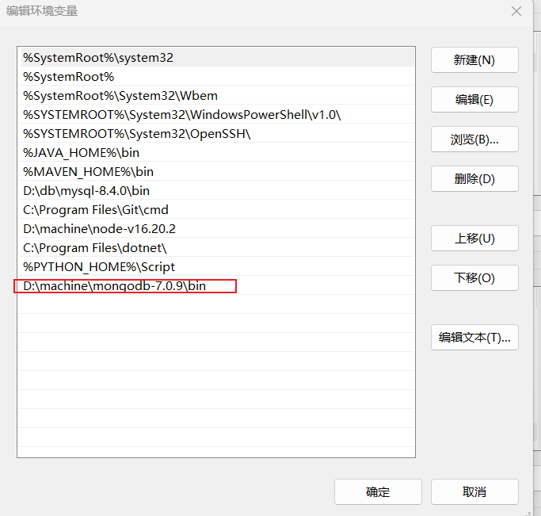

# 安装
https://www.mongodb.com/try/download/community

# 修改环境变量
- 添加 MONGODB_HOME 值为 F:\Program Files\mongodb
- 添加到path中  %MONGODB_HOME%\bin

# 创建目录
- mongodb/data/db
- mongodb/data/log/mongodb.log

# 新建mongodb.cfg文件并配置mongodb.cfg
dbpath=F:\machine\mongodb-7.0.7\data\db
logpath=F:\machine\mongodb-7.0.7\data\log\mongodb.log  
// mongodb.log 为文件

# bin目录下执行cmd
./mongod.exe --config "F:\machine\mongodb-7.0.7\mongodb.cfg"

#  在浏览器中访问 http://localhost:27017/ 

# 创建mongodb服务
./mongod.exe --config "F:\machine\mongodb-7.0.7\mongodb.cfg" --install --serviceName "MongoDB"

运行 net sart MongoDB

停止 net stop MongoDB

----
1. 添加系统变量

2. 创建数据目录
- /data/db 存放数据库相关信息
- /logs 存放启动运行过程的相关日志信息

3. 命令行参数方式启动
mongod --dbpath=D:\machine\mongodb-7.0.9\data\db --logpath=D:\machine\mongodb-7.0.9\logs\mongo.log
4. 浏览器访问，http://localhost:27017/
5. 命令行参数方式启动并将本次启动安装为系统服务
- 系统管理员权限启动命令行窗口
- 执行 mongod --dbpath=D:\machine\mongodb-7.0.9\data\db --logpath=D:\machine\mongodb-7.0.9\logs\mongo.log --install --serviceName mongodb
6. 检查服务是否存在，cmd -> services.msc
7. net start 后面跟的是要启动的服务名，停止服务只需要执行 net stop 服务名
8. 重装服务：mongod --reinstall --serviceName 服务名，移除服务：mongod --remove --serviceName 服务名
----