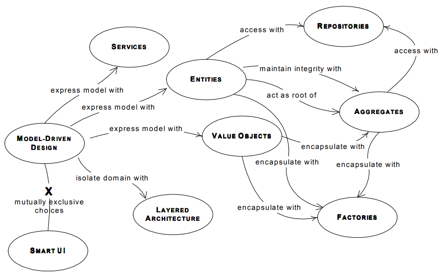
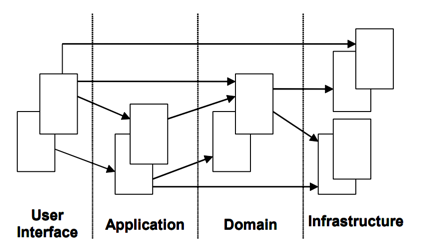

# Domain Driven Design Quickly

关注精简的业务模型及实现的匹配
面向对象思潮的回归与升华

```
在DDD以及传统OO的观点中，业务而不是技术是一个开放团队首先要关注的内容
模型驱动设计：MDD
模型驱动架构：MDA
```
## 模型
软件和领域和谐相处的最佳方式： 让软件成为领域的反射

---
领域专家：熟悉系统所有逻辑，痛点的业务人员
模型： 是对目标领域的内部展现方式，是必须的，会贯穿设计和开发的全过程
---
瀑布设计方法
- 知识只有单一的流向
- 问题：业务专家得不到分析人员的反馈信息，分析人员也得不到开发人员的反馈信息
---
敏捷方法（提倡简单）
- 产生背景：预先很难确定所有的需求或需求经常变化的情况
- 局限：
  - 每个人都对简单的意义都有自己的观点
  - 缺乏真实可见的设计原则

---
通过领域专家和软件专家的沟通，构建双方认可的初步模型

## 通用语言
领域驱动设计的一个核心的原则是使用一种基于模型的语言
通用语言：使用模型作为语言的核心骨架，要求团队在进行所有的交流都是使用一致的语言

UML擅长表现类，它们的属性和相互之间的关系，但类的行为和约束并不容易表现，UML不能表达一个模型的很重要的两个方面：它所要表现的概念的意义和对象准备做什么

由软件架构师、开发人员和领域专家构成的开发团队，需要一种语言来统一它们的行动，以帮助它们创建一个模型，并使用代码来表现模型。

## 模型驱动设计
软件开发过程的重点：它必须以业务领域为中心

任何领域都能被表现成多种模型，每一种模型都能用不同的方式表现成代码。

分析模型是业务领域分析的结果，其产生的模型不考虑软件需要如何实现。这个方法中存在的一个主要的问题是分析不能预见模型中存在的某些缺陷以及领域中的所有的复杂关系。

一个更好的方法是紧密关联领域建模和设计。

如果设计或者设计中的核心部分不能映射到领域模型，模型基本上就没有什么价值，而软件是否正确也就令人怀疑。

从模型中去除在设计中使用的术语和所赋予的基本职责后，代码就成了模型的表达式，所以对代码的一个变更就可能称为对模型的变更。

## 模型驱动设计的基本构成要素


分层架构


## 值对象
用来描述领域的特殊方面、且没有标识符的一个对象，叫做值对象。

## 服务
服务的 3个特征：
1. 服务执行的操作涉及一个领域概念，这个领域概念通常不属于一个实体或者值对象。
2. 被执行的操作涉及到领域中的其他的对象。
3. 操作是无状态的。

## 模块
使用模块的原因跟代码质量有关。普遍认为软件代码应该具有高层次的内聚性和低层次的耦合度。虽然内聚开始于类和方法级别，它也可以应用于模块级别。强烈推荐将高关联度的类分组到一个模块以提供尽可能大的内聚。有很多类型的内聚。最常用到的两个是通信性内聚和功能性内聚。通信性内聚通常在模块的部件操作相同的数据时使用。把它们分到一组很有意义，因为它们之间存在很强的关联性。功能性内聚在模块中的部件协同工作以完成定义好的任务时使用。这被认为是最佳的内聚类型

在设计中使用模块是一种增进内聚和消除耦合的方法

## 聚合
聚合是一个用来定义对象所有权和边界的领域模式。工厂和资源库是另外的两个设计模式，用来帮助处理对象的创建和存储问题。

聚合是针对数据变化可以考虑成一个单元的一组相关的对象。聚合使用边界将内部和外部的对象划分开来。每个聚合有一个根。这个根是一个实体，并且它是外部可以访问的唯一的对象。根可以保持对任意聚合对象的引用，并且其他的对象可以持有任意其他的对象，但一个外部对象只能持有根对象的引用。如果边界内有其他的实体，那些实体的标识符是本地化的，只在聚合内有意义。

## 工厂
工厂用来封装对象创建所必需的知识，它们对创建聚合特别有用。当聚合的根建立时，所有聚合包含的对象将随之建立，所有的不变量得到了强化。

有时工厂是不需要的，一个简单的构造函数就足够了。在如下情况下使用构造函数：
- 构造过程并不复杂。
- 对象的创建不涉及到其他对象的创建，所有的属性需要传递给构造函数。
- 客户程序对实现很感兴趣，可能希望选择使用策略模式。
- 类是特定的类型，不涉及到继承，所以不用在一系列的具体实现中进行选择。

## 资源库
使用一个资源库，它的目的是封装所有获取对象引用所需的逻辑。领域对象不需处理基础设施，以得到领域中对其他对象的所需的引用。只需从资源库中获取它们，于是模型重获它应有的清晰和焦点。

资源库作为一个全局的可访问对象的存储点而存在。
