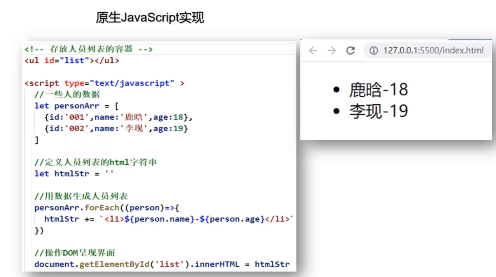
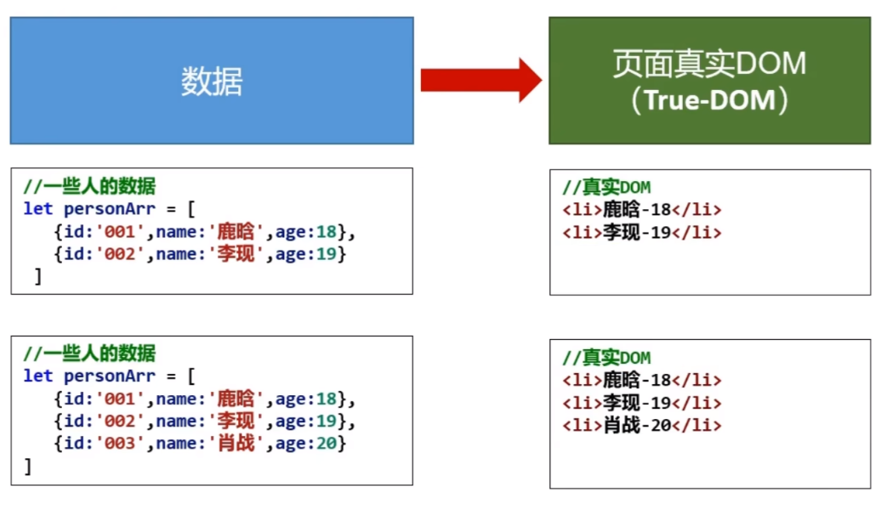
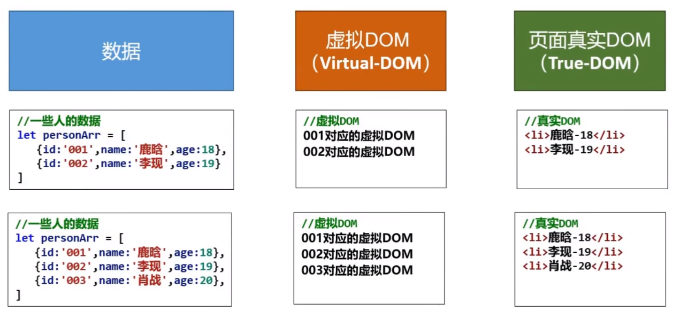
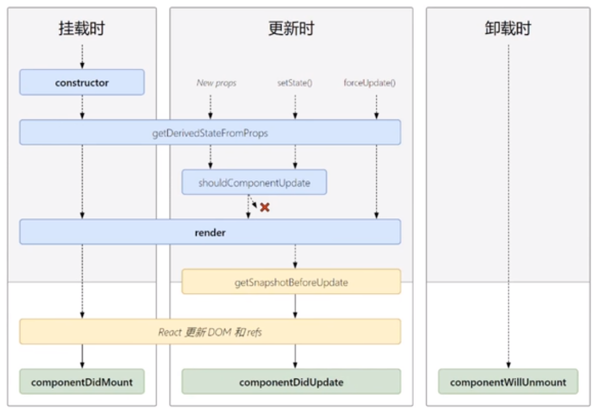

# 简介
一个将数据渲染为HTML视图的开源JavaScript库
# 原生的痛点
1. 原生JavaScript操作DOM繁琐，效率低（DOM-API操作UI）。
2. 使用JavaScript直接操作DOM，浏览器会进行大量的重绘重排。
3. 原生JavaScript没有组件化编码方案，代码复用率低。

# React的特点
1. 采用组件化模式、声明式编码，提高开发效率及组件复用率。
2. 在React Native中可以使用React语法进行移动端开发。
3. 使用虚拟DOM+优秀的Diffing算法，尽量减少与真实DOM的交互。

# 学习React之前需要掌握的JavaScript的基础知识
- 判断this的指向
- class（类）
- ES6语法规范
- npm包管理器
- 原型、原型链
- 数组常用方法
- 模块化

# 相关js库
1. react.js: React核心库
2. react-dom.js: 提供操作DOM的react扩展库
3. babel.min.js: 解析JSX语法代码转为JS代码的库

- JSX
  - 全称：JavaScript XML
  - react定义的一种类型XML的JS扩展语法：JS+XML
  - 本质是React.createElement(component,props,...children)方法的语法糖
  - 作用：用来简化创建虚拟DOM
    - 写法：var ele = <h1>Hello JSX!</h1>
    - 注意：不是字符串，也不是HTML/XML标签
    - 注意：最终产生就是一个JS对象
  - 标签名任意：HTML标签或者其他标签

> JSX 比 JS 优点
> 页面渲染时div容器不要求一定要放在body的上部（JS语法要求div容器内容放在body标签的上部）
> JSX帮助简单创建虚拟DOM
> JSX是JS的语法糖

# 模块与组件
- 模块
  - 向外提供特定功能的js程序，一般为一个js文件
  - 复用js，简化js的编写，提高js运行效率
- 模块化
  - 当应用的js都以模块来编写的，这个应用就是一个模块化的应用
- 组件
  - 用来实现局部功能效果的代码和资源的集合（html/css/js/image等等）
  - 复用编码，简化项目编码，提高运行效率
- 组件化
  - 当应用是以多组件的方式实现，这个应用就是一个组件化应用

> 简单组件和复杂组件
> 复杂组件有状态

# 组件三大核心属性
- state
1. state是组件对象最重要的属性，值是对象(可以包含多个key-value的组合)
2.  组件被称为状态机，通过更新组件state来更新对应的页面显示（重新渲染组件） 
3. 组件中render方法中的this为组件实例对象
4. 组件自定义的方法中this为undefined
   1. 强制绑定this：通过函数对象的bind()
   2. 箭头函数
5. 状态数据，不能直接修改或更新

- pros
1. 每个组件对象都会有props属性
2. 组件标签的所有属性都保存在props中
3. 通过标签属性从组件外向组件内传递变化的数据
4. 组件内部不要修改props数据

- ref
1. 组件内的标签可以定义ref属性来标识自己

# 常用的语法
- 常用的语法
  - ES5创建元素：React.createElement('li', {}, 'hello')
  - 页面刷新与元素绑定：ReactDOM.render(_ul, document.getElementById('root2'))
  - 声明使用ES6语法：<script type="text/babel">

# 函数式组件和类式组件

# 组件分类，受控组件和非受控组件
[10_1非受控组件.html](01%D1%A7%CF%B0%2F10_1%B7%C7%CA%DC%BF%D8%D7%E9%BC%FE.html)
[10_2受控组件.html](01%D1%A7%CF%B0%2F10_2%CA%DC%BF%D8%D7%E9%BC%FE.html)

# 高阶函数
如果一个函数符合下面2个规范的任何一个，那该函数就是高阶函数
1. 若A函数，接收的参数是一个函数，那么A就可以称之为高阶函数
2. 若A函数，调用的返回值依然是一个函数，那么A就可以称之为高阶函数

函数的柯里化：通过函数调用继续返回函数的方式，实现多次接收参数最后统一处理的函数编码方式

# 组件的生命周期
1. 组件对象从创建到死亡会经历特定阶段
2. React组件对象包含一系列钩子函数（生命周期回调函数），在特定的时刻调用
3. 在定义组件时，在特定的生命周期回调函数，处理特定的工作

.png)
> 生命周期三个阶段
> 1. 初始化阶段：由ReactDom.render()触发，初次渲染
>    2. constructor()
>    3. componentWillMount()
>    4. render()
>    5. componentDidMount()：一些初始化的事情，如：开启定时器，发送网络请求，订阅消息
> 2. 更新阶段：由组件内部this.setState()或者父组件重新render触发
>    3. shouldComponentUpdate()
>    4. componentWillUpdate()
>    5. render()：
>    6. componentDidUpdate()
> 3. 卸载组件：由ReactDOM.unmountComponentAtNode()触发
>    4. componentWillUnmount()：一般用于处理收尾的工作，如关闭定时器，取消订阅

- line 1
  - 父组件 
  - componentWillReceiveProps
  - shouldComponentUpdate
  - componentWillUpdate
  - render
- componentDidUpdate
- line 2
  - setState
  - shouldComponentUpdate
  - componentWillUpdate
  - render
  - componentDidUpdate
- line 3
  - forceUpdate
  - componentWillUpdate
  - render
  - componentDidUpdate

---
react脚手架
- xxx 脚手架: 用来帮助程序员快速创建一个基于 xxx 库的模板项目
1. 包含了所有需要的配置(语法检查、jsx编译、devServer...)+
2. 下载好了所有相关的依赖
3. 可以直接运行一个简单效果
- react 提供了一个用于创建react 项目的脚手架库: create-react-app
- 项目的整体技术架构为:react+webpack+es6+eslint3.
- 使用脚手架开发的项目的特点: 模块化、 组件化、 工程化

创建项目并启动
第一步，全局安装:npm install -g create-react-app
第二步，切换到想创项目的目录，使用命令:create-react-app hello-react
第三步，进入项目文件夹:cd hello-react
第四步，启动项目:npm start 

--- 
hello-react
项目说明：
/node_modules: 项目依赖包
/public: 静态资源
/public/favicon.ico: 网站页签的图标
/public/index.html: 应用主页面
/public/manifest.json: 应用加壳的配置文件
/public/robots.txt: 爬虫协议文件
/src: 源码文件夹
/src/App.css: App组件的样式
/src/App.js: App组件
/src/App.test.js: 用于给App做测试
/src/index.css: 样式
/src/index.js: 入口文件
/src/logo.svg: logo图
/src/reportWebVitals.js: 页面性能分析文件(需要web-vitals库的支持)
/src/setupTest.js: 组件测试

