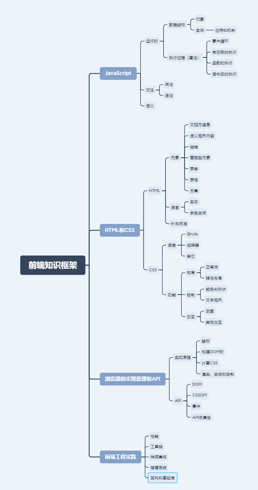

# HTML 和 CSS
## 标签分类
1. 文档元信息：通常是出现在 head 标签中的元素，包含了描述文档自身的一些信息；
2. 语义相关：扩展了纯文本，表达文章结构、不同语言要素的标签；
3. 链接：提供到文档内和文档外的链接；
4. 替换型标签：引入声音、图片、视频等外部元素替换自身的一类标签；
5. 表单：用于填写和提交信息的一类标签；
6. 表格：表头、表尾、单元格等表格的结构。

## 语义标签
语义是我们说话表达的意思，多数的语义实际上都是由文字来承载的。语义类标签则是纯文字的补充，比如标题、自然段、章节、列表，这些内容都是纯文字无法表达的，我们需要依靠语义标签代为表达。

语义标签的好处
- 语义类标签对开发者更为友好，使用语义类标签增强了可读性，即便是在没有 CSS 的时候，开发者也能够清晰地看出网页的结构，也更为便于团队的开发和维护。
- 除了对人类友好之外，语义类标签也十分适宜机器阅读。它的文字表现力丰富，更适合搜索引擎检索（SEO），也可以让搜索引擎爬虫更好地获取到更多有效信息，有效提升网页的搜索量，并且语义类还可以支持读屏软件，根据文章可以自动生成目录等等。

> 在 hgroup 中的 h1-h6 被视为同一标题的不同组成部分。
```html
<hgroup>
<h1>JavaScript 对象 </h1>
<h2> 我们需要模拟类吗？</h2>
</hgroup>
<p>balah balah</p>
```

> section 的嵌套会使得其中的 h1-h6 下降一级
```html
<section>
    <h1>HTML 语义 </h1>
    <p>balah balah balah balah</p>
    <section>
        <h1> 弱语义 </h1>
        <p>balah balah</p>
    </section>
    <section>
        <h1> 结构性元素 </h1>
        <p>balah balah</p> 
    </section>
</section>
```

> header，如其名，通常出现在前部，表示导航或者介绍性的内容。

> footer，通常出现在尾部，包含一些作者信息、相关链接、版权信息等。

> header 和 footer 一般都是放在 article 或者 body 的直接子元素，但是标准中并没有明确规定，footer 也可以和 aside，nav，section 相关联（header 不存在关联问题）。 

> aside 表示跟文章主体不那么相关的部分，它可能包含导航、广告等工具性质的内容。
> aside 和 header 中都可能出现导航（nav 标签），二者的区别是，header 中的导航多数是到文章自己的目录，而 aside 中的导航多数是到关联页面或者是整站地图。

>  footer 中包含 address，这是个非常容易被误用的标签。address 并非像 date 一样，表示一个给机器阅读的地址，而是表示“文章（作者）的联系方式”，address 明确地只关联到 article 和 body。

| 标签       | 说明                                                  |
|----------|-----------------------------------------------------|
| small    | 之前表示字体缩小的废弃标签，HTML5救回来表示补充评论                        |
| s        | 之前表示划线的废弃标签，HTML5救回来表示错误的内容，经常用于电商领域表示打折前的价格        |
| i        | 之前表示斜体的废弃标签，HTML5救回来表示读的时候变调。                       |
| b        | 之前表示黑体的废弃标签，HTML5救回来表示关键字。                          |
| u        | 之前表示下划线的废弃标签，HTML5救回来表示避免歧义的注记                      |
| data     | 跟time标签类似，给机器阅读的内容，意义广泛，可以自由定义                      |
| var      | 变量，多用于计算机和数学领域。                                     | 
| kbd      | 用户输入，表示键盘按键居多                                       |
| sub      | 下标，多用于化学/物理/数学领域                                    |
| sup      | 上标，多用于化学/物理/数学领域。                                   |
| bdi,bdo  | 用于多语言混合时指定语言或者书写方向(左到右或者右到左)。                       |
| mark     | 表示高亮，这里并非指显示为高亮，而是从读者角度希望的高亮(注意与strong的区分)          |
| wbr      | 表示可以换行的位置，主要是英文等文字不允许单词中间换行，这个标签一般在把多个单词粘成很长的单词时候用。 |
| menu     | ul的变体，用于功能菜单时使用。                                    |
| dl,dd,dt | 一般出现较为严肃的文章，对一些术语进行定义，dt和dd其实并不总是成对出现，两者是多对多的关系。    |
| main     | 整个页面只出现一个，，表示页面的主要内容，可以理解为特殊的div。                   |

## JavaScript类型
JavaScript 语言规定了 7 种语言类型。语言类型广泛用于变量、函数参数、表达式、函数返回值等场合。
1. Undefined；
2. Null；
3. Boolean；
4. String；
5. Number； 
6. Symbol； 
7. Object。

### Undefined、Null
- 为什么有的编程规范要求用 void 0 代替 undefined？ 
  - 一般我们可以用全局变量 undefined（就是名为 undefined 的这个变量）来表达这个值，或者 void 运算来把任意一个表达式变成 undefined 值。
  - 因为 JavaScript 的代码 undefined 是一个变量，而并非是一个关键字，这是 JavaScript 语言公认的设计失误之一，所以，我们为了避免无意中被篡改，我建议使用 void 0 来获取 undefined 值。Undefined 跟 null 有一定的表意差别，null 表示的是：“定义了但是为空”。所以，在实际编程时，我们一般不会把变量赋值为 undefined，这样可以保证所有值为 undefined 的变量，都是从未赋值的自然状态。
  - Null 类型也只有一个值，就是 null，它的语义表示空值，与 undefined 不同，null 是 JavaScript 关键字，所以在任何代码中，你都可以放心用 null 关键字来获取 null 值。

### Boolean
Boolean 类型有两个值， true 和 false，它用于表示逻辑意义上的真和假，同样有关键字 true 和 false 来表示两个值。

### String
- 字符串是否有最大长度。
  - String 用于表示文本数据。String 有最大长度是 2^53 - 1，这在一般开发中都是够用的，但是有趣的是，这个所谓最大长度，并不完全是你理解中的字符数。
  - String 的意义并非“字符串”，而是字符串的 UTF16 编码，我们字符串的操作 charAt、charCodeAt、length 等方法针对的都是 UTF16 编码。所以，字符串的最大长度，实际上是受字符串的编码长度影响的。
  - JavaScript 中的字符串是永远无法变更的，一旦字符串构造出来，无法用任何方式改变字符串的内容，所以字符串具有值类型的特征。
  - JavaScript 字符串把每个 UTF16 单元当作一个字符来处理，所以处理非 BMP（超出 U+0000 - U+FFFF 范围）的字符时，你应该格外小心。

> 现行的字符集国际标准，字符是以 Unicode 的方式表示的，每一个 Unicode 的码点表示一个字符，理论上，Unicode 的范围是无限的。UTF 是 Unicode 的编码方式，规定了码点在计算机中的表示方法，常见的有 UTF16 和 UTF8。 Unicode 的码点通常用 U+??? 来表示，其中 ??? 是十六进制的码点值。 0-65536（U+0000 - U+FFFF）的码点被称为基本字符区域（BMP）

### Number
JavaScript 中的 Number 类型有 18437736874454810627(即 2^64-2^53+3) 个值。

JavaScript 为了表达几个额外的语言场景（比如不让除以 0 出错，而引入了无穷大的概念），规定了几个例外情况：
- NaN，占用了 9007199254740990，这原本是符合 IEEE 规则的数字；
- Infinity，无穷大；
- -Infinity，负无穷大。

> 值得注意的是，JavaScript 中有 +0 和 -0，在加法类运算中它们没有区别，但是除法的场合则需要特别留意区分，“忘记检测除以 -0，而得到负无穷大”的情况经常会导致错误，而区分 +0 和 -0 的方式，正是检测 1/x 是 Infinity 还是 -Infinity。

> 根据双精度浮点数的定义，Number 类型中有效的整数范围是 -0x1fffffffffffff 至 0x1fffffffffffff，所以 Number 无法精确表示此范围外的整数。

- 为什么在 JavaScript 中，0.1+0.2 不能 =0.3
  - 根据浮点数的定义，非整数的 Number 类型无法用 ==（=== 也不行） 来比较
  - console.log( 0.1 + 0.2 == 0.3); 这里输出的结果是 false，说明两边不相等的，这是浮点运算的特点，也是很多同学疑惑的来源，浮点数运算的精度问题导致等式左右的结果并不是严格相等，而是相差了个微小的值。
  - 实际上，这里错误的不是结论，而是比较的方法，正确的比较方法是使用 JavaScript 提供的最小精度值：
  - console.log( Math.abs(0.1 + 0.2 - 0.3) <= Number.EPSILON);检查等式左右两边差的绝对值是否小于最小精度，才是正确的比较浮点数的方法。这段代码结果就是 true 了.

### Symbol
Symbol 是 ES6 中引入的新类型，它是一切非字符串的对象 key 的集合，在 ES6 规范中，整个对象系统被用 Symbol 重塑。  
Symbol 可以具有字符串类型的描述，但是即使描述相同，Symbol 也不相等。  
创建 Symbol 的方式是使用全局的 Symbol 函数。  
```js
var mySymbol = Symbol("my symbol");
```

一些标准中提到的 Symbol，可以在全局的 Symbol 函数的属性中找到。可以使用 Symbol.iterator 来自定义 for…of 在对象上的行为：
```js
var o = new Object
 
    o[Symbol.iterator] = function() {
        var v = 0
        return {
            next: function() {
                return { value: v++, done: v > 10 }
            }
        }        
    };
 
    for(var v of o) 
        console.log(v); // 0 1 2 3 ... 9
```

### Object
Object 表示对象的意思，它是一切有形和无形物体的总称。  
在 JavaScript 中，对象的定义是“属性的集合”。属性分为数据属性和访问器属性，二者都是 key-value 结构，key 可以是字符串或者 Symbol 类型。  
事实上，JavaScript 中的“类”仅仅是运行时对象的一个私有属性，而 JavaScript 中是无法自定义类型的。

JavaScript 中的几个基本类型，都在对象类型中有一个“亲戚”。
- Number；
- String；
- Boolean；
- Symbol。
> 我们必须认识到 3 与 new Number(3) 是完全不同的值，它们一个是 Number 类型， 一个是对象类型。

> Number、String 和 Boolean，三个构造器是两用的，当跟 new 搭配时，它们产生对象，当直接调用时，它们表示强制类型转换

> Symbol 函数比较特殊，直接用 new 调用它会抛出错误，但它仍然是 Symbol 对象的构造器。

JavaScript 语言设计上试图模糊对象和基本类型之间的关系，我们日常代码可以把对象的方法在基本类型上使用
```js
console.log("abc".charAt(0)); //a
```
在原型上添加方法，都可以应用于基本类型，比如以下代码，在 Symbol 原型上添加了 hello 方法，在任何 Symbol 类型变量都可以调用。
```js
Symbol.prototype.hello = () => console.log("hello");
 
var a = Symbol("a");
console.log(typeof a); //symbol，a 并非对象
a.hello(); //hello，有效
```

- 为什么给对象添加的方法能用在基本类型上？
  -  运算符提供了装箱操作，它会根据基础类型构造一个临时对象，使得我们能在基础类型上调用对应对象的方法。

## 类型转换
因为 JS 是弱类型语言，所以类型转换发生非常频繁，大部分我们熟悉的运算都会先进行类型转换。大部分类型转换符合人类的直觉，但是如果我们不去理解类型转换的严格定义，很容易造成一些代码中的判断失误。

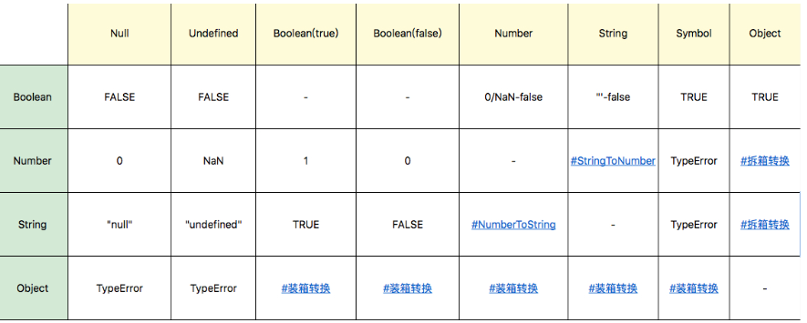

### StringToNumber
字符串到数字的类型转换，存在一个语法结构，类型转换支持十进制、二进制、八进制和十六进制，比如：
- 30；
- 0b111；
- 0o13；
- 0xFF。

JavaScript 支持的字符串语法还包括正负号科学计数法，可以使用大写或者小写的 e 来表示：
- 1e3；
- -1e-2。

> 需要注意的是，parseInt 和 parseFloat 并不使用这个转换，所以支持的语法跟这里不尽相同。
> 在不传入第二个参数的情况下，parseInt 只支持 16 进制前缀“0x”，而且会忽略非数字字符，也不支持科学计数法。
> 在一些古老的浏览器环境中，parseInt 还支持 0 开头的数字作为 8 进制前缀，这是很多错误的来源。所以在任何环境下，都建议传入 parseInt 的第二个参数，而 parseFloat 则直接把原字符串作为十进制来解析，它不会引入任何的其他进制。

> 多数情况下，Number 是比 parseInt 和 parseFloat 更好的选择。

### NumberToString
在较小的范围内，数字到字符串的转换是完全符合你直觉的十进制表示。当 Number 绝对值较大或者较小时，字符串表示则是使用科学计数法表示的。

### 装箱转换
每一种基本类型 Number、String、Boolean、Symbol 在对象中都有对应的类，所谓装箱转换，正是把基本类型转换为对应的对象，它是类型转换中一种相当重要的种类。  
前文提到，全局的 Symbol 函数无法使用 new 来调用，但我们仍可以利用装箱机制来得到一个 Symbol 对象，我们可以利用一个函数的 call 方法来强迫产生装箱。

定义一个函数，函数里面只有 return this，然后我们调用函数的 call 方法到一个 Symbol 类型的值上，这样就会产生一个 symbolObject。

可以用 console.log 看一下这个东西的 type of，它的值是 object，我们使用 symbolObject instanceof 可以看到，它是 Symbol 这个类的实例，我们找它的 constructor 也是等于 Symbol 的，所以我们无论从哪个角度看，它都是 Symbol 装箱过的对象：
```js
var symbolObject = (function(){ return this; }).call(Symbol("a"));

console.log(typeof symbolObject); //object
console.log(symbolObject instanceof Symbol); //true
console.log(symbolObject.constructor == Symbol); //true
```
> 装箱机制会频繁产生临时对象，在一些对性能要求较高的场景下，我们应该尽量避免对基本类型做装箱转换。

使用内置的 Object 函数，我们可以在 JavaScript 代码中显式调用装箱能力。
```js
var symbolObject = Object(Symbol("a"));

console.log(typeof symbolObject); //object
console.log(symbolObject instanceof Symbol); //true
console.log(symbolObject.constructor == Symbol); //true
```
每一类装箱对象皆有私有的 Class 属性，这些属性可以用 Object.prototype.toString 获取：
```js
var symbolObject = Object(Symbol("a"));

console.log(Object.prototype.toString.call(symbolObject)); //[object Symbol]
```

> 在 JavaScript 中，没有任何方法可以更改私有的 Class 属性，因此 Object.prototype.toString 是可以准确识别对象对应的基本类型的方法，它比 instanceof 更加准确。但需要注意的是，call 本身会产生装箱操作，所以需要配合 typeof 来区分基本类型还是对象类型。

 ### 拆箱转换
在 JavaScript 标准中，规定了 ToPrimitive 函数，它是对象类型到基本类型的转换（即，拆箱转换）.  
对象到 String 和 Number 的转换都遵循“先拆箱再转换”的规则。通过拆箱转换，把对象变成基本类型，再从基本类型转换为对应的 String 或者 Number。  

拆箱转换会尝试调用 valueOf 和 toString 来获得拆箱后的基本类型。如果 valueOf 和 toString 都不存在，或者没有返回基本类型，则会产生类型错误 TypeError。
```js
var o = {
    valueOf : () => {console.log("valueOf"); return {}},
    toString : () => {console.log("toString"); return {}}
}

o * 2
// valueOf
// toString
// TypeError
// 定义了一个对象 o，o 有 valueOf 和 toString 两个方法，这两个方法都返回一个对象，然后我们进行 o*2 这个运算的时候，你会看见先执行了 valueOf，接下来是 toString，最后抛出了一个 TypeError，这就说明了这个拆箱转换失败了。
```

到 String 的拆箱转换会优先调用 toString。我们把刚才的运算从 o*2 换成 String(o)，那么你会看到调用顺序就变了。
```js
var o = {
    valueOf : () => {console.log("valueOf"); return {}},
    toString : () => {console.log("toString"); return {}}
}

String(o)
// toString
// valueOf
// TypeError
```

在 ES6 之后，还允许对象通过显式指定 @@toPrimitive Symbol 来覆盖原有的行为。
```js
var o = {
    valueOf : () => {console.log("valueOf"); return {}},
    toString : () => {console.log("toString"); return {}}
}

o[Symbol.toPrimitive] = () => {console.log("toPrimitive"); return "hello"}


console.log(o + "")
// toPrimitive
// hello
```
除了这七种语言类型，还有一些语言的实现者更关心的规范类型。
- List 和 Record： 用于描述函数传参过程。
- Set：主要用于解释字符集等。
- Completion Record：用于描述异常、跳出等语句执行过程。
- Reference：用于描述对象属性访问、delete 等。
- Property Descriptor：用于描述对象的属性。
- Lexical Environment 和 Environment Record：用于描述变量和作用域。
- Data Block：用于描述二进制数据。

事实上，“类型”在 JavaScript 中是一个有争议的概念。一方面，标准中规定了运行时数据类型； 另一方面，JS 语言中提供了 typeof 这样的运算，用来返回操作数的类型，但 typeof 的运算结果，与运行时类型的规定有很多不一致的地方。
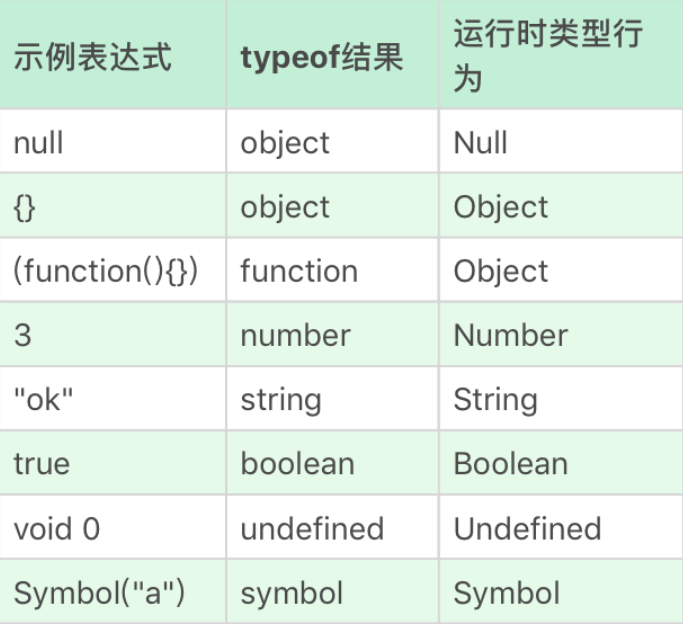

# JavaScript对象

## JavaScript 对象的特征
- 对象具有唯一标识性：即使完全相同的两个对象，也并非同一个对象。
- 对象有状态：对象具有状态，同一对象可能处于不同状态之下。
- 对象具有行为：即对象的状态，可能因为它的行为产生变迁。

> 对象具有唯一标识性。一般而言，各种语言的对象唯一标识性都是用内存地址来体现的， 对象具有唯一标识的内存地址，所以具有唯一的标识。
```js
var o1 = { a: 1 };
var o2 = { a: 1 };
console.log(o1 == o2); // false
```

在 JavaScript 中，将状态和行为统一抽象为“属性”，考虑到 JavaScript 中将函数设计成一种特殊对象，所以 JavaScript 中的行为和状态都能用属性来抽象。
```js
var o = { 
    d: 1,
    f() {
        console.log(this.d);
    }    
};
// 展示了普通属性和函数作为属性的一个例子，其中 o 是对象，d 是一个属性，而函数 f 也是一个属性，尽管写法不太相同，但是对 JavaScript 来说，d 和 f 就是两个普通属性。
```

> 对象具有高度的动态性，这是因为 JavaScript 赋予了使用者在运行时为对象添改状态和行为的能力。JavaScript 允许运行时向对象添加属性，这就跟绝大多数基于类的、静态的对象设计完全不同。

```js
var o = { a: 1 };
o.b = 2;
console.log(o.a, o.b); //1 2
// 这段代码就展示了运行时如何向一个对象添加属性，一开始我定义了一个对象 o，定义完成之后，再添加它的属性 b
```

## JavaScript 对象的两类属性
第一类属性，数据属性
- value：就是属性的值。
- writable：决定属性能否被赋值。
- enumerable：决定 for in 能否枚举该属性。
- configurable：决定该属性能否被删除或者改变特征值。

第二类属性是访问器（getter/setter）属性
- getter：函数或 undefined，在取属性值时被调用。
- setter：函数或 undefined，在设置属性值时被调用。
- enumerable：决定 for in 能否枚举该属性。
- configurable：决定该属性能否被删除或者改变特征值。

访问器属性使得属性在读和写时执行代码，它允许使用者在写和读属性时，得到完全不同的值，它可以视为一种函数的语法糖。

通常用于定义属性的代码会产生数据属性，其中的 writable、enumerable、configurable 都默认为 true。我们可以使用内置函数 Object.getOwnPropertyDescripter 来查看
```js
var o = { a: 1 };
o.b = 2;
//a 和 b 皆为数据属性
Object.getOwnPropertyDescriptor(o,"a") // {value: 1, writable: true, enumerable: true, configurable: true}
Object.getOwnPropertyDescriptor(o,"b") // {value: 2, writable: true, enumerable: true, configurable: true}
```

改变属性的特征，或者定义访问器属性，我们可以使用 Object.defineProperty
```js
var o = { a: 1 };
Object.defineProperty(o, "b", {value: 2, writable: false, enumerable: false, configurable: true});
//a 和 b 都是数据属性，但特征值变化了
Object.getOwnPropertyDescriptor(o,"a"); // {value: 1, writable: true, enumerable: true, configurable: true}
Object.getOwnPropertyDescriptor(o,"b"); // {value: 2, writable: false, enumerable: false, configurable: true}
o.b = 3;
console.log(o.b); // 2
```

## JavaScript 的原型
原型系统
- 如果所有对象都有私有字段 [[prototype]]，就是对象的原型；
- 读一个属性，如果对象本身没有，则会继续访问对象的原型，直到原型为空或者找到为止。

JavaScript 提供了一系列内置函数，以便更为直接地访问操纵原型
- Object.create 根据指定的原型创建新对象，原型可以是 null；
- Object.getPrototypeOf 获得一个对象的原型；
- Object.setPrototypeOf 设置一个对象的原型。

new 运算接受一个构造器和一组调用参数
- 以构造器的 prototype 属性（注意与私有字段 [[prototype]] 的区分）为原型，创建新对象；
- 将 this 和调用参数传给构造器，执行；
- 如果构造器返回的是对象，则返回，否则返回第一步创建的对象。

### ES6 中的类
类的写法实际上也是由原型运行时来承载的，逻辑上 JavaScript 认为每个类是有共同原型的一组对象，类中定义的方法和属性则会被写在原型对象之上。

## JavaScript 中的对象分类
- 宿主对象（host Objects）：由 JavaScript 宿主环境提供的对象，它们的行为完全由宿主环境决定。
- 内置对象（Built-in Objects）：由 JavaScript 语言提供的对象。
  - 固有对象（Intrinsic Objects ）：由标准规定，随着 JavaScript 运行时创建而自动创建的对象实例。
  - 原生对象（Native Objects）：可以由用户通过 Array、RegExp 等内置构造器或者特殊语法创建的对象。
  - 普通对象（Ordinary Objects）：由{}语法、Object 构造器或者 class 关键字定义类创建的对象，它能够被原型继承。

### 宿主对象
浏览器环境中的宿主: window、document

### 内置对象·固有对象
固有对象在任何 JS 代码执行前就已经被创建出来了，它们通常扮演者类似基础库的角色。

ECMA标准提供的固有对象表：https://262.ecma-international.org/9.0/index.html#sec-well-known-intrinsic-objects

### 内置对象·原生对象
能够通过语言本身的构造器创建的对象称作原生对象。

原生对象分类
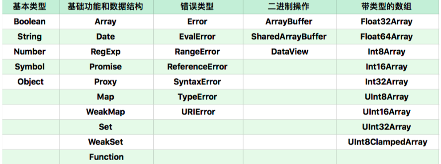

这些构造器创建的对象多数使用了私有字段, 例如：
- Error: [[ErrorData]]
- Boolean: [[BooleanData]]
- Number: [[NumberData]]
- Date: [[DateValue]]
- RegExp: [[RegExpMatcher]]
- Symbol: [[SymbolData]]
- Map: [[MapData]]

### 函数对象与构造器对象
函数对象的定义是：具有 [[call]] 私有字段的对象，构造器

对象的定义是：具有私有字段 [[construct]] 的对象。

JavaScript 用对象模拟函数的设计代替了一般编程语言中的函数，它们可以像其它语言的函数一样被调用、传参。任何宿主只要提供了“具有 [[call]] 私有字段的对象”，就可以被 JavaScript 函数调用语法支持。
> [[call]] 私有字段必须是一个引擎中定义的函数，需要接受 this 值和调用参数，并且会产生域的切换

任何对象只需要实现 [[call]]，它就是一个函数对象，可以去作为函数被调用。而如果它能实现 [[construct]]，它就是一个构造器对象，可以作为构造器被调用。

用户用 function 关键字创建的函数必定同时是函数和构造器

[[construct]] 的执行过程如下
-  Object.protoype 为原型创建一个新对象；
- 新对象为 this，执行函数的 [[call]]；
- 果 [[call]] 的返回值是对象，那么，返回这个对象，否则返回第一步创建的新对象。

```js
function cls(){
    this.a = 100;
    return {
        getValue:() => this.a
    }
}
var o = new cls;
o.getValue(); //100
//a 在外面永远无法访问到
// 如果我们的构造器返回了一个新的对象，那么 new 创建的新对象就变成了一个构造函数之外完全无法访问的对象，这一定程度上可以实现“私有”。
```

### 特殊行为的对象
- Array：Array 的 length 属性根据最大的下标自动发生变化。
- Object.prototype：作为所有正常对象的默认原型，不能再给它设置原型了。
- String：为了支持下标运算，String 的正整数属性访问会去字符串里查找。
- Arguments：arguments 的非负整数型下标属性跟对应的变量联动。
- 模块的 namespace 对象：特殊的地方非常多，跟一般对象完全不一样，尽量只用于 import 吧。
- 类型数组和数组缓冲区：跟内存块相关联，下标运算比较特殊。
- bind 后的 function：跟原来的函数相关联。

```
获取全部 JavaScript 固有对象
三个值：
Infinity、NaN、undefined。

九个函数：
eval
isFinite
isNaN
parseFloat
parseInt
decodeURI
decodeURIComponent
encodeURI
encodeURIComponent

一些构造器：
Array、Date、RegExp、Promise、Proxy、Map、WeakMap、Set、WeapSet、Function、Boolean、String、Number、Symbol、Object、Error、EvalError、RangeError、ReferenceError、SyntaxError、TypeError
URIError、ArrayBuffer、SharedArrayBuffer、DataView、Typed Array、Float32Array、Float64Array、Int8Array、Int16Array、Int32Array、UInt8Array、UInt16Array、UInt32Array、UInt8ClampedArray。

四个用于当作命名空间的对象：
Atomics
JSON
Math
Reflect

```
## CSS语法
https://www.w3.org/TR/?title=css


CSS 的顶层样式表由两种规则组成的规则列表构成，一种被称为 at-rule，也就是 at 规则，另一种是 qualified rule，也就是普通规则。

at-rule 由一个 @ 关键字和后续的一个区块组成，如果没有区块，则以分号结束。这些 at-rule 在开发中使用机会远远小于普通的规则，所以它的大部分内容，你可能会感觉很陌生。
```
@charset ： https://www.w3.org/TR/css-syntax-3/
@import ：https://www.w3.org/TR/css-cascade-4/
@media ：https://www.w3.org/TR/css3-conditional/
@page ： https://www.w3.org/TR/css-page-3/
@counter-style ：https://www.w3.org/TR/css-counter-styles-3
@keyframes ：https://www.w3.org/TR/css-animations-1/
@fontface ：https://www.w3.org/TR/css-fonts-3/
@supports ：https://www.w3.org/TR/css3-conditional/
@namespace ：https://www.w3.org/TR/css-namespaces-3/
```
### @charset
@charset 用于提示 CSS 文件使用的字符编码方式，它如果被使用，必须出现在最前面。这个规则只在给出语法解析阶段前使用，并不影响页面上的展示效果。
```css
@charset "utf-8";
```
### @import
@import 用于引入一个 CSS 文件，除了 @charset 规则不会被引入，@import 可以引入另一个文件的全部内容。
```css
@import "mystyle.css";
@import url("mystyle.css");
```
### @import
```css
@import "mystyle.css";
@import url("mystyle.css");
```
```
@import [ <url> | <string> ]
        [ supports( [ <supports-condition> | <declaration> ] ) ]?
        <media-query-list>? ;
```

### @media
media 就是大名鼎鼎的 media query 使用的规则了，它能够对设备的类型进行一些判断。在 media 的区块内，是普通规则列表。
```css
@media print {
  body { font-size: 10pt }
}
```

### @page
page 用于分页媒体访问网页时的表现设置，页面是一种特殊的盒模型结构，除了页面本身，还可以设置它周围的盒。
```css
@page {
  size: 8.5in 11in;
  margin: 10%;

  @top-left {
    content: "Hamlet";
  }
  @top-right {
    content: "Page " counter(page);
  }
}
```

### @counter-style
counter-style 产生一种数据，用于定义列表项的表现。
```css
@counter-style triangle {
  system: cyclic;
  symbols: ‣;
  suffix: " ";
}
```

### @key-frames
keyframes 产生一种数据，用于定义动画关键帧。
```css
@keyframes diagonal-slide {
  from {
    left: 0;
    top: 0;
  }
 
  to {
    left: 100px;
    top: 100px;
  }
 
}
```

### @fontface
fontface 用于定义一种字体，icon font 技术就是利用这个特性来实现的。
```css
@font-face {
  font-family: Gentium;
  src: url(http://example.com/fonts/Gentium.woff);
}
 
p { font-family: Gentium, serif; }
```
### @support
support 检查环境的特性，它与 media 比较类似。

### @namespace
用于跟 XML 命名空间配合的一个规则，表示内部的 CSS 选择器全都带上特定命名空间。

### @viewport
用于设置视口的一些特性，不过兼容性目前不是很好，多数时候被 html 的 meta 代替。

### 其它
@color-profile 是 SVG1.0 引入的 CSS 特性，但是实现状况不怎么好。  
@document 还没讨论清楚，被推迟到了 CSS4 中。  
@font-feature-values 。todo 查一下。  

## 普通规则
qualified rule 主要是由选择器和声明区块构成。声明区块又由属性和值构成。
- 普通规则
  - 选择器
  - 声明列表
    - 属性
    - 值
      - 值的类型
      - 函数
### 选择器
https://www.w3.org/TR/selectors-4/

从语法结构可以看出，任何选择器，都是由几个符号结构连接的：空格、大于号、加号、波浪线、双竖线，这里需要注意一下，空格，即为后代选择器的优先级较低。

对每一个选择器来说，如果它不是伪元素的话，由几个可选的部分组成，标签类型选择器，id、class、属性和伪类，它们中只要出现一个，就构成了选择器。
如果它是伪元素，则在这个结构之后追加伪元素。只有伪类可以出现在伪元素之后。

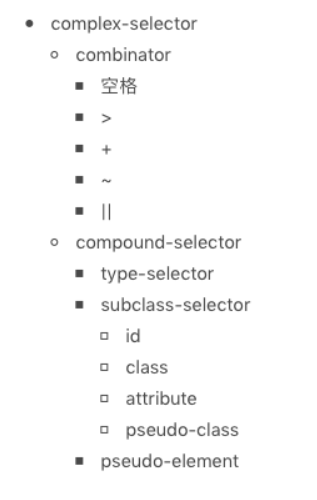
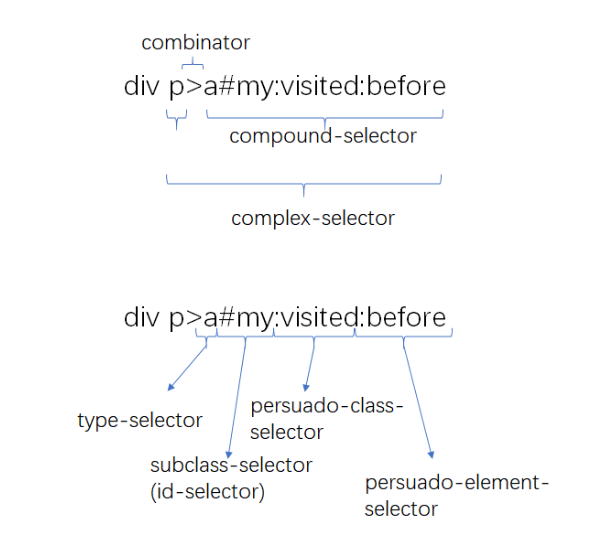

### 声明：属性和值
声明部分是一个由“属性: 值”组成的序列。

属性是由中划线、下划线、字母等组成的标识符，CSS 还支持使用反斜杠转义。 需要注意的是：属性不允许使用连续的两个中划线开头，这样的属性会被认为是 CSS 变量。
https://www.w3.org/TR/css-variables/
https://www.w3.org/TR/css-values-4/
```css
:root {
  --main-color: #06c; /* 以双中划线开头的属性被当作变量，*/
  --accent-color: #006;
}
/* The rest of the CSS file */
#foo h1 {
  color: var(--main-color);
}
```

CSS 属性值
- CSS 范围的关键字：initial，unset，inherit，任何属性都可以的关键字。
- 字符串：比如 content 属性。
- URL：使用 url() 函数的 URL 值。
- 整数 / 实数：比如 flex 属性。
- 维度：单位的整数 / 实数，比如 width 属性。
- 百分比：大部分维度都支持。
- 颜色：比如 background-color 属性。
- 图片：比如 background-image 属性。
- 2D 位置：比如 background-position 属性。
- 函数：来自函数的值，比如 transform 属性。

CSS 支持一批特定的计算型函数
- calc()
- max()
- min()
- clamp()
- toggle()
- attr()

calc()函数是基本的表达式计算，它支持加减乘除四则运算。在针对维度进行计算时，calc() 函数允许不同单位混合运算，这非常的有用。
```css
section {
  float: left;
  margin: 1em; border: solid 1px;
  width: calc(100%/3 - 2*1em - 2*1px);
}
```
max()、min() 和 clamp()则是一些比较大小的函数，max() 表示取两数中较大的一个，min() 表示取两数之中较小的一个，clamp() 则是给一个值限定一个范围，超出范围外则使用范围的最大或者最小值。

toggle() 函数在规则选中多于一个元素时生效，它会在几个值之间来回切换，比如我们要让一个列表项的样式圆点和方点间隔出现，可以使用下面代码：
```css
ul { list-style-type: toggle(circle, square); }
```
attr() 函数允许 CSS 接受属性值的控制。

## 浏览器
一个 URL 变成一个屏幕上显示的网页的过程
1. 浏览器首先使用 HTTP 协议或者 HTTPS 协议，向服务端请求页面；
2. 把请求回来的 HTML 代码经过解析，构建成 DOM 树；
3. 计算 DOM 树上的 CSS 属性；
4. 最后根据 CSS 属性对元素逐个进行渲染，得到内存中的位图；
5. 一个可选的步骤是对位图进行合成，这会极大地增加后续绘制的速度；
6. 合成之后，再绘制到界面上。

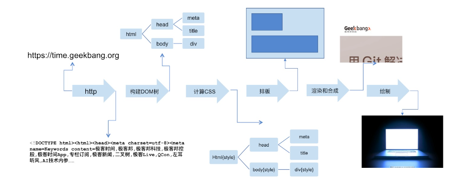

从 HTTP 请求回来，就产生了流式的数据，后续的 DOM 树构建、CSS 计算、渲染、合成、绘制，都是尽可能地流式处理前一步的产出：即不需要等到上一步骤完全结束，就开始处理上一步的输出，这样我们在浏览网页时，才会看到逐步出现的页面。

### HTTP 协议

1. HTTP1.1 https://tools.ietf.org/html/rfc2616
2. HTTP1.1 https://tools.ietf.org/html/rfc7234

HTTP 协议是基于 TCP 协议出现的，对 TCP 协议来说，TCP 协议是一条双向的通讯通道，HTTP 在 TCP 的基础上，规定了 Request-Response 的模式。这个模式决定了通讯必定是由浏览器端首先发起的。

HTTP 是纯粹的文本协议，它是规定了使用 TCP 协议来传输文本格式的一个应用层协议。

### HTTP 协议格式
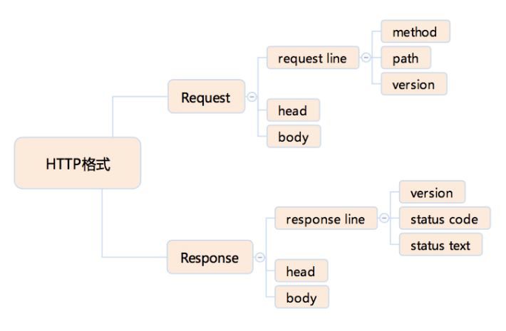

### HTTP Method（方法）
HTTP 请求希望执行的操作类型
- GET
- POST
- HEAD
- PUT
- DELETE
- CONNECT
- OPTIONS
- TRACE

浏览器通过地址栏访问页面都是 GET 方法。表单提交产生 POST 方法。  
HEAD 则是跟 GET 类似，只返回请求头，多数由 JavaScript 发起  
PUT 和 DELETE 分别表示添加资源和删除资源，但是实际上这只是语义上的一种约定，并没有强约束。  
CONNECT 现在多用于 HTTPS 和 WebSocket。  
OPTIONS 和 TRACE 一般用于调试，多数线上服务都不支持。  

### HTTP Status code（状态码）和 Status text（状态文本）
- 1xx：临时回应，表示客户端请继续。
- 2xx：请求成功。
  - 200：请求成功。
- 3xx: 表示请求的目标有变化，希望客户端进一步处理。
  - 301&302：永久性与临时性跳转。
  - 304：跟客户端缓存没有更新。
- 4xx：客户端请求错误。
  - 403：无权限。
  - 404：表示请求的页面不存在。
  - 418：It’s a teapot. 这是一个彩蛋，来自 ietf 的一个愚人节玩笑。（超文本咖啡壶控制协议）https://datatracker.ietf.org/doc/html/rfc2324
- 5xx：服务端请求错误。
  - 500：服务端错误
  - 503：服务端暂时性错误，可以一会再试。

1xx 系列的状态码是非常陌生的，原因是 1xx 的状态被浏览器 http 库直接处理掉了，不会让上层应用知晓。

### HTTP Head (HTTP 头)
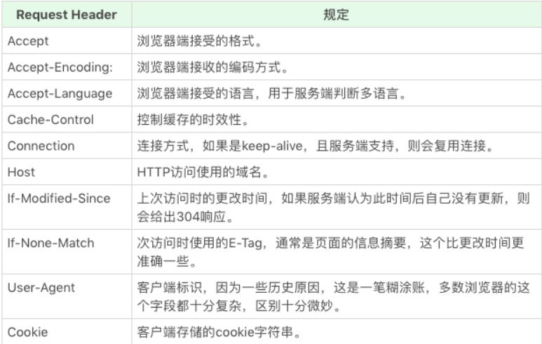

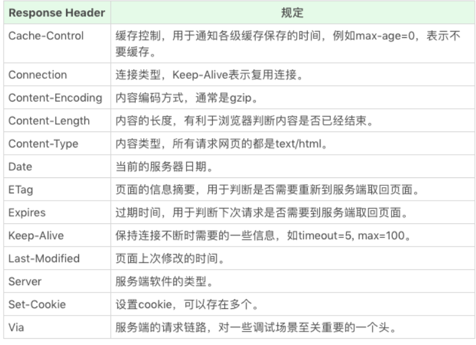

使用 html 的 form 标签提交产生的 html 请求，默认会产生 application/x-www-form-urlencoded 的数据格式，当有文件上传时，则会使用 multipart/form-data。

### HTTPS
HTTPS 有两个作用，一是确定请求的目标服务端身份，二是保证传输的数据不会被网络中间节点窃听或者篡改。

https://datatracker.ietf.org/doc/html/rfc2818

HTTPS 是使用加密通道来传输 HTTP 的内容。但是 HTTPS 首先与服务端建立一条 TLS 加密通道。TLS 构建于 TCP 协议之上，它实际上是对传输的内容做一次加密，所以从传输内容上看，HTTPS 跟 HTTP 没有任何区别。

### HTTP 2
https://datatracker.ietf.org/doc/html/rfc7540

HTTP 2.0 最大的改进有两点，一是支持服务端推送，二是支持 TCP 连接复用。

服务端推送能够在客户端发送第一个请求到服务端时，提前把一部分内容推送给客户端，放入缓存当中，这可以避免客户端请求顺序带来的并行度不高，从而导致的性能问题。

TCP 连接复用，则使用同一个 TCP 连接来传输多个 HTTP 请求，避免了 TCP 连接建立时的三次握手开销，和初建 TCP 连接时传输窗口小的问题。

## Dom tree 构建过程
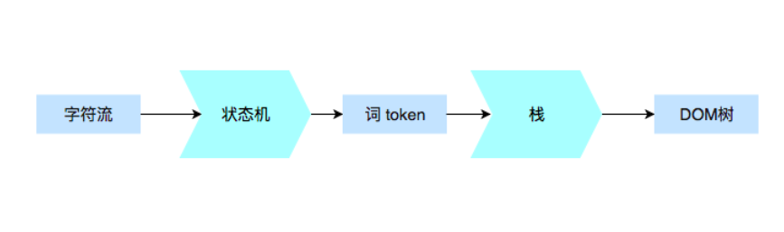

### 解析代码
常开发需要的 90% 的“词”（指编译原理的术语 token，表示最小的有意义的单元），种类大约只有标签开始、属性、标签结束、注释、CDATA 节点几种。
#### 词（token）是如何被拆分的
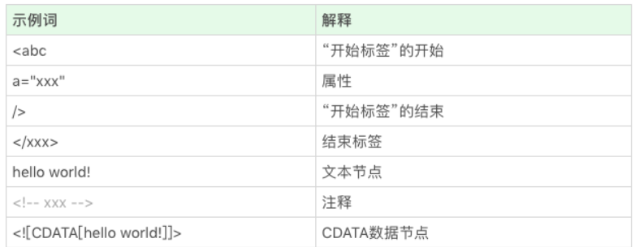

#### 状态机
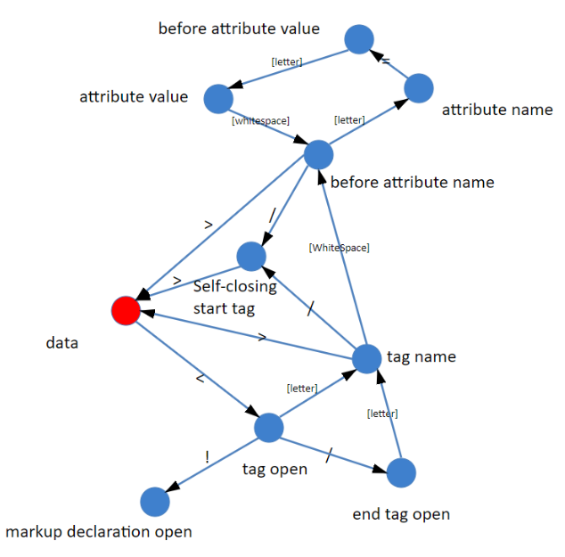

https://html.spec.whatwg.org/multipage/parsing.html#tokenization

状态机的初始状态，我们仅仅区分 “< ”和 “非 <”：  
- 如果获得的是一个非 < 字符，那么可以认为进入了一个文本节点；  
- 如果获得的是一个 < 字符，那么进入一个标签状态。  
不过当我们在标签状态时，则会面临着一些可能性。
- 比如下一个字符是“ ! ” ，那么很可能是进入了注释节点或者 CDATA 节点。
- 如果下一个字符是 “/ ”，那么可以确定进入了一个结束标签。
- 如果下一个字符是字母，那么可以确定进入了一个开始标签。
- 如果我们要完整处理各种 HTML 标准中定义的东西，那么还要考虑“ ? ”“% ”等内容。


### 构建 DOM 树
https://html.spec.whatwg.org/multipage/parsing.html#tree-construction

### CSS选择器
```
空格: 后代，选中它的子节点和所有子节点的后代节点。
>: 子代，选中它的子节点。
+：直接后继选择器，选中它的下一个相邻节点。
~：后继，选中它之后所有的相邻节点。
||：列，选中表格中的一列。
```

### 后代选择器 “空格”
```css
a#b .cls {
    width: 100px;
}
```
```html
<a id=b>
    <span>1<span>
    <span class=cls>2<span>
</a>
<span class=cls>3<span>
```

### 后继选择器“ ~ ”
后继选择器，跟后代选择器不同的地方是，后继选择器只作用于一层
```html
.cls~* {
    border:solid 1px green;
}
<div>
<span>1</span>
<span class=cls>2</span>
  <span>3
    <span>4</span>
    </span>
<span>5</span>
</div>
/* 这里后继选择器，当前半段的 .cls 匹配成功时，后续 * 所匹配的所有元素的父元素都已经确定了（后继节点和当前节点父元素相同是充分必要条件） */
```
### 子代选择器" >"
```html
div>.cls {
    border:solid 1px green;
}
<div>
<span>1</span>
<span class=cls>2</span>
<span>
    3
    <span>4</span>
</span>
<span>5</span>
</div>
```

### 直接后继选择器“ +”
### 列选择器“ || ”


