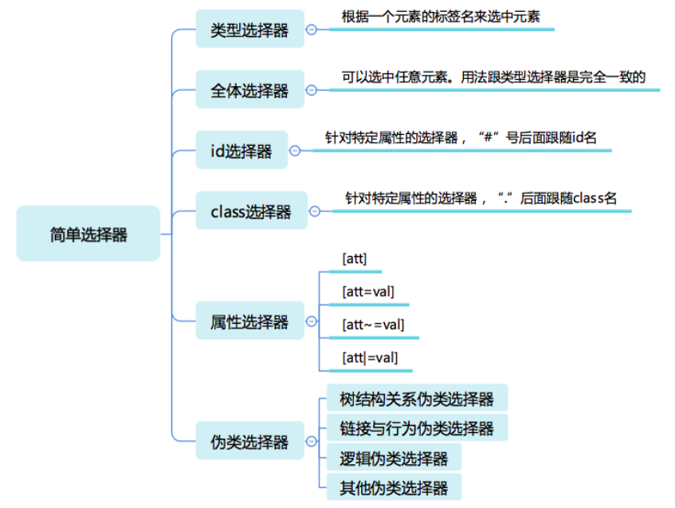

# CSS选择器
选择器的基本意义是：根据一些特征，选中元素树上的一批元素。

选择器的结构
- 简单选择器：针对某一特征判断是否选中元素。
- 复合选择器：连续写在一起的简单选择器，针对元素自身特征选择单个元素。
- 复杂选择器：由“（空格）”“ >”“ ~”“ +”“ ||”等符号连接的复合选择器，根据父元素或者前序元素检查单个元素。
- 选择器列表：由逗号分隔的复杂选择器，表示“或”的关系。

## 简单选择器
简单选择器是针对某一特征判断是否为选中元素



### 类型选择器和全体选择器
类型选择器，它根据一个元素的标签名来选中元素。
```css
div {

}
```

svg 和 html 中都有 a 元素，若要想区分选择 svg 中的 a 和 html 中的 a，就必须用带命名空间的类型选择器。
```html
<!DOCTYPE html>
<html>
<head>
  <meta charset="utf-8">
  <title>JS Bin</title>
</head>
<body>
<svg width="100" height="28" viewBox="0 0 100 28" version="1.1"
     xmlns="http://www.w3.org/2000/svg" xmlns:xlink="http://www.w3.org/1999/xlink">
  <desc>Example link01 - a link on an ellipse
  </desc>
  <a xlink:href="http://www.w3.org">
    <text y="100%">name</text>
  </a>
</svg>
<br/>
<a href="javascript:void 0;">name</a>
</body>
</html>
 
@namespace svg url(http://www.w3.org/2000/svg);
@namespace html url(http://www.w3.org/1999/xhtml);
svg|a {
  stroke:blue;
  stroke-width:1;
}
 
html|a {
  font-size:40px
}
```