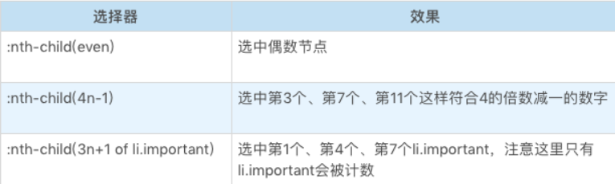

# CSS选择器
选择器的基本意义是：根据一些特征，选中元素树上的一批元素。

选择器的结构
- 简单选择器：针对某一特征判断是否选中元素。
- 复合选择器：连续写在一起的简单选择器，针对元素自身特征选择单个元素。
- 复杂选择器：由“（空格）”“ >”“ ~”“ +”“ ||”等符号连接的复合选择器，根据父元素或者前序元素检查单个元素。
- 选择器列表：由逗号分隔的复杂选择器，表示“或”的关系。

## 简单选择器
简单选择器是针对某一特征判断是否为选中元素


### 类型选择器和全体选择器
类型选择器，它根据一个元素的标签名来选中元素。
```css
div {

}
```

svg 和 html 中都有 a 元素，若要想区分选择 svg 中的 a 和 html 中的 a，就必须用带命名空间的类型选择器。
```html
<!DOCTYPE html>
<html>
<head>
  <meta charset="utf-8">
  <title>JS Bin</title>
</head>
<body>
<svg width="100" height="28" viewBox="0 0 100 28" version="1.1"
     xmlns="http://www.w3.org/2000/svg" xmlns:xlink="http://www.w3.org/1999/xlink">
  <desc>Example link01 - a link on an ellipse
  </desc>
  <a xlink:href="http://www.w3.org">
    <text y="100%">name</text>
  </a>
</svg>
<br/>
<a href="javascript:void 0;">name</a>
</body>
</html>
 
@namespace svg url(http://www.w3.org/2000/svg);
@namespace html url(http://www.w3.org/1999/xhtml);
svg|a {
  stroke:blue;
  stroke-width:1;
}
 
html|a {
  font-size:40px
}
```
这里有一个特殊的选择器，就是“ * ” ，它称为全体选择器，可以选中任意元素。它的用法跟类型选择器是完全一致的，这里就把它们放到一起介绍了。

### id 选择器与 class 选择器
id 选择器和 class 选择器都是针对特定属性的选择器。id 选择器是“#”号后面跟随 id 名，class 选择器是“.”后面跟随 class 名。
```css
#myid {
  stroke:blue;
  stroke-width:1;
}
 
.mycls {
  font-size:40px
}
```
这两个选择器都是在属性选择器之前就设计出来的选择器，属性选择器出来了以后，理论上可以一定程度上替代它们。但是要注意，class 选择器识别的是：用空格分隔的 class 语法。
```
<a class="a b c">xxx</a>
.a {
    color:red;
}
```
使用了用空格分隔的 class 属性，使用“.a”“.b”或者“.c”都能够选中元素，也可以使用多个 class 选择器来要求元素具有多个类。

### 属性选择器
属性选择器根据 HTML 元素的属性来选中元素。属性选择器有四种形态。
- 第一种，[att]
  - 直接在方括号中放入属性名，是检查元素是否具有这个属性，只要元素有这个属性，不论属性是什么值，都可以被选中。
- 第二种，[att=val]
  - 精确匹配，检查一个元素属性的值是否是 val。
- 第三种，[att~=val]
  - 多种匹配，检查一个元素的值是否是若干值之一，这里的 val 不是一个单一的值了，可以是用空格分隔的一个序列。
- 第四种，[att|=val]
  - 开头匹配，检查一个元素的值是否是以 val 开头，它跟精确匹配的区别是属性只要以 val 开头即可，后面内容不管。

有些 HTML 属性含有特殊字符，这个时候，可以把 val 用引号括起来，形成一个 CSS 字符串。CSS 字符串允许使用单双引号来规避特殊字符，也可以用反斜杠转义，这样，就可以表示出任意属性值啦。

### 伪类选择器
伪类选择器是一系列由 CSS 规定好的选择器，它们以冒号开头。伪类选择器有普通型和函数型两种。

#### 树结构关系伪类选择器
:root 伪类表示树的根元素，在选择器是针对完整的 html 文档情况，我们一般用 html 标签即可选中根元素。但是随着 scoped css 和 shadow root 等场景出现，选择器可以针对某一子树来选择，这时候就很需要 root 伪类了。

- :empty 伪类表示没有子节点的元素，这里有个例外就是子节点为空白文本节点的情况。
- :nth-child 和 :nth-last-child 这是两个函数型的伪类，CSS 的 An+B 语法设计的是比较复杂的

- :nth-last-child 的区别仅仅是从后往前数。
- :first-child :last-child 分别表示第一个和最后一个元素。
- :only-child 按字面意思理解即可，选中唯一一个子元素。

of-type 系列，是一个变形的语法糖，S:nth-of-type(An+B) 是:nth-child(|An+B| of S) 的另一种写法。以此类推，还有 nth-last-of-type、first-of-type、last-of-type、only-of-type。

### 链接与行为伪类选择器
链接与行为是第一批设计出来的伪类
- :any-link 表示任意的链接，包括 a、area 和 link 标签都可能匹配到这个伪类。
- :link 表示未访问过的链接， :visited 表示已经访问过的链接。
- :hover 表示鼠标悬停在上的元素，
- :active 表示用户正在激活这个元素，如用户按下按钮，鼠标还未抬起时，这个按钮就处于激活状态
- :focus 表示焦点落在这个元素之上。
- :target 用于选中浏览器 URL 的 hash 部分所指示的元素。

### 逻辑伪类选择器
逻辑伪类 —— :not 伪类 这个伪类是个函数型伪类，它的作用是选中内部的简单选择器命中的元素。
```css
*|*:not(:hover)
```
### 其它伪类选择器
国际化：用于处理国际化和多语言问题。
- dir
- lang

音频 / 视频：用于区分音视频播放状态。
- play
- pause

时序：用于配合读屏软件等时序性客户端的伪类。
- current
- past
- future

表格：用于处理 table 的列的伪类。
- nth-col
- nth-last-col

> 伪类是很大的一类简单选择器，它是选择器能力的一种补充。在实际使用中，我还是建议你尽量通过合适的 id 和 class 来标识元素，约束伪类的使用。最好只在不得不使用伪类的场景使用伪类，这对于 CSS 代码的性能和可读性都有好处。

## 选择器的组合
选择器列表是用逗号分隔的复杂选择器序列；复杂选择器则是用空格、大于号、波浪线等符号连接的复合选择器；复合选择器则是连写的简单选择器组合。

- 第一优先级
  - 无连接符号
- 第二优先级
  - “空格”
  - “~”
  - “+”
  - “>”
  - “||”
- 第三优先级
  - “,”
```css
.c,.a>.b.d {
    /*......*/
}
```
应该理解为这样的结构。
- .c,.a>.b.d
  - .c
  - .a>.b.d
    - .a
    - .b.d
      - .b
      - .d