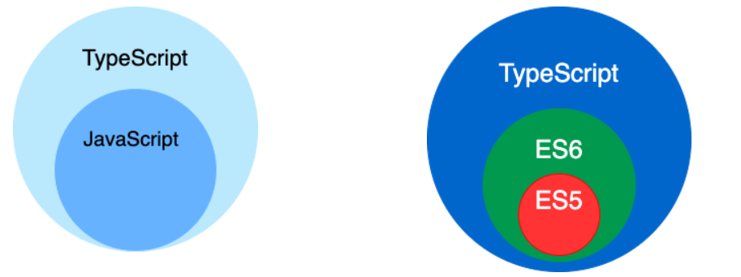
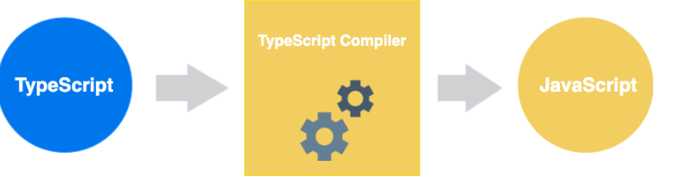

# 介绍
`TypeScript`是什么:
TypeScript 是 JavaScript 的一个超集，支持 ECMAScript 6 标准
1. 以`JavaScript`为基础构建的语言
2. 一个`JavaScript`的超集
3. 可以在任何支持`JavaScript`的平台中执行
4. `TypeScript`扩展了`JavaScript`并添加类型
5. `TS`不能被`JS`解析器直接执行

`TypeScript`较`JS`增加的特性:
- 类型批注和编译时类型检查
- 类型推断
- 类型擦除
- 接口
- 枚举
- Mixin
- 泛型编程
- 名字空间
- 元组
- Await

从 ECMA 2015 反向移植而来的功能
- 类
- 模块
- lambda 函数的箭头语法
- 可选参数以及默认参数

## JavaScript 与 TypeScript 的区别
TypeScript 是 JavaScript 的超集，扩展了 JavaScript 的语法，因此现有的 JavaScript 代码可与 TypeScript 一起工作无需任何修改，TypeScript 通过类型注解提供编译时的静态类型检查。  
TypeScript 可处理已有的 JavaScript 代码，并只对其中的 TypeScript 代码进行编译。


# 搭建`TypeScript`开发环境
https://www.runoob.com/typescript/ts-install.html
1. 下载`Node.js`
2. 安装`Node.js`
3. 使用npm全局安装`TypeScript`
4. 创建一个`ts`文件
5. 使用`tsc`对ts文件进行编译
   - 进入命令行
   - 进入ts文件所在目录
   - 执行命令： tsc xxx.ts

使用国内镜像
> npm config set registry https://registry.npmmirror.com

安装 typescript
> npm install -g typescript

安装完成后我们可以使用 tsc 命令来执行 TypeScript 的相关代码
> tsc -v

执行以下命令将 TypeScript 转换为 JavaScript 代码
> tsc 01helloWorld.ts



# 基础语法
- 模块
- 函数
- 变量
- 语句和表达式
- 注释

tsc 常用编译参数
```
--help 显示帮助信息  
--module 载入扩展模块
--target 设置 ECMA 版本  
--declaration 额外生成一个 .d.ts 扩展名的文件。  
   tsc ts-hw.ts --declaration
   以上命令会生成 ts-hw.d.ts、ts-hw.js 两个文件。
--removeComments 删除文件的注释
--out 编译多个文件并合并到一个输出的文件
--sourcemap 生成一个 sourcemap (.map) 文件。
   sourcemap 是一个存储源代码与编译代码对应位置映射的信息文件。
--module noImplicitAny 在表达式和声明上有隐含的 any 类型时报错
--watch 在监视模式下运行编译器。会监视输出文件，在它们改变时重新编译
```

## TypeScript 保留关键字

|           |              |            |          |
|-----------|--------------|------------|----------|
|  break	   | as	          | catch	     | switch   |
|  case	    | if	          | throw	     | else     |
|  var	     | number	      | string	    | get      |
|  module	  | type	        | instanceof | 	typeof  |
|  public	  | private	     | enum	      | export   |
|  finally	 | for	         | while	     | void     |
|  null	    | super	       | this	      | new      |
|  in	      | return	      | true	      | false    |
|  any      | 	extends     | 	static	   | let      |
|  package  | 	implements	 | interface	 | function |
|  do	      | try	         | yield	     | const    |

## 空白和换行
TypeScript 会忽略程序中出现的空格、制表符和换行符。

空格、制表符通常用来缩进代码，使代码易于阅读和理解。

## TypeScript 区分大小写
TypeScript 区分大写和小写字符。
## 分号是可选的
每行指令都是一段语句，你可以使用分号或不使用， 分号在 TypeScript 中是可选的，建议使用。
```typescript
console.log("Runoob")
console.log("Google");
//如果语句写在同一行则一定需要使用分号来分隔，否则会报错
console.log("Runoob");console.log("Google");
```
## TypeScript 注释
注释是一个良好的习惯，虽然很多程序员讨厌注释，但还是建议你在每段代码写上文字说明。

注释可以提高程序的可读性。

注释可以包含有关程序一些信息，如代码的作者，有关函数的说明等。

编译器会忽略注释。

## TypeScript 支持两种类型的注释
- 单行注释 ( // ) − 在 // 后面的文字都是注释内容。
- 多行注释 (/* */) − 这种注释可以跨越多行。
```typescript

// 这是一个单行注释

/*
这是一个多行注释
这是一个多行注释
这是一个多行注释
*/
```
## TypeScript 与面向对象
面向对象是一种对现实世界理解和抽象的方法。

TypeScript 是一种面向对象的编程语言。

面向对象主要有两个概念：对象和类。
- 对象：对象是类的一个实例（对象不是找个女朋友），有状态和行为。例如，一条狗是一个对象，它的状态有：颜色、名字、品种；行为有：摇尾巴、叫、吃等。
- 类：类是一个模板，它描述一类对象的行为和状态。
- 方法：方法是类的操作的实现步骤

```typescript
class Site { 
   name():void { 
      console.log("Runoob") 
   } 
} 
var obj = new Site(); 
obj.name();
```
编译后代码
```typescript
var Site = /** @class */ (function () {
    function Site() {
    }
    Site.prototype.name = function () {
        console.log("Runoob");
    };
    return Site;
}());
var obj = new Site();
obj.name();
```

# 基础类型

| 数据类型       | 关键字       | 描述                                                                                                                                                                                                                |
|------------|-----------|-------------------------------------------------------------------------------------------------------------------------------------------------------------------------------------------------------------------|
| 任意类型       | any       | 声明为 any 的变量可以赋予任意类型的值。                                                                                                                                                                                            |
| 数字类型       | number    | 双精度 64 位浮点值。它可以用来表示整数和分数。 <br/>let binaryLiteral: number = 0b1010; // 二进制 <br/> let octalLiteral: number = 0o744; // 八进制 <br/>let decLiteral: number = 6; // 十进制 <br/>let hexLiteral: number = 0xf00d;    // 十六进制 |
| 字符串类型      | 	string   | 一个字符系列，使用单引号（'）或双引号（"）来表示字符串类型。反引号（\`）来定义多行文本和内嵌表达式。<br/> let name: string = "Runoob"; <br/>let years: number = 5; <br/> let words: string = `您好，今年是 ${ name } 发布 ${ years + 1} 周年`; <br/>                        |
| 布尔类型	      | boolean   | 表示逻辑值：true 和 false。`let flag: boolean = true;`                                                                                                                                                                    |
| 数组类型       | 	无        | 声明变量为数组。<br/>// 在元素类型后面加上[]<br/>let arr: number[] = [1, 2];<br/>// 或者使用数组泛型<br/>let arr: Array<number> = [1, 2];                                                                                                  |
| 元组	        | 无         | 元组类型用来表示已知元素数量和类型的数组，各元素的类型不必相同，对应位置的类型需要相同.<br/>let x: [string, number];<br/>x = ['Runoob', 1];    // 运行正常<br/>x = [1, 'Runoob'];    // 报错<br/>console.log(x[0]);    // 输出 Runoob<br/>                           |
| 枚举	        | enum      | 枚举类型用于定义数值集合。<br/>enum Color {Red, Green, Blue};<br/>let c: Color = Color.Blue;<br/>console.log(c);    // 输出 2                                                                                                    |
| void	      | void      | 用于标识方法返回值的类型，表示该方法没有返回值。<br/>function hello(): void {<br/>alert("Hello<br/>Runoob");}                                                                                                                             |
| null       | 	null     | 表示对象值缺失。                                                                                                                                                                                                          |
| undefined	 | undefined | 用于初始化变量为一个未定义的值                                                                                                                                                                                                   |
| never      | 	never    | never 是其它类型（包括 null 和 undefined）的子类型，代表从不会出现的值。                                                                                                                                                                   |
> TypeScript 和 JavaScript 没有整数类型。

## Any 类型
任意值是 TypeScript 针对编程时类型不明确的变量使用的一种数据类型，它常用于以下三种情况。
1. 变量的值会动态改变时，比如来自用户的输入，任意值类型可以让这些变量跳过编译阶段的类型检查，示例代码如下：
```typescript
let x: any = 1;    // 数字类型
x = 'I am who I am';    // 字符串类型
x = false;    // 布尔类型
```
改写现有代码时，任意值允许在编译时可选择地包含或移除类型检查，示例代码如下：
```typescript
let x: any = 4;
x.ifItExists();    // 正确，ifItExists方法在运行时可能存在，但这里并不会检查
x.toFixed();    // 正确
```
定义存储各种类型数据的数组时，示例代码如下：
```typescript
let arrayList: any[] = [1, false, 'fine'];
arrayList[1] = 100;
```
## Null 和 Undefined
### null
在 JavaScript 中 null 表示 "什么都没有"。

null是一个只有一个值的特殊类型。表示一个空对象引用。

用 typeof 检测 null 返回是 object。

### undefined
在 JavaScript 中, undefined 是一个没有设置值的变量。

typeof 一个没有值的变量会返回 undefined。

Null 和 Undefined 是其他任何类型（包括 void）的子类型，可以赋值给其它类型，如数字类型，此时，赋值后的类型会变成 null 或 undefined。而在TypeScript中启用严格的空校验（--strictNullChecks）特性，就可以使得null 和 undefined 只能被赋值给 void 或本身对应的类型，示例代码如下：
```typescript
// 启用 --strictNullChecks
let x: number;
x = 1; // 编译正确
x = undefined;    // 编译错误
x = null;    // 编译错误
```
上面的例子中变量 x 只能是数字类型。如果一个类型可能出现 null 或 undefined， 可以用 | 来支持多种类型，示例代码如下
```typescript
// 启用 --strictNullChecks
let x: number | null | undefined;
x = 1; // 编译正确
x = undefined;    // 编译正确
x = null;    // 编译正确
```
### never 类型
never 是其它类型（包括 null 和 undefined）的子类型，代表从不会出现的值。这意味着声明为 never 类型的变量只能被 never 类型所赋值，在函数中它通常表现为抛出异常或无法执行到终止点（例如无限循环），示例代码如下：
```typescript
let x: never;
let y: number;

// 编译错误，数字类型不能转为 never 类型
x = 123;

// 运行正确，never 类型可以赋值给 never类型
x = (()=>{ throw new Error('exception')})();

// 运行正确，never 类型可以赋值给 数字类型
y = (()=>{ throw new Error('exception')})();

// 返回值为 never 的函数可以是抛出异常的情况
function error(message: string): never {
    throw new Error(message);
}

// 返回值为 never 的函数可以是无法被执行到的终止点的情况
function loop(): never {
    while (true) {}
}
```

# TypeScript 变量声明
变量是一种使用方便的占位符，用于引用计算机内存地址。

我们可以把变量看做存储数据的容器。

TypeScript 变量的命名规则：
- 变量名称可以包含数字和字母。
- 除了下划线 _ 和美元 $ 符号外，不能包含其他特殊字符，包括空格。
- 变量名不能以数字开头。
变量使用前必须先声明，我们可以使用 var 来声明变量。

我们可以使用以下四种方式来声明变量：  
声明变量的类型及初始值：
```typescript
var [变量名] : [类型] = 值;
var uname:string = "Runoob";
```
声明变量的类型，但没有初始值，变量值会设置为 undefined：
```typescript
var [变量名] : [类型];
var uname:string;
```
声明变量并初始值，但不设置类型，该变量可以是任意类型：
```typescript
var [变量名] = 值;
var uname = "Runoob";
```
声明变量没有设置类型和初始值，类型可以是任意类型，默认初始值为 undefined：
```typescript
var [变量名];
var uname;
```
> 变量不要使用 name 否则会与 DOM 中的全局 window 对象下的 name 属性出现了重名。

TypeScript 遵循强类型，如果将不同的类型赋值给变量会编译错误，如下实例：
```typescript
var num:number = "hello"     // 这个代码会编译错误
```
## 类型断言（Type Assertion）
类型断言可以用来手动指定一个值的类型，即允许变量从一种类型更改为另一种类型。

语法格式：
```
<类型>值
值 as 类型
```
```typescript
var str = '1' 
var str2:number = <number> <any> str   //str、str2 是 string 类型
console.log(str2)
```

### TypeScript 是怎么确定单个断言是否足够
当 S 类型是 T 类型的子集，或者 T 类型是 S 类型的子集时，S 能被成功断言成 T。这是为了在进行类型断言时提供额外的安全性，完全毫无根据的断言是危险的，如果你想这么做，你可以使用 any。

它之所以不被称为类型转换，是因为转换通常意味着某种运行时的支持。但是，类型断言纯粹是一个编译时语法，同时，它也是一种为编译器提供关于如何分析代码的方法。  
编译后，以上代码会生成如下 JavaScript 代码
```typescript
var str = '1';
var str2 = str;  //str、str2 是 string 类型
console.log(str2);
```
### 类型推断
当类型没有给出时，TypeScript 编译器利用类型推断来推断类型。
如果由于缺乏声明而不能推断出类型，那么它的类型被视作默认的动态 any 类型。
```typescript
var num = 2;    // 类型推断为 number
console.log("num 变量的值为 "+num); 
num = "12";    // 编译错误
console.log(num);
```
- 第一行代码声明了变量 num 并=设置初始值为 2。 注意变量声明没有指定类型。因此，程序使用类型推断来确定变量的数据类型，第一次赋值为 2，num 设置为 number 类型。
- 第三行代码，当我们再次为变量设置字符串类型的值时，这时编译会错误。因为变量已经设置为了 number 类型。
  - error TS2322: Type '"12"' is not assignable to type 'number'.

### 变量作用域
变量作用域指定了变量定义的位置。

程序中变量的可用性由变量作用域决定。

TypeScript 有以下几种作用域：
- 全局作用域 − 全局变量定义在程序结构的外部，它可以在你代码的任何位置使用。
- 类作用域 − 这个变量也可以称为 字段。类变量声明在一个类里头，但在类的方法外面。 该变量可以通过类的对象来访问。类变量也可以是静态的，静态的变量可以通过类名直接访问。
- 局部作用域 − 局部变量，局部变量只能在声明它的一个代码块（如：方法）中使用。

```typescript
var global_num = 12          // 全局变量
class Numbers { 
   num_val = 13;             // 实例变量
   static sval = 10;         // 静态变量
   
   storeNum():void { 
      var local_num = 14;    // 局部变量
   } 
} 
console.log("全局变量为: "+global_num)  
console.log(Numbers.sval)   // 静态变量
var obj = new Numbers(); 
console.log("实例变量: "+obj.num_val)
```
以上代码使用 tsc 命令编译为 JavaScript 代码为：
```js
var global_num = 12; // 全局变量
var Numbers = /** @class */ (function () {
    function Numbers() {
        this.num_val = 13; // 实例变量
    }
    Numbers.prototype.storeNum = function () {
        var local_num = 14; // 局部变量
    };
    Numbers.sval = 10; // 静态变量
    return Numbers;
}());
console.log("全局变量为: " + global_num);
console.log(Numbers.sval); // 静态变量
var obj = new Numbers();
console.log("实例变量: " + obj.num_val);
```

## TypeScript 运算符


