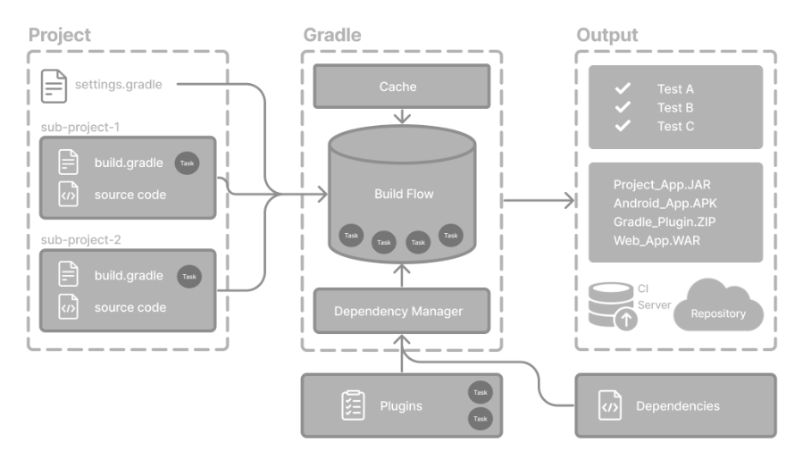
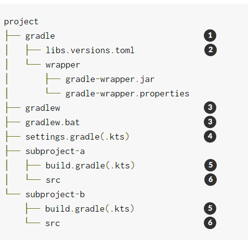
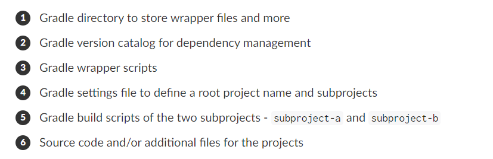

all note from https://docs.gradle.org/current/userguide/getting_started_eng.html

# gradle basics


1. Projects
- Single project
- Multi-project

2. Build Scripts
3. Dependency Management
4. Tasks
5. Plugins

## gradle project structure



## setting file basics
The primary purpose of the settings file is to add subprojects to your build.

```groovy
rootProject.name = 'root-project'   

include('sub-project-a')            
include('sub-project-b')
include('sub-project-c')
```

## build file basics
Every Gradle build comprises at least one build script.

```groovy
plugins {
    id 'application'                
}

application {
    mainClass = 'com.example.Main'  
}
```

## dependency management basics
Version catalogs provide a way to centralize your dependency declarations in a libs.versions.toml file.
The file is located in the gradle directory so that it can be used by Gradle and IDEs automatically. The version catalog should be checked into source control: gradle/libs.versions.toml.

```groovy
[versions]
androidGradlePlugin = "7.4.1"
mockito = "2.16.0"

[libraries]
googleMaterial = { group = "com.google.android.material", name = "material", version = "1.1.0-alpha05" }
mockitoCore = { module = "org.mockito:mockito-core", version.ref = "mockito" }

[plugins]
androidApplication = { id = "com.android.application", version.ref = "androidGradlePlugin" }
```


add dependency
```groovy
plugins {
    alias(libs.plugins.androidApplication)
}

dependencies {
    // Dependency on a remote binary to compile and run the code
    implementation(libs.googleMaterial)    

    // Dependency on a remote binary to compile and run the test code
    testImplementation(libs.mockitoCore)   
}
```

## plugins basics 
Plugins are distributed in three ways:

Core plugins - Gradle develops and maintains a set of Core Plugins.
https://docs.gradle.org/current/userguide/plugin_reference.html#plugin_reference

Community plugins - Gradle’s community shares plugins via the Gradle Plugin Portal.
https://plugins.gradle.org/?_gl=1*1kuu17y*_gcl_au*MTk0ODc5NjY2Ny4xNzI3MzE1MTU1*_ga*NzA4MDYwMzg2LjE3MjczMTUxNTY.*_ga_7W7NC6YNPT*MTcyNzMxOTIwMS4yLjEuMTcyNzMyNDM4NC41OS4wLjA.

Local plugins - Gradle enables users to create custom plugins using APIs.
https://docs.gradle.org/current/javadoc/org/gradle/api/Plugin.html