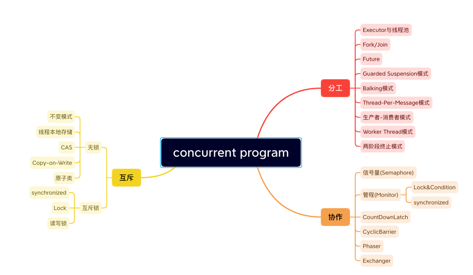

# 并发编程的核心：
1. 分工：如何高效地拆解任务并分配给线程
2. 同步：线程之间如何协作：当某个条件不满足时，线程需要等待，当某个条件满足时，线程需要被唤醒执行。
   1. 管程：解决并发问题的关键
3. 互斥：同一时刻只允许一个线程访问共享资源

# 主要问题（内存模型）
- 可见性问题
- 有序性问题
- 原子性问题

> ReadWriteLock、StampedLock：优化读多写少场景下锁的性能
> 无锁的数据结构：原子类
> 不共享变量或者变量只允许读：Thread Local和final关键字，Copy-on-write的模式

为了合理利用 CPU 的高性能，平衡这三者的速度差异，计算机体系机构、操作系统、编译程序都做出了贡献，主要体现为：
1. CPU 增加了缓存，以均衡与内存的速度差异；
2. 操作系统增加了进程、线程，以分时复用 CPU，进而均衡 CPU 与 I/O 设备的速度差异；
3. 编译程序优化指令执行次序，使得缓存能够得到更加合理地利用

可见性：一个线程对共享变量的修改，另一个线程能够立刻看到。