# 并发编程的核心：
1. 分工：如何高效地拆解任务并分配给线程
2. 同步：线程之间如何协作：当某个条件不满足时，线程需要等待，当某个条件满足时，线程需要被唤醒执行。
   1. 管程：解决并发问题的关键
3. 互斥：同一时刻只允许一个线程访问共享资源

# 多线程导致结果不确定的主要问题（内存模型）
- 可见性问题
- 有序性问题
- 原子性问题

> ReadWriteLock、StampedLock：优化读多写少场景下锁的性能
> 无锁的数据结构：原子类
> 不共享变量或者变量只允许读：Thread Local和final关键字，Copy-on-write的模式

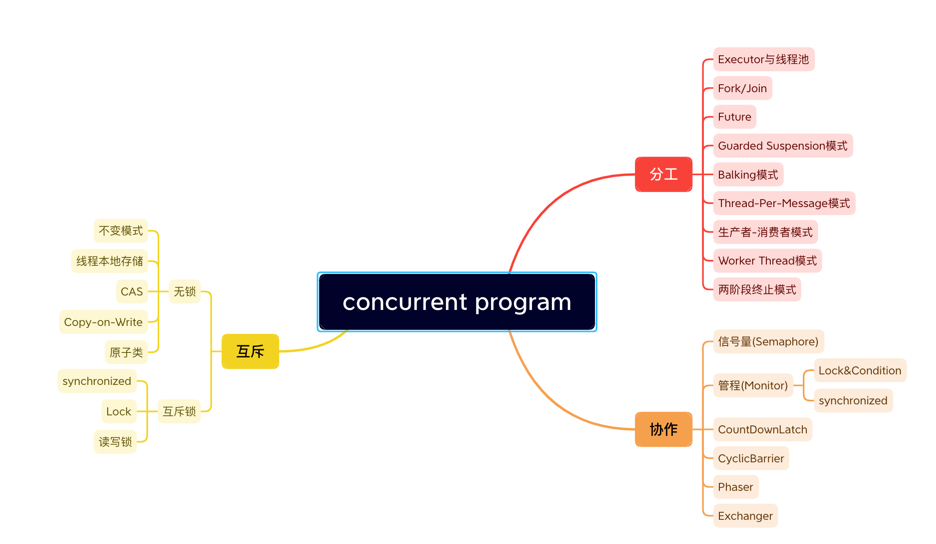

为了合理利用 CPU 的高性能，平衡这三者的速度差异，计算机体系机构、操作系统、编译程序都做出了贡献，主要体现为：
1. CPU 增加了缓存，以均衡与内存的速度差异；
2. 操作系统增加了进程、线程，以分时复用 CPU，进而均衡 CPU 与 I/O 设备的速度差异；
3. 编译程序优化指令执行次序，使得缓存能够得到更加合理地利用

可见性：一个线程对共享变量的修改，另一个线程能够立刻看到。

> 操作系统做任务切换，可以发生在任何一条CPU指令执行完。

原子性：一个或者多个操作在CPU执行的过程中不被终端的特性

有序性：程序按照代码的先后顺序执行。
```java
//编译器优化带来的bug
public class Singleton {
   static Singleton instance;
   static Singleton getInstance(){
      if (instance == null) {
         synchronized(Singleton.class) {
            if (instance == null)
               instance = new Singleton();
         }
      }
      return instance;
   }
}
// 常规理解：线程A，B同时调用**getInstance()**方法，在第一个判断过后两线程同时对**Singleton.class**加锁，而`JVM`保证只有一个线程加锁成功，另一个线程会处于等待状态, 
// 当第一个线程获得锁并创建对象成功后，第一个线程释放锁，第二个线程取得锁后进行判断，发现对象已创建，结束逻辑，释放锁。

// 可能出问题的点在`new`
// 常认为`new`操作为：
// 1. 分配一块内存 M
// 2. 在内存 M 上初始化 Singleton 对象
// 3. 然后 M 的地址赋值给 instance 变量

// 实际上`new`操作为：
// 1. 分配一块内存 M
// 2. 然后 M 的地址赋值给 instance 变量
// 3. 在内存 M 上初始化 Singleton 对象
```
> 导致的结果
> 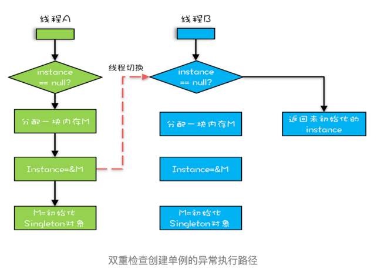

--- 
> 缓存导致的可见性问题
> 线程切换带来的原子性问题
> 编译优化带来的有序性问题

---
解决可见性、有序性最直接的办法：禁用缓存和编译优化
Java内存模型规范了JVM如何提供按需禁用缓存和编译优化的方法。
三个关键字：`volatile`、`synchronized`、`final`
六项`Happens-Before`原则

---
- volatile：告诉编译器，对于变量的读写，不能使用CPU缓存，必须从内存中读取或写入
- Happens-Before：前面一个操作的结果对后续操作是可见的
---
- Happens-Before
1. 程序的顺序性规则：一个线程中，按照程序顺序，前面的操作Happens-Before于后续的任意操作，程序前面对某个变量的修改一定是对后续操作可见的。
> 代码按程序顺序
```java
class VolatileExample {
 int x = 0;
 volatile boolean v = false;
 public void writer() {
 x = 42; // x=42 happens before v =true
 v = true; 
 }
 public void reader() {
 if (v == true) {
 }
 }
}
```
2. volatile变量规则：对一个volatile变量的写操作，Happens-Before于后续对这个volatile变量的读操作。
```java
class VolatileExample {
 int x = 0;
 volatile boolean v = false;
 public void writer() {
 x = 42; 
 v = true; 
 }
 public void reader() {
 if (v == true) {
    System.out.println(x); //x=42 这里的读操作 在写操作之后
 }
 }
}
```
3. 传递性：如果A Happens-Before B，且B Happens-Before C，那么A Happens-Before C。
```java
class VolatileExample {
 int x = 0;
 volatile boolean v = false;
 public void writer() {
 x = 42; 
 v = true; 
 }
 public void reader() {
 if (v == true) {
    System.out.println(x); //x=42 先writer()，后reader()，x写->v写->v读，传递依赖
 }
 }
}
```
4. 管程中锁的规则：对一个锁的解锁 Happens-Before于后续对这个锁的加锁
```
synchronized (this) { // 加锁
 // x 是共享变量, 初始值 =10
 if (this.x < 12) {
 this.x = 12;
 }
} // 解锁
// 解锁的指令在加锁指令后
```
5. 线程start()规则：主线程A启动子线程B后，子线程B能够看到主线程在启动子线程B前的操作
```
Thread B = new Thread(()->{
 // 主线程调用 B.start() 之前
 // 所有对共享变量的修改，此处皆可见
 // 此例中，var==77
});
// 此处对共享变量 var 修改
var = 77;
// 主线程启动子线程
B.start();
```
6. 线程join()规则：主线程A等待子线程B完成（主线程A通过调用子线程B的join()方法实现），当子线程B完成后（主线程A中join()方法返回），主线程能够看到子线程的操作。
```
Thread B = new Thread(()->{
 // 此处对共享变量 var 修改
 var = 66;
});
// 例如此处对共享变量修改，
// 则这个修改结果对线程 B 可见
// 主线程启动子线程
B.start();
B.join()
// 子线程所有对共享变量的修改
// 在主线程调用 B.join() 之后皆可见
// 此例中，var==66
```
7. 线程中断规则：对线程interrupt()方法的调用先行发生于被中断线程的代码检测到中断事件的发生，可以通过Thread.interrupted()方法检测到是否有中断发生。
8. 对象终结规则：一个对象的初始化完成（构造函数执行结束）先行发生于它的finalize()方法的开始。
---
# 互斥锁
原子性：一个或者多个操作在CPU执行的过程中不被中断的特性；
> 原子性问题的源头：线程切换
> 
> 单CPU情况
> 如若能禁用线程切换，即可解决原子性问题
> 操作系统做线程切换依赖CPU中断，所以禁止CPU中断就能禁止线程切换
> 
> 多核场景
> 同一时刻，有可能有两个线程同时执行，此时禁止CPU中断，只能保证CPU上的线程连续执行，并不能保证同一时刻只有一个线程执行，当两个线程同时写long型变量高32位时，就会出现并发问题

互斥：同一时刻只有一个线程执行

## synchronized
修饰方法（静态和非静态）、代码块。
当synchronized修饰静态方法时，锁定的是当前类的Class对象。
当修饰非静态方法时，锁定的是当前实力对象this。
```java
class X {
 // 修饰非静态方法
 synchronized void foo() {
 // 临界区
 }
 // 修饰静态方法
 synchronized static void bar() {
 // 临界区
 }
 // 修饰代码块
 Object obj = new Object();
 void baz() {
 synchronized(obj) {
 // 临界区
 }
 }
}
```
> 主要分析出程序执行的先后，锁只能保证加锁的区间线程安全，无法保证非区间内的事情
> 保证多线程环境下共享变量的一致性，最好使用共享标志（用锁保证共享变量）
> 方法中声明标志参数，用锁保证安全，其他线程读取数据时先观察标志是否完成

---
一把锁保护多个资源会导致所有的操作都串行，影响性能
细粒度锁：用不同的锁对受保护资源进行精细化管理，提升性能
```java
// 线程不安全，无法保证线程之前的顺序
class Account {
 private int balance;
 // 转账
 synchronized void transfer(
 Account target, int amt){
 if (this.balance > amt) {
 this.balance -= amt;
 target.balance += amt;
 }
 }
}

// 通过传入对象锁，保证多线程直接有序读取共享变量
class Account {
   private Object lock;
   private int balance;
   private Account();
   // 创建 Account 时传入同一个 lock 对象
   public Account(Object lock) {
      this.lock = lock;
   }
   // 转账
   void transfer(Account target, int amt){
      // 此处检查所有对象共享的锁
      synchronized(lock) {
         if (this.balance > amt) {
            this.balance -= amt;
            target.balance += amt;
         }
      }
   }
}

// 将对象锁替换为类
class Account {
   private int balance;
// 转账
void transfer(Account target, int amt){
   synchronized(Account.class) {
      if (this.balance > amt) {
         this.balance -= amt;
         target.balance += amt;
      }
   }
}
}
```
> 原子性的本质：多个资源间有一致性要求，操作的中间状态对外不可见。
---
死锁：一组相互竞争资源的线程因相互等待，导致永久阻塞的现象。
出现死锁的四个条件：
1. 互斥：共享资源X和Y只能被一个线程占用
2. 占有且等待，线程T1已经取得共享资源X，在等待共享资源Y的时候，不释放共享资源X
3. 不可抢占，其他线程不能强行抢占T1占有的资源
4. 循环等待，线程T1等待线程T2占有的资源，线程T2等待线程T1占有的资源。
> 对于资源的互斥，无法改变
> 可以改变内容如下
> 占有且等待，将资源变为不可以分割的整体或者一次性申请所有的资源，申请不到也不占有部分资源
> 不可抢占，占用部分资源的线程进一步申请其他资源时，如果申请不到，主动释放它占有的资源
> 循环等待，靠按序申请资源来预防，所谓按序申请，是指资源是有线性顺序的，申请的时候可以先申请资源序号小的，再申请资源序号大的
>
> 当前部分资源被线程占用后，线程不主动释放，其他线程无法主动获取，循环等待
> 

- 破坏占用且等待条件
```java
class Allocator {
 private List<Object> als = new ArrayList<>();
 // 一次性申请所有资源
 synchronized boolean apply(Object from, Object to){
 if(als.contains(from) || als.contains(to)){
 return false;
 } else {
 als.add(from);
 als.add(to);
 }
 return true;
 }
 // 归还资源
synchronized void free(Object from, Object to){
   als.remove(from);
   als.remove(to);
}
}
class Account {
   // actr 应该为单例
   private Allocator actr;
   private int balance;
   // 转账
   void transfer(Account target, int amt){
      // 一次性申请转出账户和转入账户，直到成功
      while(!actr.apply(this, target));
      try{
         // 锁定转出账户
         synchronized(this){
            // 锁定转入账户
            synchronized(target){
               if (this.balance > amt){
                  this.balance -= amt;
                  target.balance += amt;
               }
            }
         }
      } finally {
         actr.free(this, target);
      }
   }
}

```
- 破坏不可抢占条件
- 破坏循环等待条件
```java
// 对账户进行排序，确保出发传递依赖时，按照确认的顺序进行加锁
class Account {
 private int id;
 private int balance;
 // 转账
 void transfer(Account target, int amt){
 Account left = this;
 Account right = target; 
 if (this.id > target.id) { 
 left = target; 
 right = this; 
 } 
 // 锁定序号小的账户
 synchronized(left){
 // 锁定序号大的账户
 synchronized(right){
 if (this.balance > amt){
 this.balance -= amt;
 target.balance += amt;
 }
 }
 }
 }
}
```
---
一个完整的等待-通知机制：线程首先获取互斥锁，当线程要求的条件不满足时，释放互斥锁，进入等待状态；当要求的条件满足时，通知等待线程，重新获取互斥锁。

- wait()，notify()，notifyALl()方法操作的等待队列时互斥锁的等待队列
- wait()，notify()，notifyALl()都是在synchronized()内部被调用，在synchronized{}外部调用会抛出IllegalMonitorStateException
操作工作原理.png)
操作工作原理图.png)
> wait() 释放锁在进入等待队列
> notify()只能保证通知时间点，条件是满足，但是线程执行的具体时间点是由CPU分配时间片确认的，可能线程在执行时条件已不满足。

等待-通知机制中，四个需要考虑的要素
1. 互斥锁：this作为互斥锁
2. 线程要求的条件：准出账户和转入账户都没有被分配过。
3. 何时等待：线程要求的条件不满足就等待
4. 何时通知：当线程释放账户时通知

```java
class Allocator {
 private List<Object> als;
 // 一次性申请所有资源
 synchronized void apply(Object from, Object to){
 // 经典写法
 while(als.contains(from) || als.contains(to)){
 try{
 wait();
 }catch(Exception e){
 }
 }
 als.add(from);
 als.add(to);
 }
 // 归还资源
 synchronized void free(Object from, Object to){
    als.remove(from);
    als.remove(to);
    notifyAll();
 }
}
```
- notify()和notifyAll()的区别
  - notify()是随机地通知等待队列中的一个线程
  - notify()会通知等待队列中的所有线程
> 使用notify()可能会导致某些线程永远不会被通知到

> wait和sleep的区别
> wait会释放所有锁而sleep不会释放锁资源
> wait只能在同步方法或者同步代码块中使用，sleep可以在任何地方使用
> wait无需不抓异常，sleep需要
> wait是Object类方法，sleep是Thread方法
> sleep方法需要出入指定时间

---
竞态条件(Race Condition)：程序的执行结果依赖线程执行的顺序
活锁：线程虽然没发生阻塞，但仍然会存在执行不下去的情况
饥饿：线程因无法访问所需资源而无法执行下去的情况

> 阿姆达尔(Amdahl)定律：处理器并行运算之后效率提升的能力
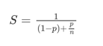
公式中n为CPU核数，p为并行百分比，(1-p)为串行百分比
临界区都是串行的，非临界区都是并行的，用单线程执行临界区的时间/用单线程执行(临界区+非临界区)的时间就是串行百分比

避免锁带来的性能问题
1. 使用无所的算法和数据结构：线程本地存储(Thread Local Storage TLS)、写入时复制(Copy-on-write)、乐观锁等。
2. 减少锁持有的时间：互斥锁的本质是将并行的程序串行化，所以要增加并行度，一定要减少持有锁的时间。如ConcurrentHashMap分段锁，读写锁

- 性能方面度量的指标
  - 吞吐量：指的是单位时间内能处理的请求数量。吞吐量越高，说明性能越好。
  - 延迟：从发出请求到收到响应的时间。延迟越小，说明性能越好。
  - 并发量：能同时处理的请求数量，一般来说随着并发量的增加、延迟也会增加。所以延迟这个指标，一般都会是基于并发量来说的。例如并发量是 1000 的时候，延迟是 50 毫秒。
---
管程(Monitor)：管理共享变量以及对共享变量的操作过程

> 并发编程的两大核心问题：
> 互斥：同一时刻只允许一个线程访问共享资源
> 同步：线程之间如何通讯、协作。


> 参照 concurrent.java.test02.queue.BlockedQueue
```
MESA管程特有：有一个编程范式，就是需要在一个while循环里面调用wait()
while(条件不满足) {
  wait();
}
```
> Hasen模型：要求notify()放在代码的最后，线程执行完成后再去唤醒其他线程，可以保证线程完成
```
// T2
执行内容
notify()
结束

// T1
wait()
执行内容
```
> Hoare模型: 线程交替顺序执行，中断当前线程，唤醒另一个线程，另一个线程执行完成后再唤醒原线程，能够保证线程完成
```
// T2
notify()
wait()
执行内容

// T1 
wait()
执行内容
notify()
```
> MESA模型：
```
// T2
notify()
执行内容

// T1
判断条件
  wait()
执行内容
```

- notify()的使用条件
  - 所有等待线程拥有相同的等待条件
  - 所有等待线程被唤醒后，执行相同的操作
  - 只需要唤醒一个线程
---
通用的线程生命周期
- 初始状态：线程已经被创建，但尚未分配CPU执行（编程层面被创建，但是操作系统层面还没创建线程）
- 可运行状态：线程可以分配CPU执行（操作系统层面创建线程）
- 运行状态：线程被分配到CPU
- 休眠状态：运行状态的线程如果调用一个阻塞的API或者等待某个事件，线程的状态就会转换到休眠状态，同时释放CPU使用权，休眠状态的线程永远没有机会获得 CPU 使用权。当等待的事件出现了，线程就会从休眠状态转换到可运行状态。
- 终止状态：线程执行完或者出现异常就会进入终止状态，终止状态的线程不会切换到其他任何状态，进入终止状态也就意味着线程的生命周期结束了。
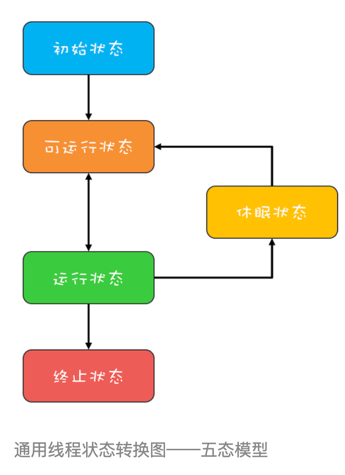

Java中线程的六种状态
1. NEW（初始化状态）
2. RUNNABLE（可运行 / 运行状态）
3. BLOCKED（阻塞状态）
4. WAITING（无时限等待）
5. TIMED_WAITING（有时限等待）
6. TERMINATED（终止状态）

- RUNNABLE 与 BLOCKED 的状态转换
  - 只有一种场景会触发这种转换，就是线程等待 synchronized 的隐式锁。
  - synchronized 修饰的方法、代码块同一时刻只允许一个线程执行，其他线程只能等待，这种情况下，等待的线程就会从 RUNNABLE 转换到 BLOCKED 状态。而当等待的线程获得 synchronized 隐式锁时，就又会从 BLOCKED 转换到 RUNNABLE 状态。
- RUNNABLE 与 WAITING 的状态转换
  - RUNNABLE 与 WAITING 的状态转换
  - 调用无参数的 Thread.join() 方法。其中的 join() 是一种线程同步方法
    - 例如有一个线程对象 thread A，当调用 A.join() 的时候，执行这条语句的线程会等待 thread A 执行完，而等待中的这个线程，其状态会从 RUNNABLE 转换到 WAITING。当线程 thread A 执行完，原来等待它的线程又会从 WAITING 状态转换到 RUNNABLE。
  - 调用 LockSupport.park() 方法
    - 调用 LockSupport.park() 方法，当前线程会阻塞，线程的状态会从 RUNNABLE 转换到 WAITING。调用 LockSupport.unpark(Thread thread) 可唤醒目标线程，目标线程的状态又会从 WAITING 状态转换到 RUNNABLE。
- RUNNABLE 与 TIMED_WAITING 的状态转换
  - 调用带超时参数的 Thread.sleep(long millis) 方法；
  - 获得 synchronized 隐式锁的线程，调用带超时参数的 Object.wait(long timeout) 方法；
  - 调用带超时参数的 Thread.join(long millis) 方法；
  - 调用带超时参数的 LockSupport.parkNanos(Object blocker, long deadline) 方法；
  - 调用带超时参数的 LockSupport.parkUntil(long deadline) 方法。
- 从 NEW 到 RUNNABLE 状态
  - Thread调用start()方法
- 从 RUNNABLE 到 TERMINATED 状态
  - 线程执行完 run() 方法后，会自动转换到 TERMINATED 状态，当然如果执行 run() 方法的时候异常抛出，也会导致线程终止
    - 主动调用Thread类中的stop()方法（已废弃，不建议使用）或者interrupt()方法
> stop()和interrupt()的区别
> stop()方法会杀死线程，如果线程持有ReentrantLock锁，被 stop() 的线程并不会自动调用 ReentrantLock 的 unlock() 去释放锁，那其他线程就再也没机会获得 ReentrantLock 锁。
> 类似的方法还有 suspend() 和 resume() 方法，这两个方法同样也都不建议使用。
> interrupt() 方法仅仅是通知线程，线程有机会执行一些后续操作，同时也可以无视这个通知，线程收到interrupt通知（InterruptedException）后会清楚中断标志

举例说明线程A被触发interrupt()
- 当线程 A 处于 WAITING、TIMED_WAITING 状态时，如果其他线程调用线程 A 的 interrupt() 方法，会使线程 A 返回到 RUNNABLE 状态，同时线程 A 的代码会触发 
  InterruptedException 异常。转换到 WAITING、TIMED_WAITING 状态的触发条件，都是调用了类似 wait()、join()、sleep() 这样的方法，从看这些方法的签名，发现都会 
  throws InterruptedException 这个异常。这个异常的触发条件就是：其他线程调用了该线程的 interrupt() 方法。
- 当线程 A 处于 RUNNABLE 状态时，并且阻塞在 java.nio.channels.InterruptibleChannel 上时，如果其他线程调用线程 A 的 interrupt() 方法，线程 A 会触发 java.
  nio.channels.ClosedByInterruptException 这个异常。阻塞在 java.nio.channels.Selector 上时，如果其他线程调用线程 A 的 interrupt() 方法，线程 A 
  的 java.nio.channels.Selector 会立即返回。

---
- 延迟：发出请求到收到响应这个过程的时间；延迟越短，意味着程序执行得越快，性能也就越好
- 吞吐量：在单位时间内能处理请求的数量；吞吐量越大，意味着程序能处理的请求越多，性能也就越好
> 两个指标内部有一定的联系（同等条件下，延迟越短，吞吐量越大），但是由于它们隶属不同的维度（一个是时间维度，一个是空间维度），并不能互相转换

提升性能，从度量的角度，主要是降低延迟，提高吞吐量
在并发编程领域，提升性能本质上就是提升硬件的利用率，再具体点来说，就是提升 I/O 的利用率和 CPU 的利用率.

---
I/O密集型计算：I/O操作执行的时间相对于CPU计算来说都非常长
CPU密集型计算：CPU密集型计算大部分场景下都是纯CPU计算

> 对于CPU密集型计算场景，理论上，线程的数量=CPU核数，但在实际工程中，线程的数量一般会设置为 CPU核数+1，这样即使线程因为偶尔的内存页失效或者其他原因导致阻塞时，额外的线程也可顶上，从而保证CPU的利用率。

> 如果CPU 计算和 I/O 操作的耗时是 1:1，那么 2 个线程是最合适的。如果 CPU 计算和 I/O 操作的耗时是 1:2，那多少个线程合适呢？是 3 个线程。

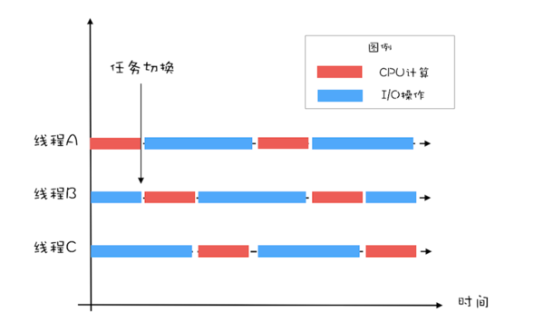
CPU 在 A、B、C 三个线程之间切换，对于线程 A，当 CPU 从 B、C 切换回来时，线程 A 正好执行完 I/O 操作。这样 CPU 和 I/O 设备的利用率都达到了 100%。

- 对于I/O密集型计算场景，最佳的线程数是与程序中CPU计算和I/O操作的耗时比相关
  - 单核CPU： 最佳线程数 = 1 + (I/O耗时 / CPU耗时)
  - 多核CPU： 最佳线程数 = CPU 核数 * [ 1 + (I/O耗时 / CPU耗时)]
--- 
调用栈：栈帧和方法是共同生死的
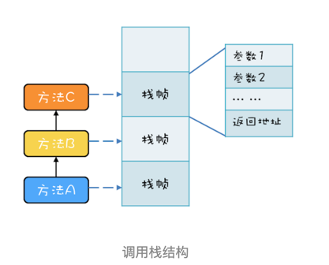
有三个方法 A、B、C，他们的调用关系是 A->B->C（A 调用 B，B 调用 
C），在运行时，会构建出下面这样的调用栈。每个方法在调用栈里都有自己的独立空间，称为栈帧，每个栈帧里都有对应方法需要的参数和返回地址。当调用方法时，会创建新的栈帧，并压入调用栈；当方法返回时，对应的栈帧就会被自动弹出，

局部变量
局部变量的作用域是方法内部，也就是说当方法执行完，局部变量就没用了，局部变量应该和方法同生共死
调用栈的栈帧就是和方法同生共死的，所以局部变量放到调用栈里那儿是相当的合理。
局部变量就是放到了调用栈里
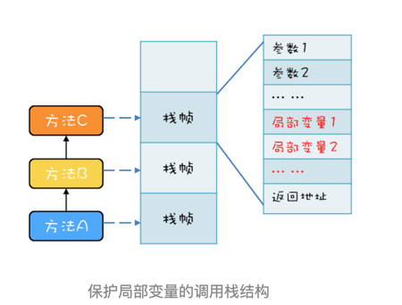

> 局部变量是和方法同生共死的，一个变量如果想跨越方法的边界，就必须创建在堆里。

调用栈于线程
两个线程可以同时用不同的参数调用相同的方法
每个线程都有自己独立的调用栈
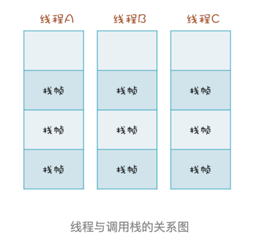

线程封闭：仅在但线程内访问数据，由于不存在共享，所以即便不同步也不会有并发问题
采用线程封闭技术的案例：从数据库连接池里获取的连接 Connection，在 JDBC 规范里并没有要求这个 Connection 必须是线程安全的。数据库连接池通过线程封闭技术，保证一个 Connection 
一旦被一个线程获取之后，在这个线程关闭 Connection 之前的这段时间里，不会再分配给其他线程，从而保证了 Connection 不会有并发问题。
---
封装：封装的通俗解释就是将属性和实现细节封装在对象内部，外界对象只能通过目标对象提供的公共方法来间接访问这些内部属性

将共享变量作为对象属性封装在内部，对所有公共方法制定并发访问策略
```java
public class Counter {
  private long value;
  synchronized long get(){
    return value;
  }
  synchronized long addOne(){
    return ++value;
  }
}
```
对于这些不会发生变化的共享变量，建议用 final 关键字来修饰

制定并发访问策略
1. 避免共享：避免共享的技术主要是利于线程本地存储以及为每个任务分配独立的线程。
2. 不变模式：不变模式：这个在 Java 领域应用的很少，但在其他领域却有着广泛的应用，例如 Actor 模式、CSP 模式以及函数式编程的基础都是不变模式。
3. 管程及其他同步工具：Java 领域万能的解决方案是管程，但是对于很多特定场景，使用 Java 并发包提供的读写锁、并发容器等同步工具会更好。

```
logger.debug("The var1：" +  var1 + ", var2:" + var2); // 方法调用前会先计算参数
logger.debug("The var1：{}, var2:{}", var1, var2); // 没有参数计算
```
> 当调用 Java 对象的 wait() 方法或者线程的 sleep() 方法时，需要捕获并处理 InterruptedException 异常

> 最佳线程数最终还是靠压测来确定的，实际工作中大家面临的系统，“I/O 耗时 / CPU 耗时”往往都大于 
> 1，所以基本上都是在这个初始值的基础上增加。增加的过程中，应关注线程数是如何影响吞吐量和延迟的。一般来讲，随着线程数的增加，吞吐量会增加，延迟也会缓慢增加；但是当线程数增加到一定程度，吞吐量就会开始下降，延迟会迅速增加。这个时候基本上就是线程能够设置的最大值了.

---
> synchronized 申请资源的时候，如果申请不到，线程直接进入阻塞状态了，而线程进入阻塞状态，啥都干不了，也释放不了线程已经占有的资源

- 对于“不可抢占”这个条件，占用部分资源的线程进一步申请其他资源时，如果申请不到，可以主动释放它占有的资源，这样不可抢占这个条件就破坏掉了

破坏锁不可抢占的条件
1. 锁能够响应中断
2. 支持超时
3. 非阻塞地获取锁

可重入锁：线程可以重复获取同一把锁
可重入函数：多个线程可以同时调用该函数，每个线程都能得到正确结果；同时在一个线程内支持线程切换，无论被切换多少次，结果都是正确的。可重入函数是线程安全的。

- 用锁的最佳实践
  - 永远只在更新对象的成员变量时加锁
  - 永远只在访问可变的成员变量时加锁
  - 永远不在调用其他对象的方法时加锁

---
Condition 实现了管程模型里面的条件变量

程序支持异步的两种方式
1. 异步调用：调用方创建一个子线程，在子线程中执行方法调用
2. 异步方法：方法实现的时候，创建一个新的线程执行主要逻辑，主线程直接return

TCP协议本身就是异步的，在 TCP 协议层面，发送完 RPC 请求后，线程是不会等待 RPC 的响应结果的
---
信号量模型：一个计数器，一个等待队列，三个方法。
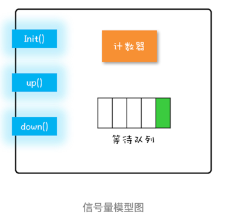
```
class Semaphore{
  // 计数器
  int count;
  // 等待队列
  Queue queue;
  // 初始化操作
  Semaphore(int c){
    this.count=c;
  }
  // 
  void down(){
    this.count--;
    if(this.count<0){
      // 将当前线程插入等待队列
      // 阻塞当前线程
    }
  }
  void up(){
    this.count++;
    if(this.count<=0) {
      // 移除等待队列中的某个线程 T
      // 唤醒线程 T
    }
  }
}
```

```
static int count;
// 初始化信号量
static final Semaphore s 
    = new Semaphore(1);
// 用信号量保证互斥    
static void addOne() {
  s.acquire();
  try {
    count+=1;
  } finally {
    s.release();
  }
}

```
- Semaphore 可以允许多个线程访问一个临界区
比较常见的需求就是我们工作中遇到的各种池化资源，例如连接池、对象池、线程池等等。
  数据库连接池，在同一时刻，一定是允许多个线程同时使用连接池的，当然，每个连接在被释放前，是不允许其他线程使用的。

---
读写锁都遵守以下三条基本原则
1. 允许多个线程同时读共享变量
2. 只允许一个线程写共享变量
3. 如果一个写线程正在执行写操作，此时禁止读线程读共享变量

读写锁与互斥锁的一个重要区别：读写锁允许多个线程同时读共享变量，而互斥锁是不允许的。但读写锁的写操作是互斥的，当一个线程在写共享变量的时候，是不允许其他线程执行写操作和读操作。

ReadWriteLock并不支持锁升级
```
// 读缓存
r.lock();         
try {
  v = m.get(key); 
  if (v == null) {
    w.lock();
    try {
      // 再次验证并更新缓存
      // 省略详细代码
    } finally{
      w.unlock();
    }
  }
} finally{
  r.unlock();     
}

// 这里的读锁没释放前，无法获取写锁，会导致写锁永久等待，最终导致相关线程都被阻塞。
```

```
class CachedData {
  Object data;
  volatile boolean cacheValid;
  final ReadWriteLock rwl = new ReentrantReadWriteLock();
  // 读锁  
  final Lock r = rwl.readLock();
  // 写锁
  final Lock w = rwl.writeLock();
  
  void processCachedData() {
    // 获取读锁
    r.lock();
    if (!cacheValid) {
      // 释放读锁，因为不允许读锁的升级
      r.unlock();
      // 获取写锁
      w.lock();
      try {
        // 再次检查状态  
        if (!cacheValid) {
          data = ...
          cacheValid = true;
        }
        // 释放写锁前，降级为读锁
        // 降级是可以的
        r.lock(); 
      } finally {
        // 释放写锁
        w.unlock(); 
      }
    }
    // 此处仍然持有读锁
    try {use(data);} 
    finally {r.unlock();}
  }
}

```

> 读写锁不支持升级，但是支持降级
> 先加读锁，再加写锁，不允许
> 但是先加写锁，再加读写，允许

---
StampedLock支持三种模式：写锁、悲观读锁和乐观读
其中，写锁、悲观读锁的语义和 ReadWriteLock 的写锁、读锁的语义非常类似，允许多个线程同时获取悲观读锁，但是只允许一个线程获取写锁，写锁和悲观读锁是互斥的。不同的是：StampedLock 里的写锁和悲观读锁加锁成功之后，都会返回一个 stamp；然后解锁的时候，需要传入这个 stamp。
```
final StampedLock sl = 
  new StampedLock();
  
// 获取 / 释放悲观读锁示意代码
long stamp = sl.readLock();
try {
  // 省略业务相关代码
} finally {
  sl.unlockRead(stamp);
}
 
// 获取 / 释放写锁示意代码
long stamp = sl.writeLock();
try {
  // 省略业务相关代码
} finally {
  sl.unlockWrite(stamp);
}
```
> StampedLock性能比ReadWriteLock好的原因：StampedLock 支持乐观读的方式。ReadWriteLock 支持多个线程同时读，但是当多个线程同时读的时候，所有的写操作会被阻塞；而 
> StampedLock 提供的乐观读，是允许一个线程获取写锁的，也就是说不是所有的写操作都被阻塞。 

乐观读是无锁操作

StampedLock性能很好，但仅仅是ReadWriteLock的子集，使用注意事项如下：
1. StampedLock不支持冲入
2. Stamped的悲观锁、写锁都不支持条件变量
3. 如果线程阻塞在 StampedLock 的 readLock() 或者 writeLock() 上时，此时调用该阻塞线程的 interrupt() 方法，会导致 CPU 飙升

```
final StampedLock lock = new StampedLock();
Thread T1 = new Thread(()->{
  // 获取写锁
  lock.writeLock();
  // 永远阻塞在此处，不释放写锁
  LockSupport.park();
});

T1.start();
// 保证 T1 获取写锁
Thread.sleep(100);
Thread T2 = new Thread(()->
  // 阻塞在悲观读锁
  lock.readLock()
);
T2.start();
// 保证 T2 阻塞在读锁
Thread.sleep(100);
// 中断线程 T2
// 会导致线程 T2 所在 CPU 飙升
T2.interrupt();
T2.join();
```
- 使用 StampedLock 一定不要调用中断操作，如果需要支持中断功能，一定使用可中断的悲观读锁 readLockInterruptibly() 和写锁 writeLockInterruptibly()

StampedLock读模版
```
final StampedLock sl =  new StampedLock();
 
// 乐观读
long stamp = sl.tryOptimisticRead();
// 读入方法局部变量
......
// 校验 stamp
if (!sl.validate(stamp)){
  // 升级为悲观读锁
  stamp = sl.readLock();
  try {
    // 读入方法局部变量
    .....
  } finally {
    // 释放悲观读锁
    sl.unlockRead(stamp);
  }
}
// 使用方法局部变量执行业务操作
......
```
StampedLock写模版
```
long stamp = sl.writeLock();
try {
  // 写共享变量
  ......
} finally {
  sl.unlockWrite(stamp);
}
```

---
案例：
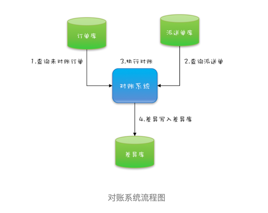
```
while(存在未对账订单){
  // 查询未对账订单
  pos = getPOrders();
  // 查询派送单
  dos = getDOrders();
  // 执行对账操作
  diff = check(pos, dos);
  // 差异写入差异库
  save(diff);
} 
```
- 单线程执行，效率太低

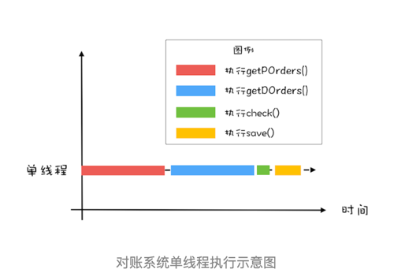
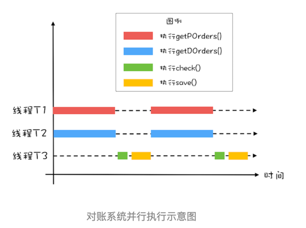

```
while(存在未对账订单){
  // 查询未对账订单
  Thread T1 = new Thread(()->{
    pos = getPOrders();
  });
  T1.start();
  // 查询派送单
  Thread T2 = new Thread(()->{
    dos = getDOrders();
  });
  T2.start();
  // 等待 T1、T2 结束
  T1.join();
  T2.join();
  // 执行对账操作
  diff = check(pos, dos);
  // 差异写入差异库
  save(diff);
} 
```
- 循环里边创建线程，线程创建频繁

```
// 创建 2 个线程的线程池
Executor executor = Executors.newFixedThreadPool(2);
while(存在未对账订单){
  // 计数器初始化为 2
  CountDownLatch latch = new CountDownLatch(2);
  // 查询未对账订单
  executor.execute(()-> {
    pos = getPOrders();
    latch.countDown();
  });
  // 查询派送单
  executor.execute(()-> {
    dos = getDOrders();
    latch.countDown();
  });
  
  // 等待两个查询操作结束
  latch.await();
  
  // 执行对账操作
  diff = check(pos, dos);
  // 差异写入差异库
  save(diff);
}
```
- 模型存在优化空间，对账操作可以与查询操作并行
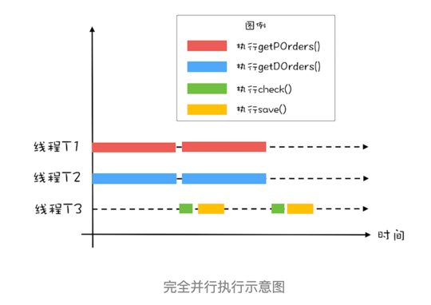
```java
// 订单队列
Vector<P> pos;
// 派送单队列
Vector<D> dos;
// 执行回调的线程池 
Executor executor = Executors.newFixedThreadPool(1);
final CyclicBarrier barrier = new CyclicBarrier(2, ()->{
    executor.execute(()->check());
  });
  
void check(){
  P p = pos.remove(0);
  D d = dos.remove(0);
  // 执行对账操作
  diff = check(p, d);
  // 差异写入差异库
  save(diff);
}
  
void checkAll(){
  // 循环查询订单库
  Thread T1 = new Thread(()->{
    while(存在未对账订单){
      // 查询订单库
      pos.add(getPOrders());
      // 等待
      barrier.await();
    }
  });
  T1.start();  
  // 循环查询运单库
  Thread T2 = new Thread(()->{
    while(存在未对账订单){
      // 查询运单库
      dos.add(getDOrders());
      // 等待
      barrier.await();
    }
  });
  T2.start();
}
```

- CountDownLatch 主要用来解决一个线程等待多个线程的场景
  - 类比旅游团团长要等待所有的游客到齐才能去下一个景点
- CyclicBarrier 是一组线程之间互相等待
  - 像是几个驴友之间不离不弃

> CountDownLatch 的计数器是不能循环利用的，也就是说一旦计数器减到 0，再有线程调用 await()，该线程会直接通过。但CyclicBarrier 的计数器是可以循环利用的，而且具备自动重置的功能，一旦计数器减到 
> 0 会自动重置到你设置的初始值。 CyclicBarrier 还可以设置回调函数，可以说是功能丰富。

---
所有非线程安全的类通过包装的方式实现线程安全
```
List list = Collections.synchronizedList(new ArrayList());
Set set = Collections.synchronizedSet(new HashSet());
Map map = Collections.synchronizedMap(new HashMap());

// 使用模版
List list = Collections.synchronizedList(new ArrayList());
synchronized(list){
    Iterator i = list.iterator(); 
    while (i.hasNext())
        foo(i.next());
}    
```

同步容器：Vector, Stack 和 Hashtable
对容器的遍历要加锁保证互斥

并发容器
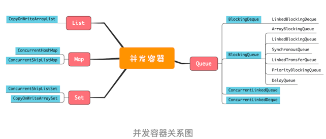
- List
  - CopyOnWriteArrayList: 写的时候会将共享变量新复制一份出来，这样做的好处是读操作完全无锁。
  - CopyOnWriteArrayList 仅适用于写操作非常少的场景，而且能够容忍读写的短暂不一致
  - CopyOnWriteArrayList 迭代器是只读的，不支持增删改
- Map
  - ConcurrentHashMap: key 是无序的，key 和 value 都不能为空，否则会抛出NullPointerException这个运行时异常
  - ConcurrentSkipListMap: key 是有序的，key 和 value 都不能为空，否则会抛出NullPointerException这个运行时异常
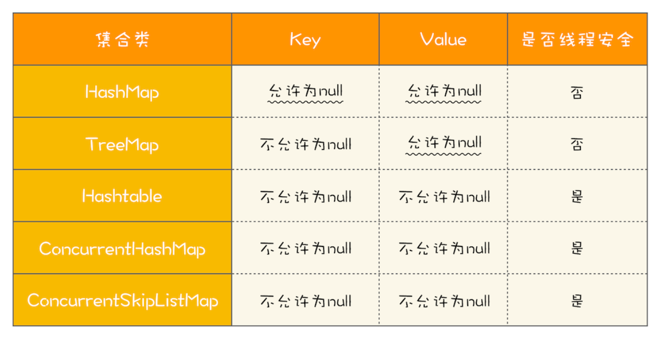

- Set
  - CopyOnWriteArraySet: 写时复制
  - ConcurrentSkipListSet: 跳表实现
- Queue
  - Java 并发包里阻塞队列都用 Blocking 关键字标识，单端队列使用 Queue 标识，双端队列使用 Deque 标识。
  - 单端阻塞队列：
    - ArrayBlockingQueue、LinkedBlockingQueue、SynchronousQueue、LinkedTransferQueue、PriorityBlockingQueue 和 DelayQueue。内部一般会持有一个队列，
    - 这个队列可以是数组（其实现是 ArrayBlockingQueue）
    - 也可以是链表（其实现是 LinkedBlockingQueue）；
    - 甚至还可以不持有队列（其实现是 SynchronousQueue），此时生产者线程的入队操作必须等待消费者线程的出队操作。
    - 而 LinkedTransferQueue 融合 LinkedBlockingQueue 和 SynchronousQueue 的功能，性能比 LinkedBlockingQueue 更好；
    - PriorityBlockingQueue 支持按照优先级出队；
    - DelayQueue 支持延时出队。
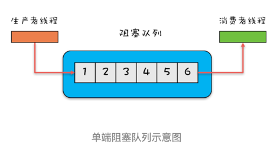

  - 双端阻塞队列：LinkedBlockingDeque
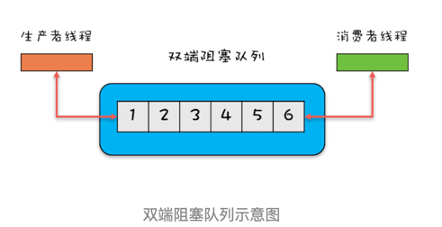

  - 单端非阻塞队列：ConcurrentLinkedQueue
  - 双端非阻塞队列：ConcurrentLinkedDeque

> 使用队列时，需要格外注意队列是否支持有界（所谓有界指的是内部的队列是否有容量限制）。实际工作中，一般都不建议使用无界的队列，因为数据量大了之后很容易导致 OOM。 在使用其他无界队列时，一定要充分考虑是否存在导致 OOM 的隐患。

---
无锁方案相对互斥锁方案，最大的好处就是性能。互斥锁方案为了保证互斥性，需要执行加锁、解锁操作，而加锁、解锁操作本身就消耗性能；同时拿不到锁的线程还会进入阻塞状态，进而触发线程切换，线程切换对性能的消耗也很大。 
相比之下，无锁方案则完全没有加锁、解锁的性能消耗，同时还能保证互斥性，既解决了问题，又没有带来新的问题，可谓绝佳方案。 

无锁方案的实现原理：硬件支持，CPU 为了解决并发问题，提供了 CAS 指令（CAS，全称是 Compare And Swap，即“比较并交换”）。
CAS 指令包含 3 个参数：共享变量的内存地址 A、用于比较的值 B 和共享变量的新值 C；并且只有当内存中地址 A 处的值等于 B 时，才能将内存中地址 A 处的值更新为新值 C。作为一条 CPU 指令，CAS 指令本身是能够保证原子性的。
```java
//两个参数，一个是期望值 expect，另一个是需要写入的新值 newValue，只有当目前 count 的值和期望值 expect 相等时，才会将 count 更新为 newValue。
class SimulatedCAS{
  int count;
  synchronized int cas(int expect, int newValue){
    // 读目前 count 的值
    int curValue = count;
    // 比较目前 count 值是否 == 期望值
    if(curValue == expect){
      // 如果是，则更新 count 的值
      count = newValue;
    }
    // 返回写入前的值
    return curValue;
  }
}
```

CAS方案中的ABA问题：
> 在多线程场景下CAS会出现ABA问题，关于ABA问题这里简单科普下，例如有2个线程同时对同一个值(初始值为A)进行CAS操作，这三个线程如下:
> 线程1，期望值为A，欲更新的值为B 
> 线程2，期望值为A，欲更新的值为B
> 线程1抢先获得CPU时间片，而线程2因为其他原因阻塞了，线程1取值与期望的A值比较，发现相等然后将值更新为B，然后这个时候出现了线程3，期望值为B，欲更新的值为A，线程3取值与期望的值B比较，发现相等则将值更新为A，此时线程2
> 从阻塞中恢复，并且获得了CPU时间片，这时候线程2取值与期望的值A比较，发现相等则将值更新为B，虽然线程2也完成了操作，但是线程2并不知道值已经经过了A->B->A的变化过程。

