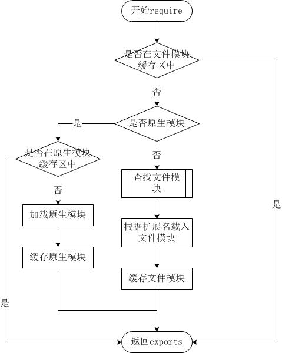

Node.js 安装包及源码下载地址为：https://nodejs.org/en/download
Node.js 历史版本下载地址：https://nodejs.org/dist/

# Linux 上安装 Node.js
解压
```shell
# wget https://nodejs.org/dist/v10.9.0/node-v10.9.0-linux-x64.tar.xz    // 下载
# tar xf  node-v10.9.0-linux-x64.tar.xz       // 解压
# cd node-v10.9.0-linux-x64/                  // 进入解压目录
# ./bin/node -v                               // 执行node命令 查看版本
v10.9.0
```

设置软连接
```shell
ln -s /usr/software/nodejs/bin/npm   /usr/local/bin/ 
ln -s /usr/software/nodejs/bin/node   /usr/local/bin/
```
---
# 创建 Node.js 应用
步骤一、使用 require 指令来加载和引入模块
语法格式如下：
const module = require('module-name');
module-name 可以是一个文件路径（相对或绝对路径），也可以是一个模块名称，如果是一个模块名称，Node.js 会自动从 node_modules 目录中查找该模块.
require 指令会返回被加载的模块的导出对象，可以通过该对象来访问模块中定义的属性和方法，如果模块中有多个导出对象，则可以使用解构赋值的方式来获取它们。

步骤二、创建服务器
使用 http.createServer() 方法创建服务器，并使用 listen 方法绑定 8888 端口。 函数通过 request, response 参数来接收和响应数据。

```js
var http = require('http');

http.createServer(function (request, response) {

    // 发送 HTTP 头部 
    // HTTP 状态值: 200 : OK
    // 内容类型: text/plain
    response.writeHead(200, {'Content-Type': 'text/plain'});

    // 发送响应数据 "Hello World"
    response.end('Hello World\n');
}).listen(8888);

// 终端打印如下信息
console.log('Server running at http://127.0.0.1:8888/');
```

---
# NPM包管理
NPM（Node Package Manager）是一个 JavaScript 包管理工具，也是 Node.js 的默认包管理器。

NPM 允许开发者轻松地下载、安装、共享、管理项目的依赖库和工具。
## 主要功能
1. 包管理： 帮助安装并管理项目所需的各种第三方库（包）。例如，可以通过简单的命令来安装、更新、或删除依赖
2. 版本管理：支持版本控制，允许锁定某个特定版本的依赖，或根据需求选择最新的版本。
3. 包发布： NPM 允许开发者将自己的库发布到 NPM 仓库中，其他开发者可以通过 NPM 下载并使用这些库。
4. 命令行工具： NPM 提供了强大的命令行工具，可以用于安装包、运行脚本、初始化项目等多种操作。

```shell
#升级npm
sudo npm install npm -g
# windows npm install -g cnpm --registry=https://registry.npmmirror.com
npm install npm -g

# 安装模块 npm install <Module Name>

```
npm 的包安装分为本地安装（local）、全局安装（global）两种，从敲的命令行来看，差别只是有没有-g而已
npm install express      # 本地安装
npm install express -g   # 全局安装

> 异常处理
> npm err! Error: connect ECONNREFUSED 127.0.0.1:8087 
> 解决办法为： npm config set proxy null

本地安装
1. 将安装包放在 ./node_modules 下（运行 npm 命令时所在的目录），如果没有 node_modules 目录，会在当前执行 npm 命令的目录下生成 node_modules 目录。
2. 可以通过 require() 来引入本地安装的包

全局安装
1. 将安装包放在 /usr/local 下或者你 node 的安装目录。
2. 可以直接在命令行里使用。

```shell
#安装express
npm install express -g
npm list -g #查看安装信息
npm list grunt #查看某个模块
```
---
Package.json属性说明

name - 包名。

version - 包的版本号。

description - 包的描述。

homepage - 包的官网 url 。

author - 包的作者姓名。

contributors - 包的其他贡献者姓名。

dependencies - 依赖包列表。如果依赖包没有安装，npm 会自动将依赖包安装在 node_module 目录下。

repository - 包代码存放的地方的类型，可以是 git 或 svn，git 可在 Github 上。

main - main 字段指定了程序的主入口文件，require('moduleName') 就会加载这个文件。这个字段的默认值是模块根目录下面的 index.js。
keywords - 关键字
---
卸载模块
npm uninstall express
更新模块
npm update express
创建模块
npm init

npm adduser #在npm资源库中注册用户
npm publish #发布模块

---
版本号
使用 NPM 下载和发布代码时都会接触到版本号，NPM 使用语义版本号来管理代码，这里简单介绍一下。

语义版本号分为 X.Y.Z 三位，分别代表主版本号、次版本号和补丁版本号，当代码变更时，版本号按以下原则更新。

如果只是修复 bug，需要更新 Z 位。
如果是新增了功能，但是向下兼容，需要更新 Y 位。
如果有大变动，向下不兼容，需要更新 X 位。

版本号有了这个保证后，在申明第三方包依赖时，除了可依赖于一个固定版本号外，还可依赖于某个范围的版本号。例如 "argv": "0.0.x" 表示依赖于 0.0.x 系列的最新版 argv。

---
常用命令
NPM 提供了很多命令，可以使用 npm help 可查看所有命令。
```
npm init：初始化一个新的 Node.js 项目，生成 package.json 文件。
npm install <package>：安装某个包并将其添加到项目的依赖中。
npm install：安装 package.json 文件中定义的所有依赖。
npm uninstall <package>：卸载某个包并从依赖中移除。
npm update：更新项目中所有的依赖包到最新版本。
npm run <script>：运行在 package.json 中定义的脚本。
```

---
使用淘宝NPM镜像
使用淘宝定制的 cnpm (gzip 压缩支持) 命令行工具代替默认的 npm:
npm install -g cnpm --registry=https://registry.npmmirror.com
使用 cnpm 命令来安装模块
```shell
cnpm install [name]
```

> 如果你遇到了使用 npm 安 装node_modules 总是提示报错：报错: npm resource busy or locked.....。 可以先删除以前安装的 node_modules :
> npm cache clean
> npm install

---
Node.js REPL(交互式解释器)
Node.js REPL(Read Eval Print Loop:交互式解释器) 表示一个电脑的环境，类似 Windows 系统的终端或 Unix/Linux shell，我们可以在终端中输入命令，并接收系统的响应。
Node 自带了交互式解释器，可以执行以下任务：
读取 - 读取用户输入，解析输入的 Javascript 数据结构并存储在内存中。
执行 - 执行输入的数据结构
打印 - 输出结果
循环 - 循环操作以上步骤直到用户两次按下 ctrl-c 按钮退出。

REPL 命令
ctrl + c - 退出当前终端。
ctrl + c 按下两次 - 退出 Node REPL。
ctrl + d - 退出 Node REPL.
向上/向下 键 - 查看输入的历史命令
tab 键 - 列出当前命令
.help - 列出使用命令
.break - 退出多行表达式
.clear - 退出多行表达式
.save filename - 保存当前的 Node REPL 会话到指定文件
.load filename - 载入当前 Node REPL 会话的文件内容。

---
Node.js 回调函数

Node.js 异步编程的直接体现就是回调。
异步编程依托于回调来实现，但不能说使用了回调后程序就异步化了。
回调函数在完成任务后就会被调用，Node 使用了大量的回调函数，Node 所有 API 都支持回调函数。
例如，我们可以一边读取文件，一边执行其他命令，在文件读取完成后，我们将文件内容作为回调函数的参数返回。这样在执行代码时就没有阻塞或等待文件 I/O 操作。这就大大提高了 Node.js 的性能，可以处理大量的并发请求。
回调函数一般作为函数的最后一个参数出现：
```js
function foo1(name, age, callback) { }
function foo2(value, callback1, callback2) { }
```

阻塞代码实例
```js
var fs = require("fs");

var data = fs.readFileSync('input.txt');

console.log(data.toString());
console.log("程序执行结束!");
```

非阻塞代码实例
```js
var fs = require("fs");

fs.readFile('input.txt', function (err, data) {
    if (err) return console.error(err);
    console.log(data.toString());
});

console.log("程序执行结束!");
```

基于新版本 ES 的语法糖，Node 的异步操作可以替换成以下两种写法。
```js
const _submit = (payload, formid, destination) => {
  return new Promise((resolve, reject) => { // 返回一个Promise对象，实现异步回调
    app.requestPost(destination, {
      payload,
      formid: formid
    }, true).then((res) => { // 调用一个异步函数，使用then方法对接成功回调
      if (res) {
        resolve(); // call成功回调
      } else {
        reject(); / call失败回调
      }
    }).catch(() => { // 调用一个异步函数，使用catch方法对接失败回调
      reject();
    })
  });
}
```

```js
async function query(collection, querySelector, queryOptions) {
  let db, data;
  try {
    db = await MongoClient.connect(_dburl); // 使用await标记上游异步函数，此时event loop会将与该变量有关的操作阻塞
    data = await db.db(DBNAME).collection(collection).find(querySelector, queryOptions || {}).toArray();
  } catch (e) {
    log(e.message, 2);
  }
  return data;
}
```

---
Node.js 事件循环
Node.js 是单进程单线程应用程序，但是因为 V8 引擎提供的异步执行回调接口，通过这些接口可以处理大量的并发，所以性能非常高。
Node.js 几乎每一个 API 都是支持回调函数的。
Node.js 基本上所有的事件机制都是用设计模式中观察者模式实现。
Node.js 单线程类似进入一个while(true)的事件循环，直到没有事件观察者退出，每个异步事件都生成一个事件观察者，如果有事件发生就调用该回调函数.

事件驱动程序
eventEmitters => events=> event loop => event handlers
```js
// 引入 events 模块
var events = require('events');
// 创建 eventEmitter 对象
var eventEmitter = new events.EventEmitter();
// 绑定事件及事件的处理程序
eventEmitter.on('eventName', eventHandler);
// 触发事件
eventEmitter.emit('eventName');
```

```js
// 引入 events 模块
var events = require('events');
// 创建 eventEmitter 对象
var eventEmitter = new events.EventEmitter();
 
// 创建事件处理程序
var connectHandler = function connected() {
   console.log('连接成功。');
  
   // 触发 data_received 事件 
   eventEmitter.emit('data_received');
}
 
// 绑定 connection 事件处理程序
eventEmitter.on('connection', connectHandler);
 
// 使用匿名函数绑定 data_received 事件
eventEmitter.on('data_received', function(){
   console.log('数据接收成功。');
});
 
// 触发 connection 事件 
eventEmitter.emit('connection');
 
console.log("程序执行完毕。");
```

---
Node 应用程序是如何工作的？
在 Node 应用程序中，执行异步操作的函数将回调函数作为最后一个参数， 回调函数接收错误对象作为第一个参数。
```js
var fs = require("fs");

fs.readFile('input.txt', function (err, data) {
   if (err){
      console.log(err.stack);
      return;
   }
   console.log(data.toString());
});
console.log("程序执行完毕");
```
---
Node.js EventEmitter
Node.js 所有的异步 I/O 操作在完成时都会发送一个事件到事件队列。

Node.js 里面的许多对象都会分发事件：一个 net.Server 对象会在每次有新连接时触发一个事件， 一个 fs.readStream 对象会在文件被打开的时候触发一个事件。 所有这些产生事件的对象都是 events.EventEmitter 的实例。
EventEmitter 类
events 模块只提供了一个对象： events.EventEmitter。EventEmitter 的核心就是事件触发与事件监听器功能的封装。
通过require("events");来访问该模块。
```js
//event.js 文件
var EventEmitter = require('events').EventEmitter; 
var event = new EventEmitter(); 
event.on('some_event', function() { 
    console.log('some_event 事件触发'); 
}); 
setTimeout(function() { 
    event.emit('some_event'); 
}, 1000);
```

EventEmitter 的每个事件由一个事件名和若干个参数组成，事件名是一个字符串，通常表达一定的语义。对于每个事件，EventEmitter 支持 若干个事件监听器。
当事件触发时，注册到这个事件的事件监听器被依次调用，事件参数作为回调函数参数传递。
EventEmitter 提供了多个属性，如 on 和 emit。on 函数用于绑定事件函数，emit 属性用于触发一个事件。接下来我们来具体看下 EventEmitter 的属性介绍。
```js
//event.js 文件
var events = require('events'); 
var emitter = new events.EventEmitter(); 
emitter.on('someEvent', function(arg1, arg2) { 
    console.log('listener1', arg1, arg2); 
}); 
emitter.on('someEvent', function(arg1, arg2) { 
    console.log('listener2', arg1, arg2); 
}); 
emitter.emit('someEvent', 'arg1 参数', 'arg2 参数');
```

---
方法
addListener(event, listener) 为指定事件添加一个监听器到监听器数组的尾部。
on(event, listener) 为指定事件注册一个监听器，接受一个字符串 event 和一个回调函数。
```js
server.on('connection', function (stream) {
  console.log('someone connected!');
});
```
once(event, listener) 为指定事件注册一个单次监听器，即 监听器最多只会触发一次，触发后立刻解除该监听器。
```js
server.once('connection', function (stream) {
  console.log('Ah, we have our first user!');
});
```
removeListener(event, listener) 移除指定事件的某个监听器，监听器必须是该事件已经注册过的监听器。它接受两个参数，第一个是事件名称，第二个是回调函数名称。
```js
var callback = function(stream) {
  console.log('someone connected!');
};
server.on('connection', callback);
// ...
server.removeListener('connection', callback);
```

removeAllListeners([event]) 移除所有事件的所有监听器， 如果指定事件，则移除指定事件的所有监听器。
setMaxListeners(n) 默认情况下， EventEmitters 如果你添加的监听器超过 10 个就会输出警告信息。 setMaxListeners 函数用于改变监听器的默认限制的数量。
listeners(event) 返回指定事件的监听器数组。
emit(event, [arg1], [arg2], [...]) 按监听器的顺序执行执行每个监听器，如果事件有注册监听返回 true，否则返回 false。

--- 
类方法
listenerCount(emitter, event) 返回指定事件的监听器数量。
```js
events.EventEmitter.listenerCount(emitter, eventName) //已废弃，不推荐
events.emitter.listenerCount(eventName) //推荐
```

---
事件
newListener event - 字符串，事件名称 listener - 处理事件函数
该事件在添加新监听器时被触发。

removeListener event - 字符串，事件名称 listener - 处理事件函数
从指定监听器数组中删除一个监听器。需要注意的是，此操作将会改变处于被删监听器之后的那些监听器的索引。

---
error 事件
EventEmitter 定义了一个特殊的事件 error，它包含了错误的语义，在遇到 异常的时候通常会触发 error 事件。
当 error 被触发时，EventEmitter 规定如果没有响 应的监听器，Node.js 会把它当作异常，退出程序并输出错误信息。
一般要为会触发 error 事件的对象设置监听器，避免遇到错误后整个程序崩溃。例如：
```js
var events = require('events'); 
var emitter = new events.EventEmitter(); 
emitter.emit('error');
```

---
继承 EventEmitter
常用的方式不是直接使用EventEmitter, 而是在对象中继承它。包括 fs、net、 http 在内的，只要是支持事件响应的核心模块都是 EventEmitter 的子类。
原因有两点：
首先，具有某个实体功能的对象实现事件符合语义， 事件的监听和发生应该是一个对象的方法。
其次 JavaScript 的对象机制是基于原型的，支持 部分多重继承，继承 EventEmitter 不会打乱对象原有的继承关系。


---
Node.js Buffer(缓冲区)
JavaScript 语言自身只有字符串数据类型，没有二进制数据类型。但在处理像TCP流或文件流时，必须使用到二进制数据。因此在 Node.js中，定义了一个 Buffer 类，该类用来创建一个专门存放二进制数据的缓存区。
在 Node.js 中，Buffer 类是随 Node 内核一起发布的核心库。Buffer 库为 Node.js 带来了一种存储原始数据的方法，可以让 Node.js 处理二进制数据，每当需要在 Node.js 中处理I/O操作中移动的数据时，就有可能使用 Buffer 库。原始数据存储在 Buffer 类的实例中。一个 Buffer 类似于一个整数数组，但它对应于 V8 堆内存之外的一块原始内存。

> 在v6.0之前创建Buffer对象直接使用new Buffer()构造函数来创建对象实例，但是Buffer对内存的权限操作相比很大，可以直接捕获一些敏感信息，所以在v6.0以后，官方文档里面建议使用 Buffer.from() 接口去创建Buffer对象。

Buffer 与字符编码
Buffer 实例一般用于表示编码字符的序列，比如 UTF-8 、 UCS2 、 Base64 、或十六进制编码的数据。 通过使用显式的字符编码，就可以在 Buffer 实例与普通的 JavaScript 字符串之间进行相互转换。

```js
const buf = Buffer.from('runoob', 'ascii');

// 输出 72756e6f6f62
console.log(buf.toString('hex'));

// 输出 cnVub29i
console.log(buf.toString('base64'));
```

Node.js 目前支持的字符编码包括：
- ascii - 仅支持 7 位 ASCII 数据。如果设置去掉高位的话，这种编码是非常快的。
- utf8 - 多字节编码的 Unicode 字符。许多网页和其他文档格式都使用 UTF-8 。
- utf16le - 2 或 4 个字节，小字节序编码的 Unicode 字符。支持代理对（U+10000 至 U+10FFFF）。
- ucs2 - utf16le 的别名。
- base64 - Base64 编码。
- latin1 - 一种把 Buffer 编码成一字节编码的字符串的方式。
- binary - latin1 的别名。
- hex - 将每个字节编码为两个十六进制字符。

---
创建 Buffer 类
Buffer.alloc(size[, fill[, encoding]])： 返回一个指定大小的 Buffer 实例，如果没有设置 fill，则默认填满 0
Buffer.allocUnsafe(size)： 返回一个指定大小的 Buffer 实例，但是它不会被初始化，所以它可能包含敏感的数据
Buffer.allocUnsafeSlow(size)
Buffer.from(array)： 返回一个被 array 的值初始化的新的 Buffer 实例（传入的 array 的元素只能是数字，不然就会自动被 0 覆盖）
Buffer.from(arrayBuffer[, byteOffset[, length]])： 返回一个新建的与给定的 ArrayBuffer 共享同一内存的 Buffer。
Buffer.from(buffer)： 复制传入的 Buffer 实例的数据，并返回一个新的 Buffer 实例
Buffer.from(string[, encoding])： 返回一个被 string 的值初始化的新的 Buffer 实例

---
写入缓冲区
buf.write(string[, offset[, length]][, encoding])
string - 写入缓冲区的字符串。
offset - 缓冲区开始写入的索引值，默认为 0 。
length - 写入的字节数，默认为 buffer.length
encoding - 使用的编码。默认为 'utf8' 。

根据 encoding 的字符编码写入 string 到 buf 中的 offset 位置。 length 参数是写入的字节数。 如果 buf 没有足够的空间保存整个字符串，则只会写入 string 的一部分。 只部分解码的字符不会被写入。

返回实际写入的大小。如果 buffer 空间不足， 则只会写入部分字符串。
```js
buf = Buffer.alloc(256);
len = buf.write("www.runoob.com");
console.log("写入字节数 : "+  len);
```

从缓冲区读取数据
buf.toString([encoding[, start[, end]]])
encoding - 使用的编码。默认为 'utf8' 。
start - 指定开始读取的索引位置，默认为 0。
end - 结束位置，默认为缓冲区的末尾。

---
将 Buffer 转换为 JSON 对象
buf.toJSON()
当字符串化一个 Buffer 实例时，JSON.stringify() 会隐式地调用该 toJSON()。

---
缓冲区合并
Buffer.concat(list[, totalLength])
list - 用于合并的 Buffer 对象数组列表。
totalLength - 指定合并后Buffer对象的总长度。
```js
var buffer1 = Buffer.from(('菜鸟教程'));
var buffer2 = Buffer.from(('www.runoob.com'));
var buffer3 = Buffer.concat([buffer1,buffer2]);
console.log("buffer3 内容: " + buffer3.toString());
```
缓冲区比较
buf.compare(otherBuffer);
otherBuffer - 与 buf 对象比较的另外一个 Buffer 对象。

```js
var buffer1 = Buffer.from('ABC');
var buffer2 = Buffer.from('ABCD');
var result = buffer1.compare(buffer2);

if(result < 0) {
   console.log(buffer1 + " 在 " + buffer2 + "之前");
}else if(result == 0){
   console.log(buffer1 + " 与 " + buffer2 + "相同");
}else {
   console.log(buffer1 + " 在 " + buffer2 + "之后");
}

```

拷贝缓冲区
buf.copy(targetBuffer[, targetStart[, sourceStart[, sourceEnd]]])

targetBuffer - 要拷贝的 Buffer 对象。
targetStart - 数字, 可选, 默认: 0
sourceStart - 数字, 可选, 默认: 0
sourceEnd - 数字, 可选, 默认: buffer.length

```js
var buf1 = Buffer.from('abcdefghijkl');
var buf2 = Buffer.from('RUNOOB');

//将 buf2 插入到 buf1 指定位置上
buf2.copy(buf1, 2);

console.log(buf1.toString());
```

缓冲区裁剪
buf.slice([start[, end]])
start - 数字, 可选, 默认: 0
end - 数字, 可选, 默认: buffer.length
```js
var buffer1 = Buffer.from('runoob');
// 剪切缓冲区
var buffer2 = buffer1.slice(0,2);
console.log("buffer2 content: " + buffer2.toString());
```

缓冲区长度
buf.length;
```js
var buffer = Buffer.from('www.runoob.com');
//  缓冲区长度
console.log("buffer length: " + buffer.length);
```
---
Node.js Stream(流)
Stream 是一个抽象接口，Node 中有很多对象实现了这个接口。例如，对http 服务器发起请求的request 对象就是一个 Stream，还有stdout（标准输出）
Node.js，Stream 有四种流类型：
Readable - 可读操作。
Writable - 可写操作。
Duplex - 可读可写操作.
Transform - 操作被写入数据，然后读出结果。

所有的 Stream 对象都是 EventEmitter 的实例。常用的事件有：
data - 当有数据可读时触发。
end - 没有更多的数据可读时触发。
error - 在接收和写入过程中发生错误时触发。
finish - 所有数据已被写入到底层系统时触发。

写入流

管道流
管道提供了一个输出流到输入流的机制。通常我们用于从一个流中获取数据并将数据传递到另外一个流中。
source => dest

链式流
链式是通过连接输出流到另外一个流并创建多个流操作链的机制。链式流一般用于管道操作。

---
Node.js模块系统
为了让Node.js的文件可以相互调用，Node.js提供了一个简单的模块系统。
模块是Node.js 应用程序的基本组成部分，文件和模块是一一对应的。换言之，一个 Node.js 文件就是一个模块，这个文件可能是JavaScript 代码、JSON 或者编译过的C/C++ 扩展。

引入模块
```js
var hello = require('./hello');
hello.world();
```
Node.js 提供了 exports 和 require 两个对象，其中 exports 是模块公开的接口，require 用于从外部获取一个模块的接口，即所获取模块的 exports 对象。
```js
exports.world = function() {
  console.log('Hello World');
}
```

把一个对象封装到模块中
```js
module.exports = function() {
  // ...
}

function Hello() {
    var name;
    this.setName = function(thyName) {
        name = thyName;
    };
    this.sayHello = function() {
        console.log('Hello ' + name);
    };
};
module.exports = Hello; // 模块接口的唯一变化是使用 module.exports = Hello 代替了exports.world = function(){}
```

---
Node.js 的 require 方法中的文件查找策略
由于 Node.js 中存在 4 类模块（原生模块和3种文件模块），尽管 require 方法极其简单，但是内部的加载却是十分复杂的，其加载优先级也各自不同


1. 从文件模块缓存中加载
尽管原生模块与文件模块的优先级不同，但是都会优先从文件模块的缓存中加载已经存在的模块。
2. 从原生模块加载
原生模块的优先级仅次于文件模块缓存的优先级。require 方法在解析文件名之后，优先检查模块是否在原生模块列表中。以http模块为例，尽管在目录下存在一个 http/http.js/http.node/http.json 文件，require("http") 都不会从这些文件中加载，而是从原生模块中加载。
原生模块也有一个缓存区，同样也是优先从缓存区加载。如果缓存区没有被加载过，则调用原生模块的加载方式进行加载和执行。
3. 从文件加载
当文件模块缓存中不存在，而且不是原生模块的时候，Node.js 会解析 require 方法传入的参数，并从文件系统中加载实际的文件，加载过程中的包装和编译细节

require方法接受以下几种参数的传递：
- http、fs、path等，原生模块。
- ./mod或../mod，相对路径的文件模块。
- /pathtomodule/mod，绝对路径的文件模块。
- mod，非原生模块的文件模块。
```
1. 如果 X 是内置模块
   a. 返回内置模块
   b. 停止执行
2. 如果 X 以 '/' 开头
   a. 设置 Y 为文件根路径
3. 如果 X 以 './' 或 '/' or '../' 开头
   a. LOAD_AS_FILE(Y + X)
   b. LOAD_AS_DIRECTORY(Y + X)
4. LOAD_NODE_MODULES(X, dirname(Y))
5. 抛出异常 "not found"

LOAD_AS_FILE(X)
1. 如果 X 是一个文件, 将 X 作为 JavaScript 文本载入并停止执行。
2. 如果 X.js 是一个文件, 将 X.js 作为 JavaScript 文本载入并停止执行。
3. 如果 X.json 是一个文件, 解析 X.json 为 JavaScript 对象并停止执行。
4. 如果 X.node 是一个文件, 将 X.node 作为二进制插件载入并停止执行。

LOAD_INDEX(X)
1. 如果 X/index.js 是一个文件,  将 X/index.js 作为 JavaScript 文本载入并停止执行。
2. 如果 X/index.json 是一个文件, 解析 X/index.json 为 JavaScript 对象并停止执行。
3. 如果 X/index.node 是一个文件,  将 X/index.node 作为二进制插件载入并停止执行。

LOAD_AS_DIRECTORY(X)
1. 如果 X/package.json 是一个文件,
   a. 解析 X/package.json, 并查找 "main" 字段。
   b. let M = X + (json main 字段)
   c. LOAD_AS_FILE(M)
   d. LOAD_INDEX(M)
2. LOAD_INDEX(X)

LOAD_NODE_MODULES(X, START)
1. let DIRS=NODE_MODULES_PATHS(START)
2. for each DIR in DIRS:
   a. LOAD_AS_FILE(DIR/X)
   b. LOAD_AS_DIRECTORY(DIR/X)

NODE_MODULES_PATHS(START)
1. let PARTS = path split(START)
2. let I = count of PARTS - 1
3. let DIRS = []
4. while I >= 0,
   a. if PARTS[I] = "node_modules" CONTINUE
   b. DIR = path join(PARTS[0 .. I] + "node_modules")
   c. DIRS = DIRS + DIR
   d. let I = I - 1
5. return DIRS
```
> exports 和 module.exports 的使用
> 如果要对外暴露属性或方法，就用 exports 就行，要暴露对象(类似class，包含了很多属性和方法)，就用 module.exports。

---
> 建议同时使用 exports 和 module.exports。 如果先使用 exports 对外暴露属性或方法，再使用 module.exports 暴露对象，会使得 exports 上暴露的属性或者方法失效。
> 原因在于，exports 仅仅是 module.exports 的一个引用。在 nodejs 中，是这么设计 require 函数的：
```
function require(...){
  var module = {exports: {}};

  ((module, exports) => {
    function myfn () {}
    // 这个myfn就是我们自己的代码
    exports.myfn = myfn; // 这里是在原本的对象上添加了一个myfn方法。
    module.exports = myfn;// 这个直接把当初的对象进行覆盖。
  })(module,module.exports)
  return module.exports;
}
```

---
Node.js 函数
在 JavaScript中，一个函数可以作为另一个函数的参数。
```js
function say(word) {
  console.log(word);
}

function execute(someFunction, value) {
  someFunction(value);
}

execute(say, "Hello");
```

匿名函数传递
```js
function execute(someFunction, value) {
  someFunction(value);
}

execute(function(word){ console.log(word) }, "Hello");
```

---
Node.js 路由
在 Node.js 中，路由（Routing）是指确定如何响应对特定端点（URL 路径）的 HTTP 请求的过程。
```
                   url.parse(string).query
                                           |
           url.parse(string).pathname      |
                       |                   |
                       |                   |
                     ------ -------------------
http://localhost:8888/start?foo=bar&hello=world
                                ---       -----
                                 |          |
                                 |          |
              querystring.parse(queryString)["foo"]    |
                                            |
                         querystring.parse(queryString)["hello"]
```

router.js
```js
function route(pathname) {
  console.log("About to route a request for " + pathname);
}
 
exports.route = route;
```
server.js
```js
var http = require("http");
var url = require("url");
 
function start(route) {
  function onRequest(request, response) {
    var pathname = url.parse(request.url).pathname;
    console.log("Request for " + pathname + " received.");
 
    route(pathname);
 
    response.writeHead(200, {"Content-Type": "text/plain"});
    response.write("Hello World");
    response.end();
  }
 
  http.createServer(onRequest).listen(8888);
  console.log("Server has started.");
}
 
exports.start = start;
```
index.js
```js
var server = require("./server");
var router = require("./router");
 
server.start(router.route);
```

---
Node.js 全局对象
JavaScript 中有一个特殊的对象，称为全局对象（Global Object），它及其所有属性都可以在程序的任何地方访问，即全局变量。
在浏览器 JavaScript 中，通常 window 是全局对象， 而 Node.js 中的全局对象是 global，所有全局变量（除了 global 本身以外）都是 global 对象的属性。
在 Node.js 我们可以直接访问到 global 的属性，而不需要在应用中包含它。

全局对象与全局变量
global 最根本的作用是作为全局变量的宿主。按照 ECMAScript 的定义，满足以下条 件的变量是全局变量：
- 在最外层定义的变量；
- 全局对象的属性；
- 隐式定义的变量（未定义直接赋值的变量）。

> 当你定义一个全局变量时，这个变量同时也会成为全局对象的属性，反之亦然。需要注 意的是，在 Node.js 中你不可能在最外层定义变量，因为所有用户代码都是属于当前模块的， 而模块本身不是最外层上下文。
> 注意： 最好不要使用 var 定义变量以避免引入全局变量，因为全局变量会污染命名空间，提高代码的耦合风险。

__filename
__filename 表示当前正在执行的脚本的文件名。它将输出文件所在位置的绝对路径，且和命令行参数所指定的文件名不一定相同。 如果在模块中，返回的值是模块文件的路径。
```js
// 输出全局变量 __filename 的值
console.log( __filename ); // /web/com/runoob/nodejs/main.js
```

__dirname
__dirname 表示当前执行脚本所在的目录。
```js
// 输出全局变量 __dirname 的值
console.log( __dirname ); // /web/com/runoob/nodejs
```

setTimeout(cb, ms)
setTimeout(cb, ms) 全局函数在指定的毫秒(ms)数后执行指定函数(cb)。：setTimeout() 只执行一次指定函数。
返回一个代表定时器的句柄值
```js
function printHello(){
   console.log( "Hello, World!");
}
// 两秒后执行以上函数
setTimeout(printHello, 2000);
```

clearTimeout(t)
clearTimeout( t ) 全局函数用于停止一个之前通过 setTimeout() 创建的定时器。 参数 t 是通过 setTimeout() 函数创建的定时器。
```js
function printHello(){
   console.log( "Hello, World!");
}
// 两秒后执行以上函数
var t = setTimeout(printHello, 2000);

// 清除定时器
clearTimeout(t);
```

setInterval(cb, ms)
setInterval(cb, ms) 全局函数在指定的毫秒(ms)数后执行指定函数(cb)。
返回一个代表定时器的句柄值。可以使用 clearInterval(t) 函数来清除定时器。
setInterval() 方法会不停地调用函数，直到 clearInterval() 被调用或窗口被关闭。

```js
function printHello(){
   console.log( "Hello, World!");
}
// 两秒后执行以上函数
setInterval(printHello, 2000);
```

console
console 用于提供控制台标准输出，它是由 Internet Explorer 的 JScript 引擎提供的调试工具，后来逐渐成为浏览器的实施标准。
Node.js 沿用了这个标准，提供与习惯行为一致的 console 对象，用于向标准输出流（stdout）或标准错误流（stderr）输出字符。
```
console.log([data][, ...])   向标准输出流打印字符并以换行符结束。该方法接收若干 个参数，如果只有一个参数，则输出这个参数的字符串形式。如果有多个参数，则 以类似于C 语言 printf() 命令的格式输出。
console.info([data][, ...])  该命令的作用是返回信息性消息，这个命令与console.log差别并不大，除了在chrome中只会输出文字外，其余的会显示一个蓝色的惊叹号。
console.error([data][, ...]) 输出错误消息的。控制台在出现错误时会显示是红色的叉子。
console.warn([data][, ...]) 输出警告消息。控制台出现有黄色的惊叹号。
console.dir(obj[, options]) 用来对一个对象进行检查（inspect），并以易于阅读和打印的格式显示。
console.time(label) 输出时间，表示计时开始。
console.timeEnd(label) 结束时间，表示计时结束。
console.trace(message[, ...]) 当前执行的代码在堆栈中的调用路径，这个测试函数运行很有帮助，只要给想测试的函数里面加入console.trace 就行了。
console.assert(value[, message][, ...]) 用于判断某个表达式或变量是否为真，接收两个参数，第一个参数是表达式，第二个参数是字符串。只有当第一个参数为false，才会输出第二个参数，否则不会有任何结果。
```

```js
console.info("程序开始执行：");

var counter = 10;
console.log("计数: %d", counter);

console.time("获取数据");
//
// 执行一些代码
// 
console.timeEnd('获取数据');

console.info("程序执行完毕。")
```

process
process 是一个全局变量，即 global 对象的属性。
它用于描述当前Node.js 进程状态的对象，提供了一个与操作系统的简单接口。通常在你写本地命令行程序的时候，少不了要 和它打交道。

```
exit 当进程准备退出时触发。
beforeExit 当 node 清空事件循环，并且没有其他安排时触发这个事件。通常来说，当没有进程安排时 node 退出，但是 'beforeExit' 的监听器可以异步调用，这样 node 就会继续执行。
uncaughtException 当一个异常冒泡回到事件循环，触发这个事件。如果给异常添加了监视器，默认的操作（打印堆栈跟踪信息并退出）就不会发生。
Signal 事件 当进程接收到信号时就触发。信号列表详见标准的 POSIX 信号名，如 SIGINT、SIGUSR1 等。
```

```js
process.on('exit', function(code) {

  // 以下代码永远不会执行
  setTimeout(function() {
    console.log("该代码不会执行");
  }, 0);
  
  console.log('退出码为:', code);
});
console.log("程序执行结束");
```
退出状态码


| 状态码 | 名称 & 描述                                                                                                                                      |
|-----|----------------------------------------------------------------------------------------------------------------------------------------------|
| 1   | Uncaught Fatal Exception 有未捕获异常，并且没有被域或 uncaughtException 处理函数处理。                                                                            |
| 2   | Unused 保留，由 Bash 预留用于内置误用                                                                                                                    |
| 3   | Internal JavaScript Parse Error<br/> JavaScript的源码启动 Node 进程时引起解析错误。非常罕见，仅会在开发 Node 时才会有。                                                    |
| 4   | Internal JavaScript Evaluation Failure <br/>JavaScript 的源码启动 Node 进程，评估时返回函数失败。非常罕见，仅会在开发 Node 时才会有。                                         |
| 5   | Fatal Error<br/>V8 里致命的不可恢复的错误。通常会打印到 stderr ，内容为： FATAL ERROR                                                                               |
| 6   | Non-function Internal Exception Handler<br/>未捕获异常，内部异常处理函数不知为何设置为on-function，并且不能被调用。                                                        |
| 7   | Internal Exception Handler Run-Time Failure<br/>未捕获的异常， 并且异常处理函数处理时自己抛出了异常。例如，如果 process.on('uncaughtException') 或 domain.on('error') 抛出了异常。 |
| 8   | Unused<br/>保留，在以前版本的 Node.js 中，退出码 8 有时表示未捕获的异常。                                                                                             |
| 9   | Invalid Argument<br/>可能是给了未知的参数，或者给的参数没有值。                                                                                                   |
| 10  | Internal JavaScript Run-Time Failure<br/>JavaScript的源码启动 Node 进程时抛出错误，非常罕见，仅会在开发 Node 时才会有。                                                  |
| 12  | Invalid Debug Argument<br/>设置了参数--debug 和/或 --debug-brk，但是选择了错误端口。                                                                           |
| 128 | 	Signal Exits<br/>如果 Node 接收到致命信号，比如SIGKILL 或 SIGHUP，那么退出代码就是128 加信号代码。这是标准的 Unix 做法，退出信号代码放在高位。                                             |

